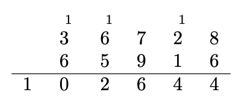

# 🔰 Algorithms Integer Addition

📚Class: CMSC 351 Algorithms

📘Subject: <a href="https://github.com/lamula21/cheat-sheets/blob/main/CMSC%20351%20Algorithms/Algorithms.md">Algorithms</a>

✏️Section: 0301

🗓️Date: 2023-04-12

---
# 🎬 Intro to Integer Addition
- Integer Addition is `not in-place`
	- Note: depending how is implemented, it can be `in-place`


# ⏳ Running Time

- `Worst Case`
	- $Θ\left( n  \right)$
- `Best Case`
	- $Θ\left( n  \right)$
- `Average Case`
	- $Θ\left(  n \right)$

# ⌛️ Space Time
- $Θ \left( n   \right)$

# 🤷🏻‍♂️ What is Integer Addition
Suppose we have two n-digit numbers and wish to add them. What is the worst-case time complexity of this operation? $Θ\left( n  \right)$

Can we do better than $Θ\left( n  \right)$? No

Basically we will convert this operation into code:



# Pseudocode
```python
\\ PRE: A and B are lists of length n containing
\\      the digits of two numbers.

\\ PRE: C is an empty list of 0s with length n+1

carry = 0
for i=0 to n-1
    C[i] = A[i] + B[i] + carry
    if C[i] > 9
        carry = the 10s digit of C[i]
        C[i] = the 1s digit of C[i]
    else
		carry = 0

C[n] = carry
\\ POST: C contains the digit-by-digit result of adding A and B.
```
