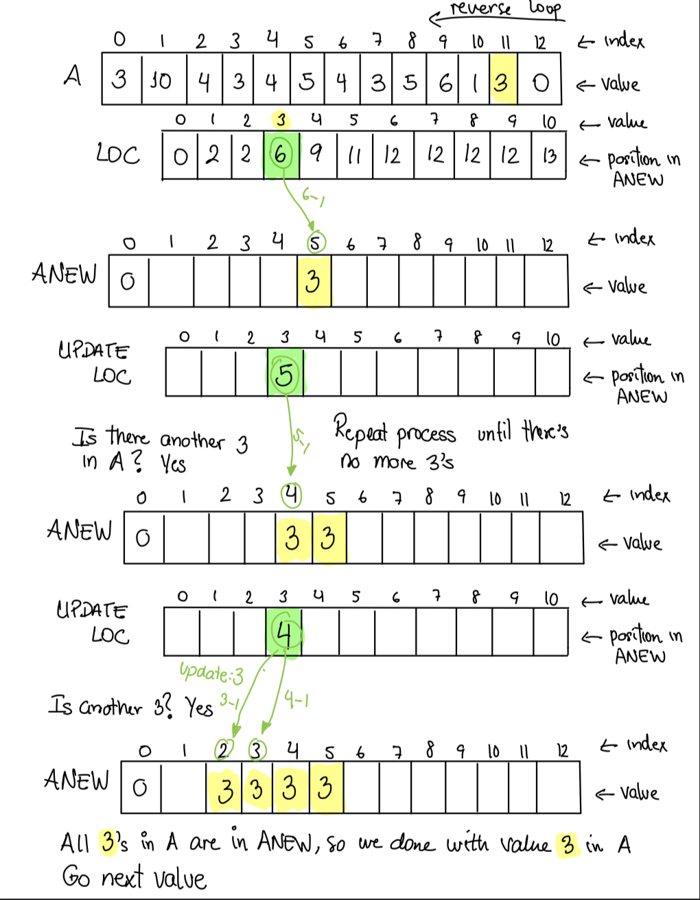
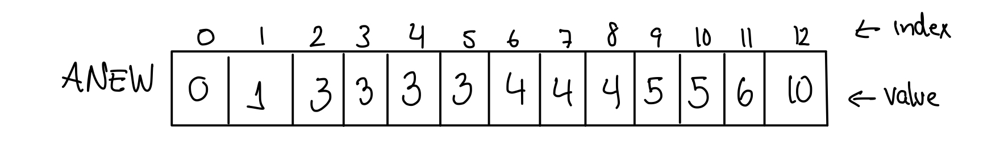

# 🔰 Algorithms Counting Sort

📚Class: CMSC 351 Algorithms

📘Subject: <a href="https://github.com/lamula21/cheat-sheets/blob/main/CMSC%20351%20Algorithms/Algorithms.md">Algorithms</a>

✏️Section: 0301

🗓️ Date: 2023-03-28

---

# 🎬 Intro to Counting Sort
- Counting Sort is `not in-place`
	- Needs Auxiliary array
	- Sorted array is in a separate array, then is copied back into the original  
- Counting Sort is `stable`
	- Two same elements are not swapped

# ⏳ Running Time

- `Worst Case`
	- $Θ\left( n+k  \right)$
- `Best Case`
	- $Θ\left( n+k   \right)$
- `Average Case`
	- $Θ\left( n+k  \right)$

**Note**:
- `n` number of integers in the list
- `k` is the maximum value digit in the list
- If $k$ is a fixed constant and we let $n$ vary then the time complexity is $Θ(n)$
- If $k$ is not fixed but we can guarantee that $k ≤ n$ then the time complexity is $Θ(n)$

# ⌛️ Space Time
- $Θ \left( n + k  \right)$
	- Original Array, n size
	- To create LOC, k+1 size
	- n+k+1 = n+k

# 🤷🏻‍♂️ What is Counting Sort
- Counting sort works by counting the number of each integer and creating a new list with that information.  


For example consider this list:
- k = maximum number of an element in the array
- 
| Index | 0   | 1   | 2   | 3   | 4   | 5   | 6   | 7   | 8   | 9   | 10  | 11  | 12  |
| ----- | --- | --- | --- | --- | --- | --- | --- | --- | --- | --- | --- | --- | --- |
| A     | 3   | 10  | 4   | 3   | 4   | 5   | 4   | 3   | 5   | 6   | 1   | 3   | 0   |


`Step 1 (First Pass)`
- Knowing maximum value is $k = 10$, we build `LOC`
	- We create an new Array `LOC` from 0 to k
	- LOC[k] contains the count of k in A
	- LOC size $k+1$
	- non-cumulative array

| Index | 0   | 1   | 2   | 3   | 4   | 5   | 6   | 7   | 8   | 9   | 10  | Element     |
| ----- | --- | --- | --- | --- | --- | --- | --- | --- | --- | --- | --- | ----------- |
| LOC   | 1   | 1   | 0   | 4   | 3   | 2   | 1   | 0   | 0   | 0   | 1   | Repetitions |

- So there are:
	- one 0's
	- one 1's
	- zero 2's
	- four 3's
	- tree 4's
	- etc

`Step 2 (Second Pass): Modify LOC (cumulative arr)`
- Add each entry to the next.

Non-cumulative array:

| Index | 0   | 1   | 2   | 3   | 4   | 5   | 6   | 7   | 8   | 9   | 10  |
| ----- | --- | --- | --- | --- | --- | --- | --- | --- | --- | --- | --- |
| LOC   | 1   | 1   | 0   | 4   | 3   | 2   | 1   | 0   | 0   | 0   | 1   |

Cumulative array:

| Index | 0   | 1     | 2     | 3     | 4     | 5      | 6       | 7   | 8   | 9   | 10  |
| ----- | --- | ----- | ----- | ----- | ----- | ------ | ------- | --- | --- | --- | --- |
| LOC   | 1   | 1+1=2 | 2+0=2 | 2+4=6 | 6+3=9 | 9+2=11 | 11+1=12 | 12  | 12  | 12  | 13  |

| Index | 0   | 1   | 2   | 3   | 4   | 5   | 6   | 7   | 8   | 9   | 10  | Element          |
| ----- | --- | --- | --- | --- | --- | --- | --- | --- | --- | --- | --- | ---------------- |
| LOC   | 1   | 2   | 2   | 6   | 9   | 11  | 12  | 12  | 12  | 12  | 13  | position in ANEW |


`Step 3 (Third Pass): Construct ANEW`
Loop A in reverse order, taking each element:
- Finding the index,  using LOC, to place it in ANEW
- Decrease entry in LOC in case there is another same element in A
- Repeat process if there is the same element in A

Here are the steps:

`Process A[12]`


`Process A[11]`



`Continue untill Process A[0]`
- ANEW is sorted
- Return ANEW


`Note`
We go next value whether:
- The UPDATE LOC's value reaches 0 (Process A[12] as example) or
- All elements in A are in ANEW (Process A[11] as example)


# ✏️ Pseudocode
```python
# A list with size n, with element maximum value k.

LOC = array of zeros of length k+1
ANEW = array of zeros of length n

# First Step
for i = 0 to n-1
	LOC[A[i]] = LOC[A[i]] + 1

# Second Step
for i = 1 to k
    LOC[i] = LOC[i] + LOC[i-1]

# Thrid Step
for i = n-1 down to 0
	ANEW[LOC[A[i]]-1] = A[i]
    LOC[A[i]] = LOC[A[i]] - 1

for i = 0 to n-1
    A[i] = ANEW[i]

# A is sorted
```


- `Counting Sort Recurrence`
$$T(n) = here $$
- `Best Case`
$$T(n) = here$$
- `Worst Case`
$$T(n) = here$$
