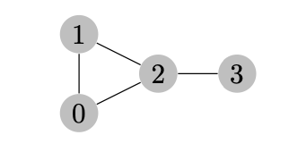
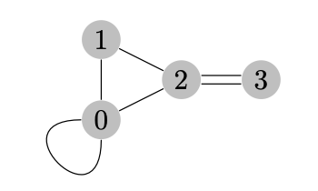
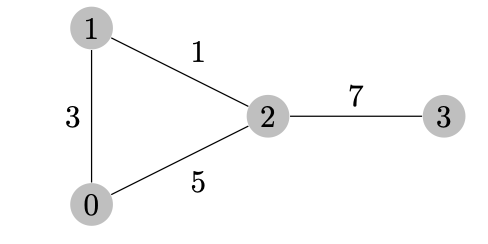
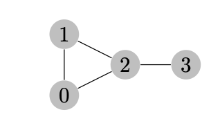
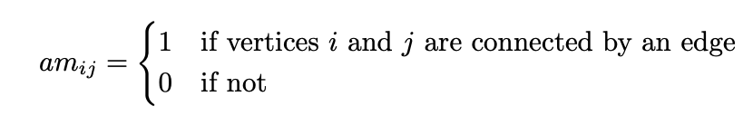
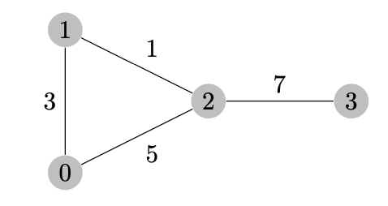
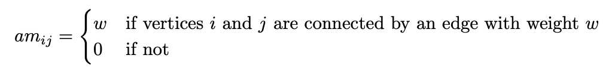
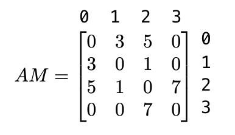
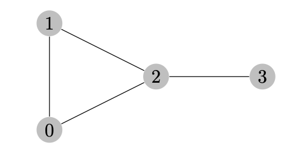

# 🔰 Algorithms Graphs

📚Class: CMSC 351 Algorithms

📘Subject: <a href="https://github.com/lamula21/cheat-sheets/blob/main/CMSC%20351%20Algorithms/Algorithms.md">Algorithms</a>

✏️Section: 0301

🗓️Date: 2023-04-16

---

# 🤷🏻‍♂️ What is Graphs
Graphs are essentially diagrams (or data, at an abstract level) which represent networks and in general connectivity between objects.

For example the following diagram could represent the connectivity between four computers:

Here we see that computers 0,1,2 are connected to one another and computer 3 is only connected to computer 2.

# 📝 Definitions

**Graph, edge, vertex (node)**:
- A graph consists of `vertices` or nodes connected by `edges`.

**Adjacent edges**:
- Two vertices are `adjacent` if they are connected by an edge.
 
**Degree**:
- The `degree` of a vertex is the number of edge connections incident at that vertex.

**Loop**:
- A `loop` is an edge which joins a vertex to itself.

**Multiple edge(s)**:
- Two vertices may be joined by more than one edge, in which case we say there are `multiple edges` between the vertices.

**Simple**:
- A graph is `simple` if it has no loops and no multiple edges.

*Note: This graph has a loop (vertex 0 to itself) and multiple edges (vertex 2 to vertex 3)*

**Weighted and unweighted**:
- A `unweighted` graph has not numberical weight on its edge
- A graph is `weighted` if each edge has a numerical weight associated to it.

**Directed and undirected**:
- A graph is `directed` if the edges have directions, by arrows, only goes one direction.
- `undirected` no arrows on its edges. Also means that it can go either both directions
*Note: Working with directed graphs is much more challenging than working with undi- rected graphs.*

---

**Walk**:
- A `walk` is simply a way of getting from vertex u to vertex u′.
- Can repeat edges and vertices.

**Trail**:
- A `trail` is a walk in which all edges are distinct.
- Vertices may be repeated.

**Path**:
- A `path` is a walk in which all vertices are distinct.
- If vertices are distinct then so are edges.

**Cycle**:
A `cycle` is a trail in which all vertices are distinct except the starting and ending vertex are the same.

---

**Connected graph**:
- `connected` graph if for any two vertices there is at least one path joining those vertices.
- In other words, every vertex in a connected graph can be reached from any other vertex by following a sequence of edges.

**Complete graph**:
- `complete` graph in which every pair of distinct vertices is connected by a unique edge.
- **If there are $n$ vertices in a complete graph, then there are n-1 edges**

**Fully Connected/Complete graph**:
- Every pair of vertices is connected by an edge, and there are no isolated vertices
- *Fully Connected, redudant expression*

---

**Tree**:
A `tree` is an `undirected` `simple` `connected` graph with the property that every two vertices are **connected by exatly one path**.

---

## Adjacency Matrix Graph
- $V * V$ = $V^{2}$

**Adjacency matrix for an unweighted undirected simple graph**:
- If the graph is simple, unweighted and undirected then:

The rules is:

Then the adjacency matrix representation is: 

**Adjacency matrix for a weighted directed simple graph**:
- If the graph is simple and weighted, but not directed, then:

The rules:

Then the adjacent matrix representation is:

## Adjacency List Graph
- Give the following graph:

then the adjacency list is:
- AL = [[1, 2], [0, 2], [0, 1, 3], [2]]
