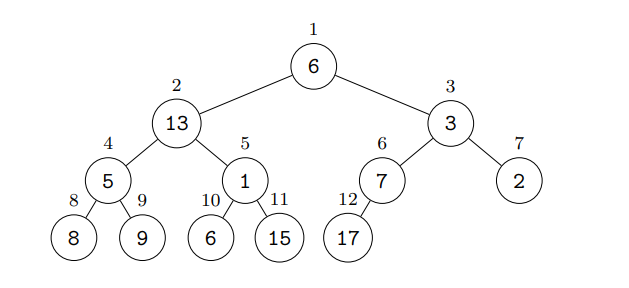

# 🔰Algorithms HeapSort
Class: <a href="https://github.com/lamula21/cheat-sheets/blob/main/CMSC%20351%20Algorithms/Algorithms.md">Algorithms</a>

Subject: #

Date: 2023-02-28

Topics: #, #, # 

---

# 🌲 Complete Binary Trees
- Complete Binary Tree is a binary tree in which all levels are completely filled,
- Except possibly for the last level, and the last level has all entries as far left as possible.
- Note that the root is considered level 0.



## Binary Tree Index
- As in the picture we begin the node indexing at the root node at $i = 1$
- Instead of 0 as is usual for arrays and lists.
- The reason for this is that there are some convenient node calculations

### Observations
- `Observation 1`: If a node has index $i$ then its` left` and `right` children (if it has them) have indices
	- $2i$
	- $2i + 1$ respectively.
- `Observation 2`: If a node has index $i$ $\Longrightarrow$ its `parent` has index $\lfloor{\frac{i}{2}}\rfloor$
- `Observation 3`: As a case of the above, 
	- If there are `n` nodes in total $\Longrightarrow$ the `largest node` with children is at index $\lfloor{\frac{n}{2}}\rfloor$
- `Observation 4`: If a node with index `i` has children  $\Longrightarrow$ all nodes with smaller indices also have children
- `Observation 5`: Combining `Observation 2` and `Observation 3`
	- If there are `n` nodes in total $\Longrightarrow$ the nodes with indices $1,2,..., \lfloor \frac{n}{2} \rfloor$ must have childrens.

# 🎬 Intro to Heaps
- Heap is a binary tree with `heap` property
- `heap property` 
	- `max heap`: Each node's value is bigger than its children's value
	- `min heap`: Each node's value is smaller than its children's value


- Heaps used as `priority queue`
	- First node in queue: root node
	- FIrst node to dequeue: root node
- Advantage of Binary Tree being **Complete**
	- It is very compact
- Perfect case for Heap
	- Complete Binary Tree is a **FULL** Binary Tree

## Full Binary Tree
- Levels start at 0
- Levels in a Full Binary Tree
	- Level 0: 1 node
	- Level 1: 2 nodes
	- Level 2: 4 nodes
	- Level 3: 8 nodes
	- ...
	- Level L: $2^{L}$ nodes
	
- If a Full Binary Tree has $L+1$ levels
	- `Total nodes`: $1 + 2^{1} + 2^{2} + 2^{3} + ... + 2^{L}$ (Geometric Series)
	- `Total nodes`: $2^{L+1}-1$

- If a Full Binary Tree has $n$ nodes
	- `Total levels`: $n = 2^{L+1}-1$
	- `Total levels`: $n+1 = 2^{L+1}$
	- `Total levels`: $\log(n+1) = \log\left(2^{L+1}\right)$
	- `Total levels`: $\log(n+1) = L+1$
	- `Total levels`: $\log(n+1) -1 = L$

## Heap 1-indexed
- `Parent`: $i$
- `Left`: $2i$
- `Right`: $2i+1$


## Storing Heap in an Array
- If array indexed at 1 **(easier)**
	- `parent`: $i$
	- `left child`: $2i$
	- `right child`: $2i + 1$
	- `parent`: $\lfloor\frac{child}{2}\rfloor$
	- $n$ elements in heap $\rightarrow$ $n+1$ elements in Array
- If array indexed at 0
	- `parent`: $i$
	- `left child`: $2i +1$
	- `right child`: $2i + 2$
	- `parent`: $\lfloor\frac{child-1}{2}\rfloor$
	- $n$ elements in heap $\rightarrow$ $n+1$ elements in Array


# 🎬 Intro to HeapSort
- HeapSort is `in-place`
	- No need of auxiliary array
- HeapSort is `not stable`
	- Two same elements are inverted
- HeapSort worst-case solved with {{replace}}? 
- HeapSort recurrence relation:
$$ Here$$
# ⏳ Running Time
- `Worst Case`
	- $Θ\left( n \log n \right)$
- `Average Case`
	- $Θ\left(  n \log n \right)$
- `Best Case`
	- $Θ\left(  n \right)$

# ⌛️ Space Time
- $Θ\left( 1  \right)$

# 🤷🏻‍♂️ What is HeapSort

## 1️⃣ Build a Heap from Unsorted Array
- `Step 1`: Convert unsorted array to Complete Binary Tree
- `Step 2:` Convert Binary Tree to Heap (heapify one level at time, starting from one before last level)

### Step 1
- Assume unsorted array: [*,33,20,10,34,25,21,84,3,17,87,33,62]

Building a Binary Tree
- Tip: at each element in array, place it from left to right into the tree


### Step 2
- Given the tree, Heapify level 2 in the Tree


- Heapify level 1 in the Tree


- Heapify level 0 in the Tree


- Done. We built a max heap

## 2️⃣ HeapSort


<iframe width="560" height="315"
src="https://www.youtube.com/embed/MUQfKFzIOeU" 
frameborder="0" 
allow="accelerometer; autoplay; encrypted-media; gyroscope; picture-in-picture" 
allowfullscreen></iframe>


# Pseudocode
```python
makeHeap(A)
	for i= to 1
		heapify(A , i)

heapify(A, i)
	loop and swap as needed going down the tree

# HeapSort
makeHeap(A)
deleteAll(A)  # Array is sorted
```

```python
deleteAll(A)
	for i=1 to len(A)-1
		# deleteRoot
		swap A[1] with last element of heap
		heapify(A , 1)
```

- `{{replace}} Recurrence`
$$T(n) = here $$
- `Best Case`
$$T(n) = here$$
- `Worst Case`
$$T(n) = here$$
