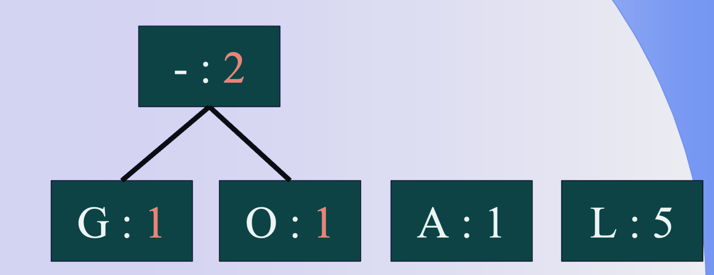
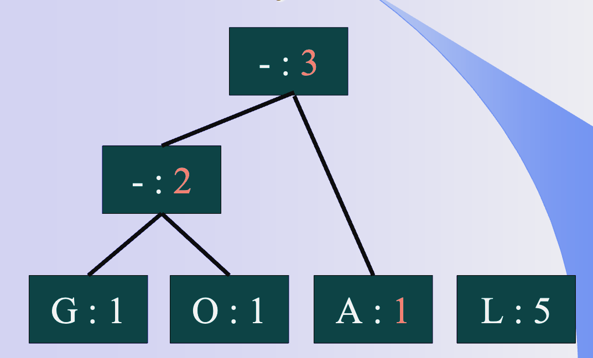
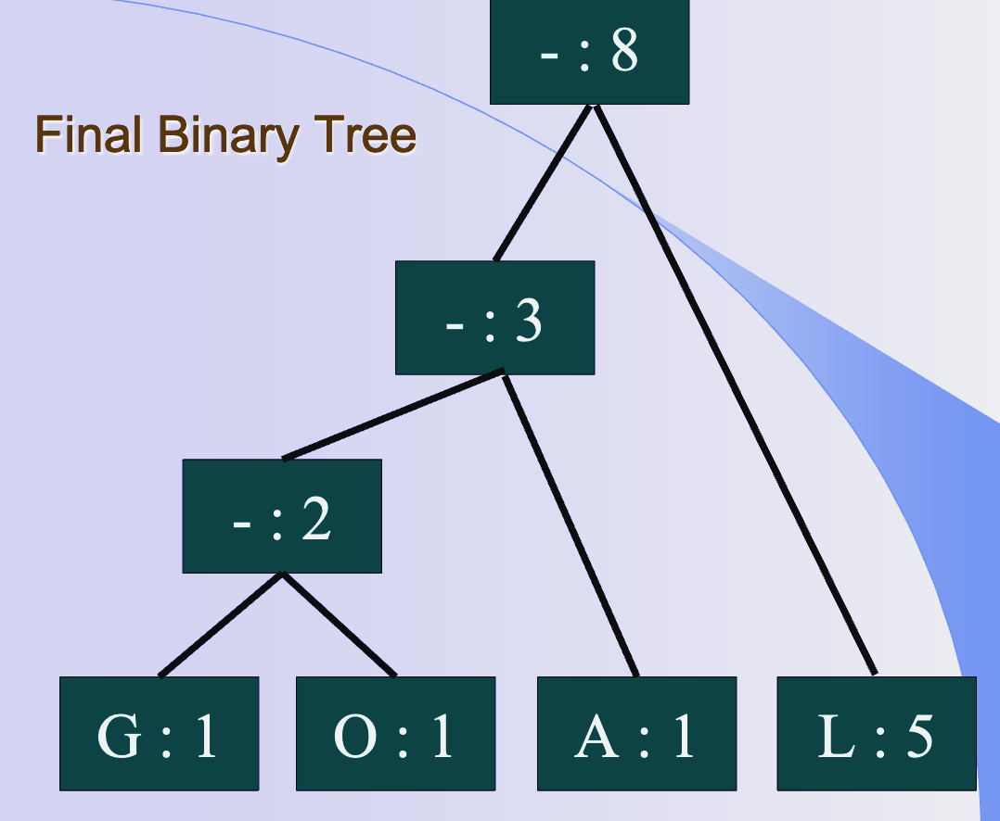
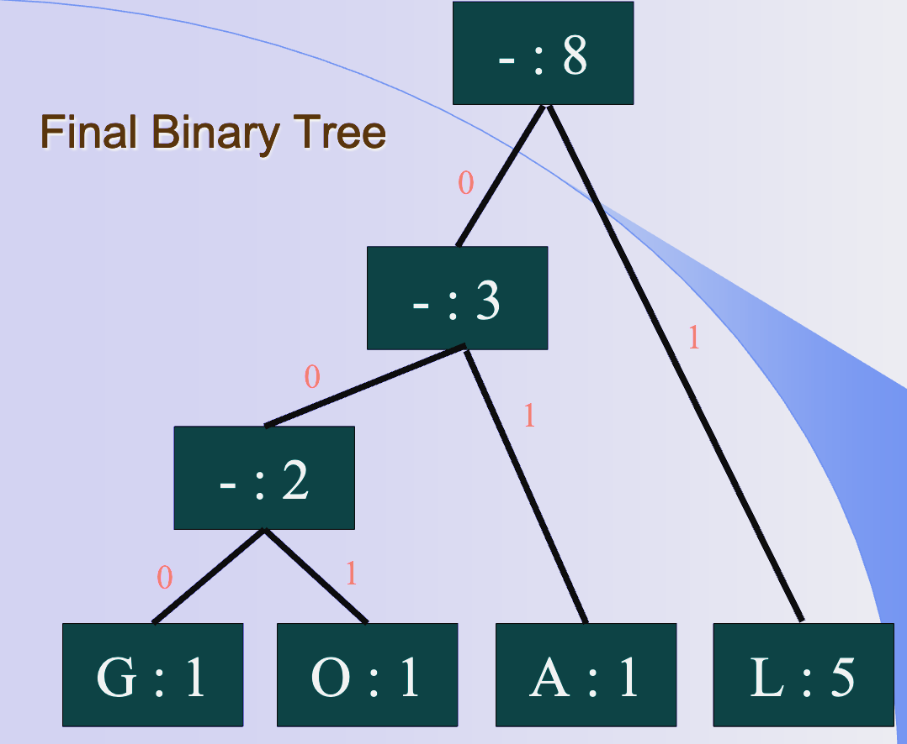
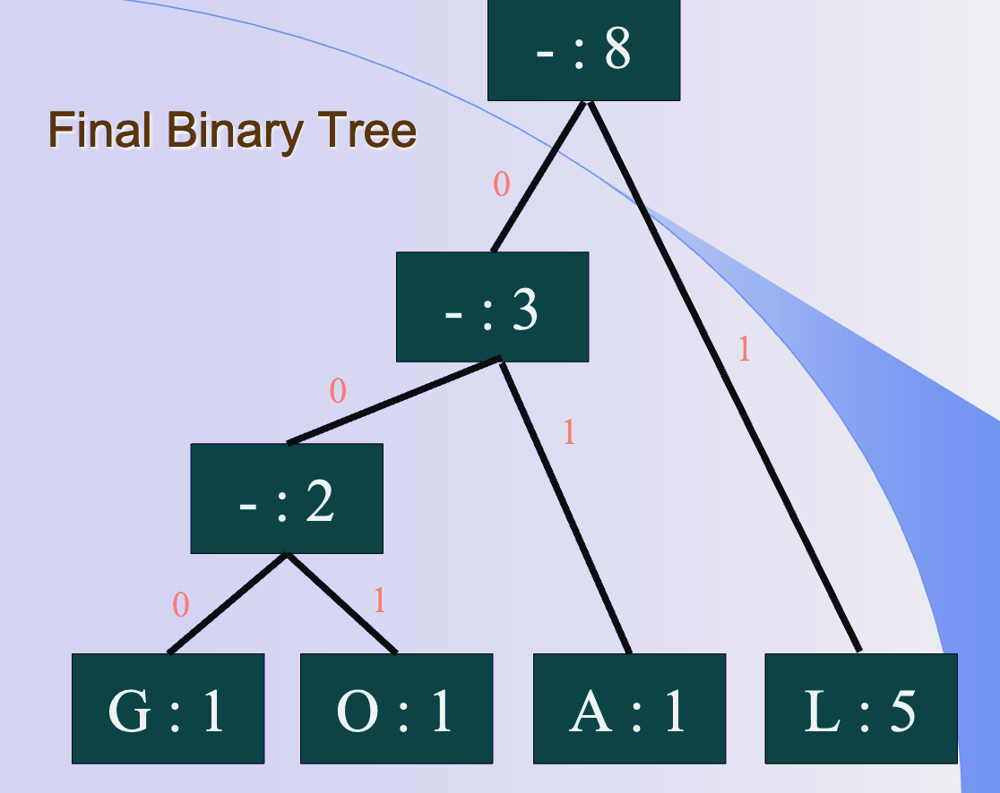

# 🔰 Algorithms Huffman

📚Class: CMSC 351 Algorithms

📘Subject: <a href="https://github.com/lamula21/cheat-sheets/blob/main/CMSC%20351%20Algorithms/Algorithms.md">Algorithms</a>

✏️Section: 0301

🗓️Date: 2023-05-02

---
# 🎬 Intro to Huffman
- Problem: How to encode a string with 0s and 1s so that the number of 0s and 1s is  minimal  
- Each character is encoded with a unique string of 0s and 1s
- Build the forest of binary trees
- Build the Binary Tree
- Get the codes
- Encode

**Example**: 
- Encode HELLO  
- Possible encoding:
H = 0  
E = 1  
L = 00  
O = 01  
HELLO = 01|00|00|01

**Example**:
- Try to decode 01000001  
- Does it start with H (01000001) or O (01000001)?

**Example**:
- Encoding is ambiguous
H = 0  
E = 1  
L = 00  
O = 01  
Try to decode 01000001  
Is it HELLO, OLLO, OHHHHHE,  
OLHHHE, ....?

# ⏳ Running Time

- `Worst Case`
	- $Θ\left( p + a  \right)$ + $Θ\left( n \log n  \right)$ + $Θ\left( p \right)$
- `Best Case`
	- $Θ\left(   \right)$
- `Average Case`
	- $Θ\left(   \right)$

Where:
- p - the length of the string to encode


# ⌛️ Space Time
- $Θ \left(   \right)$

# 🤷🏻‍♂️ What is Huffman
- Encodes a string with 0s 1s by making use of  a Binary Tree
- It is **greedy** algorithm

## Step 1: Build a Binary Tree

Forest of 4 Binary Trees
- Combine Binary Trees 2 at a time until we have one Binary Tree
- Combine the 2 Binary Trees with the lowest frequencies


We have 3 Binaries Tree
- Root node is the sum of its two children. (2 = 1 + 1)
- The frequency of the tree is the frequency of the root


- D not care about the letter

Keep going:



Finally:


- The final Binary Tree defines the encoding  
- We just label the edges 0 or 1, for example 0 going left and 1 going right  
- The leaves hold the characters of the original string




## Step 2: Read Encoding from Binary Tree

G: 000  
O: 001  
A: 01  
L: 1  
- No code word is the beginning of another  
- The fact that all letters are stored in the leaves guarantees that the code is a prefix code (why?)
- No code word is the beginning of another  
- The fact that all letters are stored in the leaves guarantees that the code is a prefix code (why?)  
- If it was not a prefix code, then one word and its encoding would not be a leaf

## Step 3: Use the Resulting Encoding to Encode the String

G: 000  
O: 001  
A: 01  
L: 1  
GOALLLLL = 0000010111111 -> 13 bits


## Solution Unique
- Is the optimal (# of bits needed to encode the original string) prefix code solution unique
- Yes? prove it  
- No? counter example

G: 000  
O: 001  
A: 01  
L: 1  
Other solution:  
G: 001  
O: 000  
Same for A and O

## Type Traversal

### preorder
### order 
### asd

# Recovering Codes
- Once the Binary Tree is built, how do you recover the codes?  
- A variation of a preorder traversal  
- We want to pick up the codes in 1 traversal, not several



- The letters are stored in the leaves  
- Need to read the 0s and 1s as we go  along and build a string for each letter that we read  
```java
// Recursive method traversing starting at nd  
public void preOrderCodes( Node nd, String s ) {
	...
}
```


- Say we are in a BinaryTree class  
- We have a HashMap instance variable that will store the letter/code pairs  
```java
// Recursive method traversing starting at nd  
// The String s stores the "current" code  
public void preOrderCodes( Node nd, String s) {
	// There are 3 scenarios:  
	// nd is null, nd is a leaf, nd is not a leaf  
}

```


The String s stores the "current" code  
```java
public void preOrderCodes( Node nd, String s ) {  
	if nd is null  
		empty subtree, nothing to do
}
```


## Traversing Left

```java
// traverse left below and traverse right below  
s += "0";  
preOrderCodes( nd.getLeft( ), s );  
s = s.substring( 0, s.length( ) - 1 ); // backtrack  
s += "1";  
preOrderCodes( nd.getRight( ), s );  
s = s.substring( 0, s.length( ) - 1 ); // backtrack
```

# Pseudocode

```java
// traverse left below and traverse right below  
- Build the final Binary Tree from the Heap  
- Loop n – 1 times: i = 1 to n - 1  
	– Delete once Θ( 1 )  
	– Rebuild the heap Θ( log ( n – i ) )  
	– Delete again Θ( 1 )  
	– Rebuild the heap Θ( log ( n – i ) )  
	– Combine the two deleted Binary trees Θ( 1 )  
	– Insert in the Heap, keep CBT property Θ( 1 )  
	– Rebuild the heap Θ( log ( n – i )
```

