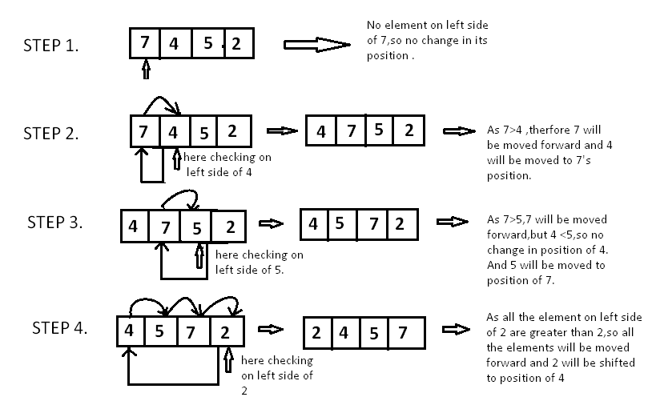

# 🔰 Algorithm Insertion Sort
Class: <a href="https://github.com/lamula21/cheat-sheets/blob/main/CMSC%20351%20Algorithms/Algorithms.md">Algorithms</a>
Subject: #
Date: 2023-02-21
Topics: #, #, # 

---
https://www.hackerearth.com/practice/algorithms/sorting/insertion-sort/tutorial/
https://www.geeksforgeeks.org/insertion-sort/
# Insertion Sort 
- 


# Runtime

- `Worst Case`
	- $\theta(n^2)$
- `Best Case`
	- $\theta(n)$
- `Average Case`
	- $\theta(n^2)$


# Space Time
- $O(1)$


# How It Works

- Take array `A[ ] = [7,4,5,2]`


- Example 2:


# Pseudocode
```c
func insertionSort(A: list of sortable items)
	n = length(A)
	for i = 1 to n - 1 do
	    j = i
	    while j > 0 and A[j-1] > A[j] do
			swap(A[j], A[j-1])
	        j = j - 1
	    end while
	end for
end procedure
```


