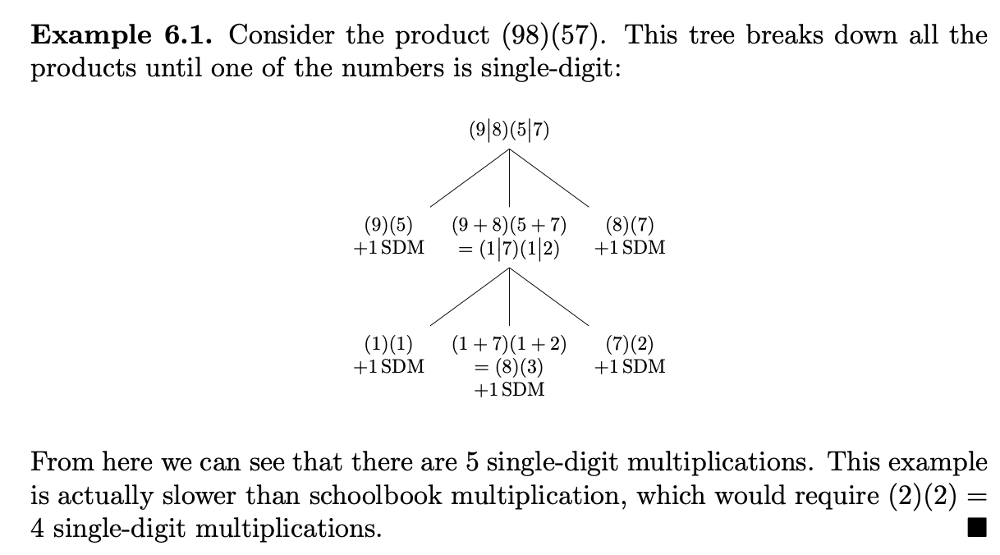
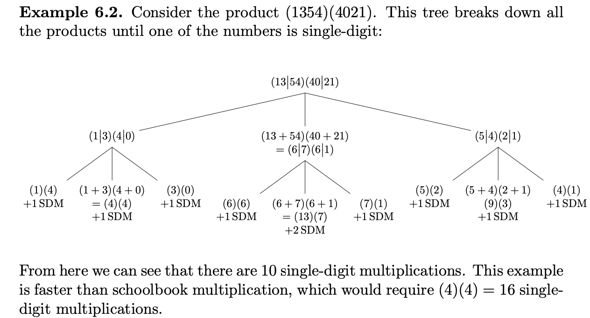

# 🔰 Algorithms Karatsuba

📚Class: CMSC 351 Algorithms

📘Subject: <a href="https://github.com/lamula21/cheat-sheets/blob/main/CMSC%20351%20Algorithms/Algorithms.md">Algorithms</a>

✏️Section: 0301

🗓️Date: 2023-04-12

---

# 🤷🏻‍♂️ What is Karatsuba
Following up the Integer Multiplication Algorithm. Karatsuba leads to the following generalized observation. Suppose A and B are both n digit numbers.

Calculation of the digits of the multiplication AB can be done using 
- Three multiplications involving numbers with essentially half as many digits
- Θ(n) worth of addition and shifts.
$$T (n) = 3T (n/2) + Θ(n)$$
The Master Theorem with a=3, b=2 and c=1 tells us that since $1 < log_{2}3$ that: 
$$T(n) = Θ(n^{log_{2}3}) = Θ(n^{lg 3}) ≈ Θ(n^{1.5849625})$$

Faster than Θ(n2), especially for large n.

# ✏️ Karatsuba Implementation

Recall two 2-digits number multiplication
- $A = a_{1}a_{0}$ and $B = b_{1}b_{0}$ 
- $AB = 100a_{1}b_{1} + 10[(a_{1} + a_{0})(b_{1} + b_{0}) - a_{0}b_{0} - a_{1}b_{1})] + a_{0}b_{0}$

We noticed $(a_{1}+a_{0}) (b_{0}+b_{1})$ could potentially be a product of two 2-digit numbers. 
- E.g. $(7+6)(4+8)$ = $(13)(12)$

When applying the Karatsuba method we use recursion even here if necessary to ensure the reduction of everything to **single-digit products**.

So for example if A=76 and B=48 then we have:  
$(76)(48) = 100(7)(4) + 10 [(7 + 6)(4 + 8) − (7)(4) − (6)(8)] + (6)(8)$

Note the central term (13)(12). We apply recursion again:
$(13)(12) = 100(1)(1) + 10 [(1 + 3)(1 + 2) − (1)(1) − (3)(2)] + (3)(2)$

Now the central term involves the multiplication of two 1-digit numbers.

## Note 1
In the case where one of A and B has one digit then even if the other has more than one, at this point it’s certainly Θ(n) to simply multiply. Consequently the actual implementation of Karatsuba’s algorithm uses this as the base case in the recursion so we’ve done this in the pseudocode too.

## Note 2
If A and B have different sizes, we split from right to left. To ensure decimal shitfting works properly.

## Tree Karatsuba
A tree diagram can succinctly show how Karatsuba’s Algorithm plays out in terms of the breaking down to single-digit multiplications.

$(98)(57) = 100(9)(5) + 10 [(9 + 8)(5 + 7) − (9)(5) − (8)(7)] + (8)(7)$

Without additions/substractions, only multiplications, no repetition:
$(98)(57) = (9)(5), (9 + 8)(5 + 7), (8)(7)$

Repeat until multiplication is single digits:

