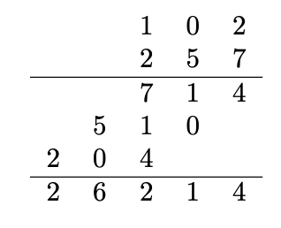

# 🔰 Algorithms Integer Multiplication

📚Class: CMSC 351 Algorithms

📘Subject: <a href="https://github.com/lamula21/cheat-sheets/blob/main/CMSC%20351%20Algorithms/Algorithms.md">Algorithms</a>

✏️Section: 0301

🗓️Date: 2023-04-12

---
# 🎬 Intro to Integer Multiplication
- Integer Multiplication is `not in-place`
- Integer Multiplication worst-case solved with Integer Multiplication? **here**

# ⏳ Running Time

- `Worst Case`
	- $Θ\left( n^{2}  \right)$
- `Best Case`
	- $Θ\left( n  \right)$
- `Average Case`
	- $Θ\left(  n \right)$

# ⌛️ Space Time
- $Θ \left(   \right)$

# 🤷🏻‍♂️ What is Integer Multiplication
Suppose we have two n-digit numbers and wish to multiply them. What is the worst-case time complexity of this operation?

We would do this operation:


## Two 2-Digit Numbers Multiplication
Let $A = a_{1}a_{0}$ and $B = b_{1}b_{0}$ be the base-10 digit representations of two 2-digit numbers. 
But we can express 
- $A = 10a_{1} + a_{0}$ 
- $B = 10b_{1} + b_{0}$ 

The product is:
$$AB = (10a_{1} + a_{0})(10b_{1} + b_{0}) = 100a_{1}b_{1} + 10(a_{1}b_{0} + a_{0}b_{1}) + a_{0}b_{0}$$
However,
In $10(a_{1}b_{0} + a_{0}b_{1})$, specifically $a_{1}b_{0} + a_{0}b_{1}$ can be expressed as
$$a_{1}b_{0} + a_{0}b_{1} = (a_{1} + a_{0})(b_{1} + b_{0}) - a_{0}b_{0} - a_{1}b_{1}$$
Consequently,
$$AB = 100a_{1}b_{1} + 10[(a_{1} + a_{0})(b_{1} + b_{0}) - a_{0}b_{0} - a_{1}b_{1})] + a_{0}b_{0}$$

Thus in total to calculate all of the required digits precisely we have:
- A total of 3 multiplications, $a_{0}b_{0}$, $a_{1}b_{1}$, and $(a_{1} + a_{0})(b_{1} + b_{0})$
	- Two of which have half as many digits as the original two numbers
		- Original: AB = 4 digits
		- $a_{0}b_{0}$ = 2 digits, $a_{1}b_{1}$ = 2 digits
	- One is a significantly easier product.
- A total of 6 additions/subtractions of numbers with at most 4 digits.  
- A totalof 2+1= 3 decimal shifts.
	- $100a_{1}b_{1}$ = $a_{1}b_{1}00$ $\rightarrow$ two decimal shift
	- $10[\dots]$ = $[\dots]0$ $\rightarrow$ one decimal shift


## Two 4-Digit Numbers Multtiplication
We will work with a multiplication of 4 digits number by 4 digits number.

Let $A=A_{1}A_{0}$ and $B=B_{1}B_{0}$, where $A_{i}$ and $B_{i}$ are pairs of two digits respectively.
In fact, we can represent A and B:
- $A = 100A_{1}+A_{0}$
- $B = 100B_{1}+B_{0}$

Suppose we wanted to calculate a product such as (1234)(5678). The result of the multiplication will have at most: 
$$len(A)\cdot len(B) = 4 * 4 = 16_{digits}$$


The product is:
$$AB = (100A_{1} + A_{0})(100B_{1} + B_{0}) = 10000A_{1}B_{1} + 100(A_{1}B_{0} + A_{0}B_{1}) + A_{0}B_{0}$$

Again observe the middle term:
$$A_{1}B_{0} +A_{0}B_{1} = (A_{1} +A_{0})(B_{1} +B_{0})−A_{0}B_{0} −A_{1}B_{1}$$

So once again the middle term can be calculated using two multiplications that we’ve already done as well as one new one, and again the required new product is certainly simpler than the original one. In summary again:
$$AB = 10000A_{1}B_{1} + 100 [(A_{1} + A_{0})(B_{1} + B_{0}) − A_{0}B_{0} − A_{1}B_{1}] + A_{0}B_{0} $$

To calculate this out in order to obtain the digits we have:
- A total of 3 multiplications, $A_{0}B_{0}$, $A_{1}B_{1}$, and $(A_{1} + A_{0})(B_{1} + B_{0})$
	- Two of which have half as many digits as the original two numbers and one is a significantly easier product.
- A total of 6 additions/subtractions of numbers with at most 8 digits.
- A total of 4+2=6 decimal shifts. 
	- $10000A_{1}B_{1}$ = $A_{1}B_{1}0000$ $\rightarrow$ 4 decimal shift
	- $100[\dots]$ = $[\dots]00$ $\rightarrow$ 2 decimal shift


## Generalized
This approach will then extend to two 8-digit numbers, two 16-digit numbers, and soon. 

In general,
if $A=A_{1}A_{0}$ and $B=B_{1}B_{0}$ where the $A_{i}$ and $B_{i}$ are pairs n-digit numbers (n even):  
$$AB = 10n(A_{1}B_{1}) + 10n/2 [(A_{1} + A_{0})(B_{1} + B_{0}) − A_{0}B_{0} − A_{1}B_{1}] + A_{0}B_{0}$$
Then we can reduce finding the digits of AB to:
- A total of 3 multiplications, $A_{0}B_{0}$, $A_{1}B_{0}$, and $(A_{1} + A_{0})(B_{1} + B_{0})$
	- Two of which have half as many digits as the original two numbers
	- one is a significantly easier product.
- A total of 6 additions/subtractions of numbers with at most $2\cdot n$ digits.        
- A total of $n + n/2$ decimal shifts.


# Pseudocode
```python
\\ PRE: A and B are lists of length n containing
\\      the digits of two numbers.

\\ PRE: C is an empty list of 0s with length n+1

carry = 0
for i=0 to n-1
    C[i] = A[i] + B[i] + carry
    if C[i] > 9
        carry = the 10s digit of C[i]
        C[i] = the 1s digit of C[i]
    else
		carry = 0

C[n] = carry
\\ POST: C contains the digit-by-digit result of adding A and B.
```
