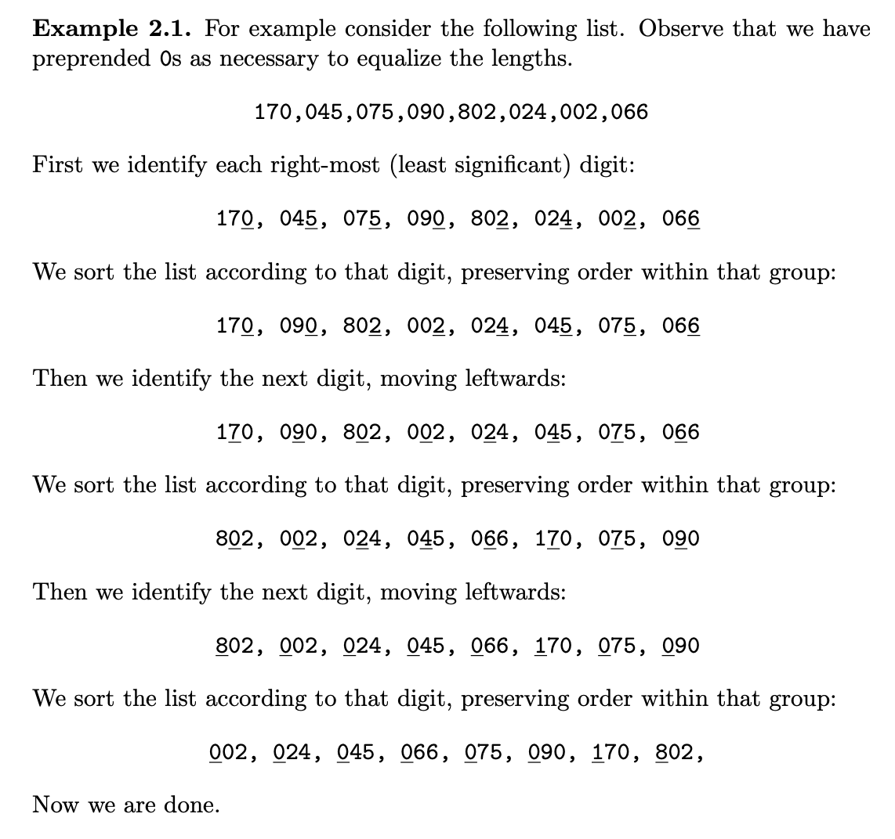
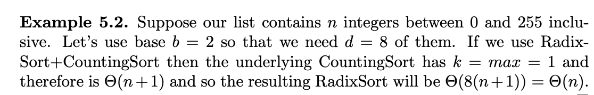
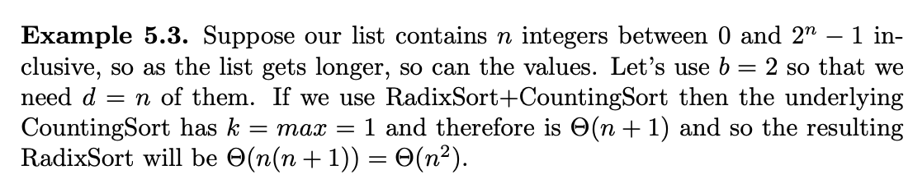
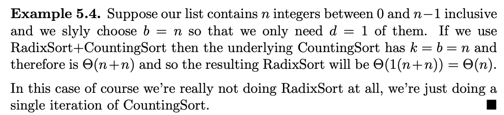
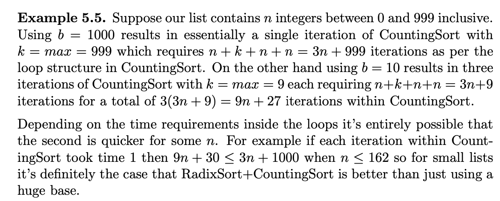

# 🔰 Algorithms RadixSort
Class: <a href="https://github.com/lamula21/cheat-sheets/blob/main/CMSC%20351%20Algorithms/Algorithms.md">Algorithms</a>

Subject: #

Date: 2023-03-28

Topics: #, #, # 

---
# 🎬 Intro to RadixSort
- RadixSort is not a comparison-based algorithm
- RadixSort depends on the stability of the underlying sort mechanism.
- RadixSort is `stable`
- Remember Counting Sort
$$Θ\left( n+k  \right)$$
- RadixSort+CountingSort recurrence relation:
$$T(n) = Θ(d*(n+k))$$
- $d$ is the number of digits that an element can have in the given list
- $n$ is the number of elements in the list, and 
- $k$ is the max value digit in the list

# ⏳ Running Time

- `Worst Case`: All the input integers have the same number of digits
	- $Θ\left(  d\cdot n \right)$
- `Best Case`: Only one digit in the input integer
	- $Θ\left( n+k  \right)$

# ⌛️ Space Time
- $Θ\left( n+b \right)$


# 🤷🏻‍♂️ What is RadixSort
- Sorts a list of integers in some base, aka radix. 
- For example positive integers in base 10 with $d$ digits all look like $x_{d} \dots x_{1}$ for digits $0 ≤ x_{i} ≤ 9$  
- For example positive integers in base 2 with d digits all look like $x_{n}...x_{1}$ for digits $x_{i} ∈ \{0, 1\}$




# ✏️ Pseudocode
```python
# A is a list of integers
for i = 1 to d
    stable sort A using digit i

# A is sorted
```

# ✍️ Solving Steps

## Find `d`
- The number of digits (in the base given) in the range of numbers given
	- For example, between 0 to 999, in base 10, there are d = 3 digits
	- For example, between 0 to 255, in base 2, there are d = 8 digits. 
		- In other words, how many digits of 0 or 1 are in 255 
		- $255_{2} = 1111\;1111$, 8 digits
	- For example, between 0 to $10^{n}-1$, in base 10, there are d = n digits.
	- For example, between 0 to $2^{n}-1$, in base 2, there are d = n digits

**Formula**: 
If the exercise gives you, between 0 to $x^{n}-1$, in base $x$, then
$$d = n$$

## Find `k`
- The maximum value of a digit in the range given. We can easily found with the **base** given. We can apply formula: 
	- $k = base - 1$
	- For example, base 10, then `k` = 9 
	- base 2, maximum digit `k` = 1

## Putting All Together
- We have `d` and `k`
- Use the formula, where `n` is the number of integers in the list:
$$Θ(d \cdot (n + k))$$

# 📝 Exercises








