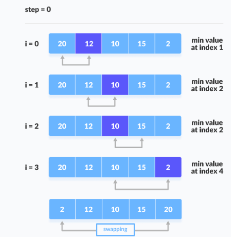
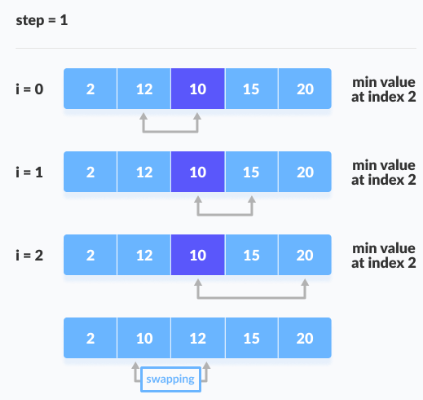

# 🔰 Algorithms Selection Sort
Class: <a href="https://github.com/lamula21/cheat-sheets/blob/main/CMSC%20351%20Algorithms/Algorithms.md">Algorithms</a>
Subject: #
Date: 2023-02-09
Topics: #, #, # 

---

# 🎬 Intro 
- We select the smallest element in the list and place it at the beginning of the list. Then we select the next-smallest element and put it in the second position in the list, and so on.
- We could the reverse:
	- Select the largest element in the list and place it at  the end of the list. Then we select the next-largest element and put it in the next-to-last position in the list, and so on.
- We consider the unsorted portion of the list as a sub-list
	- We repeatedly select the smallest value in the  current sub-list and move it to the end of the sub-list, then consider a new sub-list by  excluding the elements that are in their sorted locations.
	- We continue until the sub-list has only one element. At that time, the list is sorted.
- Memory space need $\theta(1)$
	- Two variables to store i and j, two indexes
	- Two variables to store `min` index, and `temp`
- Selection Sort, contrary to Bubble Sort, is NOT a STABLE sorting algorithm.

# Running Time

- `Worst Case`
	- Same as Bubble Sort
	- $\theta(n^2)$
- `Average Case`
	- Same as Bubble Sort
	- $\theta(n^2)$
- Best Case
	- $\theta(n)$

# Space Time
- $O(1)$


# How It Works

## Quick Breakthrough
- Assume $A = [7,5,4,2]$


## Step by Step
- First Iteration


- Second iteration


- Third iteration


- Fourth iteration


# Pseudocode

```python
int temp; #temporary location for swap  
int min; #index of min value in sub-list  

for ( int i = 0; i < list.length - 1; i++ )  {  
	# need to code indexOfSmallest  
	min = indexOfSmallest( list, i );  
	
	# swap list[min] and list[i]  
	temp = list[min];  
	list[min] = list[i];  
	list[i] = temp;  
}
```

# Index of Smallest
- Memory Space needed: $\theta(1)$
	- Three variables to store i, j, and index for the min element
	- extra variable to store when swap, `temp`
```java
public static int indexOfSmallest( int [] arr, int i )  {  
	int index = i; // smallest so far is list[i]  
	for ( int j = i + 1; j < list.length; j++ )
		if ( list[j] < list[index] )  
			index = j;  
		  
	return index;  
}
```


