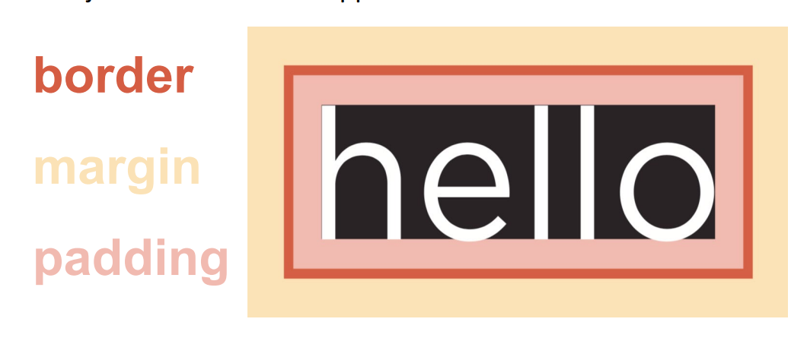

# 🎨 CSS Box Model
Class: <a href="https://github.com/lamula21/cheat-sheets/blob/main/css/CSS.md">CSS</a>

Subject: [[CSS]]

Date: 2023-03-23

Topics: #, #, # 

---

# Box Model
- CSS box model:
	- margin: whitespace outside of the box
	- border: box border
	- padding: white space between `border` and `content`
	- content: text, images, etc 



## Properties of a Box
- Commonly properties 
	- background
	- font
	- list-style
	- margin
	- border 
	- padding

```css
.noShorthand {
    /* Font specification */
    font-style: italic;
    font-variant: small-caps;
    font-weight: normal;
    font-size: .80em;
    line-height: 1.1em;
    font-family: Verdana, Arial, sans-serif;

    /* Border specification */
    border-width: 2em;
    border-style: solid;
    border-color: green;
    border-radius: 50%;

    /* Margin specification */
    margin-top: 6em;
    margin-right: 8em;
    margin-bottom: 4em;
    margin-left: 2em;
    
    /* Padding specification*/
    padding-top: 3em;
    padding-right: 4em;
    padding-bottom: 2em;
    padding-left: 1em;
}
```

```css
.withShorthand {
    /* Font specification */
    font: italic small-caps normal .80em/1.1em Verdana, Arial, sans-serif;

    /* Border specification */
    border: 2em solid green;

    /* Margin specification */
    margin: 6em 8em 4em 2em;

    /* Padding specification*/
    padding: 3em 4em 2em 1em;

    /* Description defining the color of each side */
    border-color: red green blue yellow;
}
```

## Background effects
- Styles the background of a box
```css
body {
	/* Background properties */
	background-color: silver;
	background-image: url(campusBldg.jpg);
	background-size: 20% 30%; /* Try cover, auto auto */
	background-repeat: repeat-x; /* Try repeat-y, no-repeat, repeat */
	background-attachment: fixed; /* Try scroll */
	background-position: center; /* Try top, right, bottom, left */
	
	/* background-image: url(https://background-tiles.com/overview/white/patterns/large/1029.png); */
}
```

## Media Query
- Applies different styles to a web page based on the device's characteristics or screen size
- Useful for creating responsive designs that adapt to different screen sizes and devices, a better user experience, optimize website's layout
- Uses the `@media` rule to include a block of CSS rule only if a certain condition is true
- e.g Sets the background color only if the browser window is 600px or smaller
```css
@media only screen and (max-width: 600px) {
  body {
    background-color: purple;
  }
}
```

Explanation:
- When the screen width is greater than 768 pixels, the `font-size` property will not be applied because the media query is not met.
	- However, when the screen width is 768 pixels or less, the `font-size` property will be applied to the `body` element.