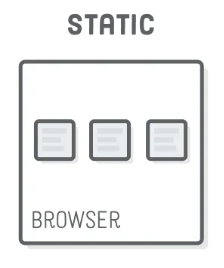
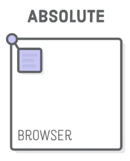
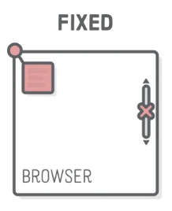

# CSS Position

📚Class: CMSC 335 Web Dev with Javascript

📘Subject: <a href="https://github.com/lamula21/cheat-sheets/blob/main/"></a>

✏️Section: 0101

🗓️Date: 2023-03-23

---

# Position Property
- Allows position elements on a web page. 
- Reset position by default from web.
- There are four types of positions you can use: static, relative, absolute, and fixed.

## 1️⃣ Static
- Default position for all elements. 
- Element is positioned according to the normal flow of the page. 
- Cannot use any of the position properties: top, bottom, left, or right.


```css
.element {
  position: static;  /* By default */
  /* The following has no effect */
  left: 5rem;
  top: 10rem;
}
```


## 2️⃣ Relative 
- Position element relative to its normal position in the page flow.
- If you make the window smaller, **scroll bars** appears


```css
.element {
  position: relative;
  top: 10px;
  left: 20px;
}
```


## 3️⃣ Absolute
- Position element relative to its parent container. 
- **Important**: parent container must be `position:relative`


```css
.parent { position: relative; }

.child {
  position: absolute;
  top: 10px;
  left: 20px;
}
```


## 4️⃣ Fixed
- Similar to absolute, but position element relative to the viewport (window)
- This means that the element stays in the same position even when the page is scrolled.
- If you make the window smaller, you will NOT see scroll bars


```css
.element {
  position: fixed;
  top: 10px;
  right: 20px;
}
```

