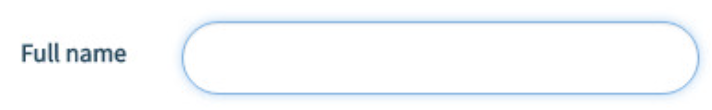

# 🎨 CSS Pseudo-classes

📚Class: CMSC 335 Web Dev with Javascript

📘Subject: <a href="https://github.com/lamula21/cheat-sheets/blob/main/"></a>

✏️Section: 0101

🗓️Date: 2023-02-23

---
# Pseudoclasses
In CSS, a pseudoclass is a keyword added to a selector that specifies a special state of the element being selected

## `:hover`
- Selects element when the user hovers over it with their mouse. 
- Provides visual feedback to the user and make web pages more interactive.
```css
button:hover { 
  background-color: yellow;
  color: black; 
}
```

## `:active`
- Selects element while it is being clicked or activated by the user (click not releaseed)
- Used to style buttons
```css
button:active { 
  background-color: red;
}
```


## `:focus`
- Selects element when it has focus
- Used to highlight interactive elements like buttons, text, or form fields when they are selected by the user.
```css
input:focus { 
  border: 2px solid blue; 
  outline: none; 
}
```




## `:link`
- Selects unvisited links
- Used to style links differently from regular text, so that users can easily identify them as clickable.
```css
a:link { 
  color: blue; 
  text-decoration: none; 
}
```


## `:visited`
- Styles to links that have been visited by the user. 
- For example, to change the color of visited links to green
```css
a:visited { 
  color: green; 
}
```

## `:target`
- Styles an element that was redirected/targeted by an anchor link
- For example, 
	- `<section>` element is removed until `<a>` is clicked then appears
	- when `<a>` is clicked, it redirects to `#section1` which applies `:target` CSS to show up
```html
<a href="#section1">Section 1</a>

<section id="section1">
  <p>This is the content of section 1.
  </p> 
</section>
```

```css
section { display: none; } 
section:target { display: block; }
```

## `:checked` 
- Styles an input element that is checked, such as a checkbox or radio button.


## `:disabled` 
- Styles a form element that is disabled, such as an input field or button.


## `:first-child`
- Styles the first child element of its parent.


## `:last-child`
- Styles the last child element of its parent.


## `:nth-child`
- Selects elements based on their position within a parent element. 
- For example, `:nth-child(3)` selects the third child element.


## `:has`
- Selects the parent element that contains the specified child element
- For example, `:has(.class)` selects all elements that do not have the class "class".


## `:not`
- Selects elements that do not match a particular selector. 
- For example, `p:not(.special)` selects all `p` elements that do not have the class ".special".
```css
p:not(.special) { 
  color: black; 
}
```

- Multiple selectors
```css
:not(p, a) {
  color: red;
}
```


# Pseudoclass for Anchors
```html
<p>
	<a href="#">This is an anchor tag within a ptag</a>
</p>

<div class="footer">
	<div>
		<a href="#">This is another anchor tag within a div tag</a>
	</div>
</div>
```

```css
p a:link    {color:maroon;}
p a:visited {color:green;}
p a:hover   {color:red;}
p a:active  {color:yellow;}

div a:link    {color:maroon;}
div a:visited {color:green;}
div a:hover   {color:red;}
div a:active  {color:yellow;}

.footer a:link    {color:maroon;}
.footer a:visited {color:green;}
.footer a:hover   {color:red;}
.footer a:active  {color:yellow;}
```