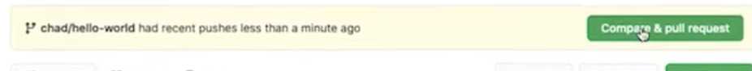
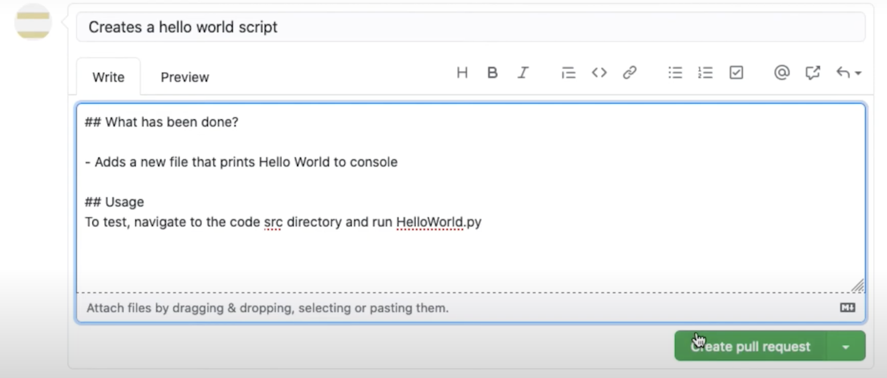
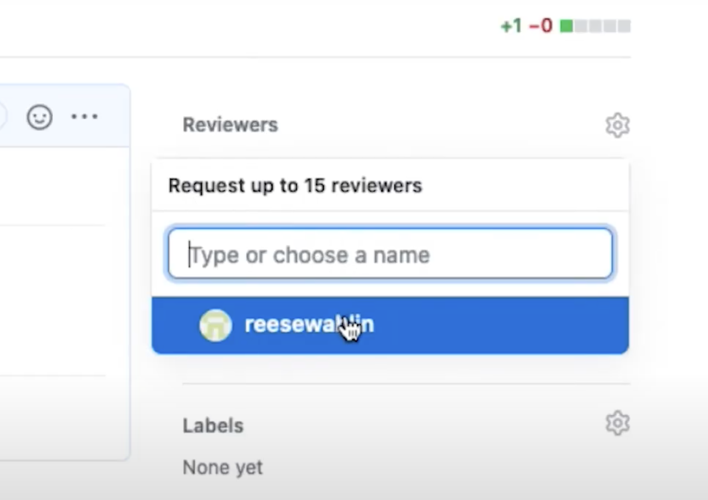

# Git Branch

📚Class: Git

📘Subject: <a href="https://github.com/lamula21/cheat-sheets/blob/main/"></a>

✏️Section: 

🗓️Date: 2023-04-20

---

# GitHub Workflow

In order to work on a repository, this is the workflow GitHub recommends:

1.  Create a branch
2.  Make changes
3.  Create a pull request
4.  Address review comments
5.  Merge your pull request
6.  Delete your branch

Source: [Github Workflow](https://www.freecodecamp.org/news/how-to-use-git-and-github-in-a-team-like-a-pro/#:~:text=07%3A34%20potionfy/-,GitHub%20workflow,-In%20order%20to)

# Useful Commands

- Check our current branch
```bash
git status
```

- View all branches
```bash
git branch
```

- Download new branches created from Github to you local machine (useful when someone creates a new branch and it is not in your local machine yet)
```bash
git fetch
``` 

- Up to date
```bash
git pull
```

- Add untracked files/add all untracked files
```bash
git add file_name
git add .
```

- Commit all tracked files (make them ready to be push to github)
```bash
git commit -m "yourMessage"
```

- If we are on Branch Main
```bash
git push
```


# Branching

- Leave current Branch and create new branch
```bash
git checkout -B branchName/functionality
```

- Once you are in your branch. You can now add, commit, push to your own branch.

- Push to a specific Branch
```bash
git push origin branchName/functionality
```
**Note**: `origin` is just a keyword specifying that we gonna push to a specific branch instead of `main` branch
**Note2**: You only need to do `git push origin branchName/functionality` once. Git will save this. Now, `git push` will be uploaded to the branch `branchName/functionality` automatically.


# Pull Request

**Objective**: Merge your branch with the main branch

- Once you made a push in your branch. Go to the repo project in Github. A new message will appear to ask a pull request (do this **ONLY** when you done your task in your branch).


- Add message and press Create pull request


- Add Reviewer. On the right corner of the page.


- If we want to modify the **Pull Request**/our branch. We can do the sames steps of add, commit, push to your **OWN** branch. The pull request will update your new changes.

Source: https://www.youtube.com/watch?v=nlF-SOrod5o&ab_channel=MissionBit


# Reviewing Pull Request
These steps only applies to the owner of the repository:

- Review code by checking out to the Branch to be reviewed. Check that everything is OK. If not, request changes. Source: https://www.youtube.com/watch?v=M_-cFDwq5xI&ab_channel=CodingGarden

- If everything is OK, press **Merge and Pull** to merge with Main Branch.

- Delete Branch

- Once the changes has been merge with **Main** Branch. Checkout to Main Branch and pull to have all updated files.
```bash
git checkout main
git pull
```

- Create another branch for another functionality task


Source: https://www.youtube.com/watch?v=jZSkGQ0k3L4&ab_channel=MissionBit