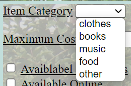

# 💻 HTML Forms Type

📚Class: CMSC 335 Web Dev with Javascript

📘Subject: <a href="https://github.com/lamula21/cheat-sheets/blob/main/"></a>

✏️Section: 0101

🗓️Date: 2023-02-23


---

# 👨‍🏫 More Form Code from Instructor
WebServersFormCOde.zip
[AccessFormDataUsingJSCode.zip](https://www.cs.umd.edu/class/spring2023/cmsc335/prot/lectures/Week09/AccessFormDataUsingJSCode.zip)


# 🏷️ Label
- Used to associate with a HTML form tag, `<input>`
- Provides description of what the form box is and is displayed **before the text field**

**Rule**:
- `for=""` - must have the id from `<input>`
- The `id` of `<input>` tag can be anything you want
```html
<label for="email_id">Email: </label>
<input type="text" id="email_id" name="email">
```


# ⌨️ Input Type
- Used for user enters data/information
- There are many input tags with different `types` attributes

## Text
```html
<input type="text" id="username" name="username">
```

## Text Area
- Multi-line text input area for users to enter text
```html
<textarea id="message" name="message" rows="5" cols="30"></textarea>
```

## Submit & Reset
```html
<form action = "/user">
  <label for="name">Name:</label>
  <input type="text" id="name" name="name"><br><br>
  
  <input type="submit" value="Submit"> // submit the form to route "/user"
  <input type="reset" value="Reset"> // reset to default values of the form
</form>

```


# 👇 Input Attributes
## `placeholder` attribute
https://www.w3schools.com/tags/tryit.asp?filename=tryhtml5_input_placeholder

## `pattern` attribute
https://www.w3schools.com/tags/tryit.asp?filename=tryhtml5_input_placeholder

## `required` attribute
```html
<label for="max-cost"> <u>Credit Card #</u> </label>
	<input type="text" name="cc1" id="" pattern="[0-9]{4}" required> <br> <br>
	
	<input type="text" name="cc2" id="" pattern="[0-9]{4}" required> <br> <br>
	
	<input type="text" name="cc3" id="" pattern="[0-9]{4}" required> <br> <br>
	
	<input type="text" name="cc4" id="" pattern="[0-9]{4}" required> <br> <br>
```


# Input-List
## Datalist


# Select
```html
<label for="item-category"><u>Item Category</u> </label>

<select name="plan" id="item-category">
	<option value="none" selected disabled hidden></option>
	<option value="free">clothes</option>
	<option value="starter">books </option>
	<option value="professional">music</option>
	<option value="corporate">food</option>
	<option value="corporate">other</option>
</select>
```


