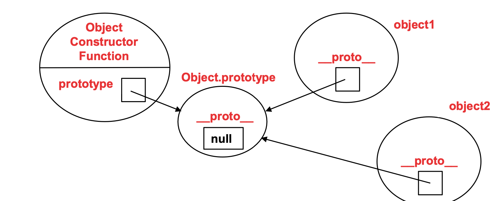
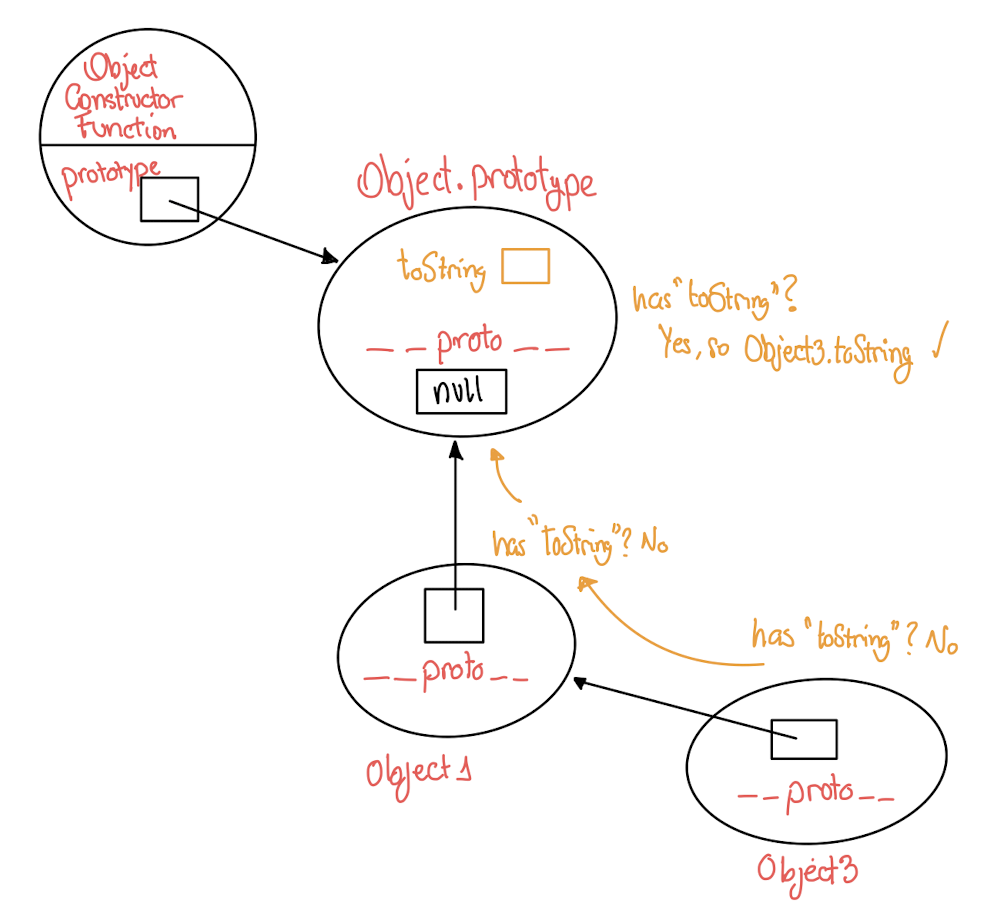
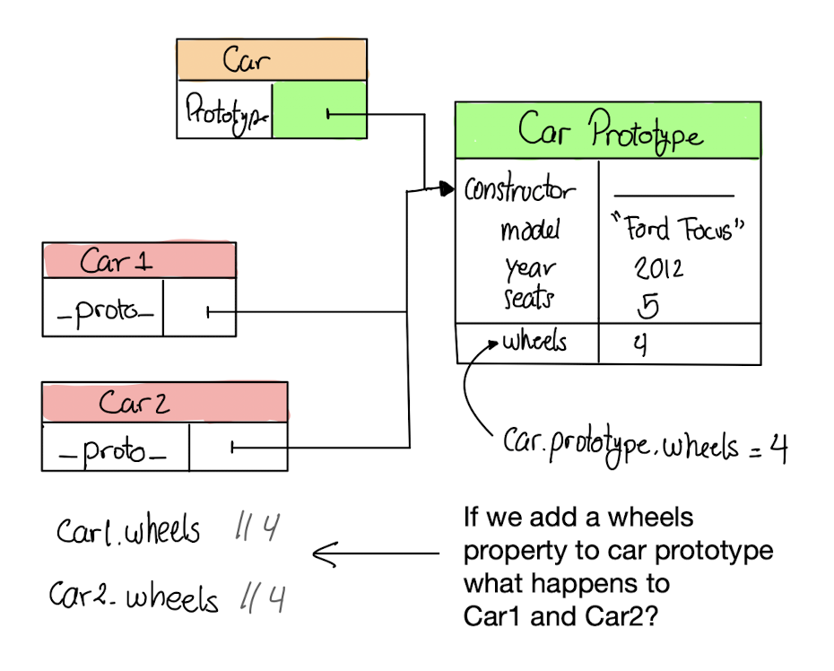
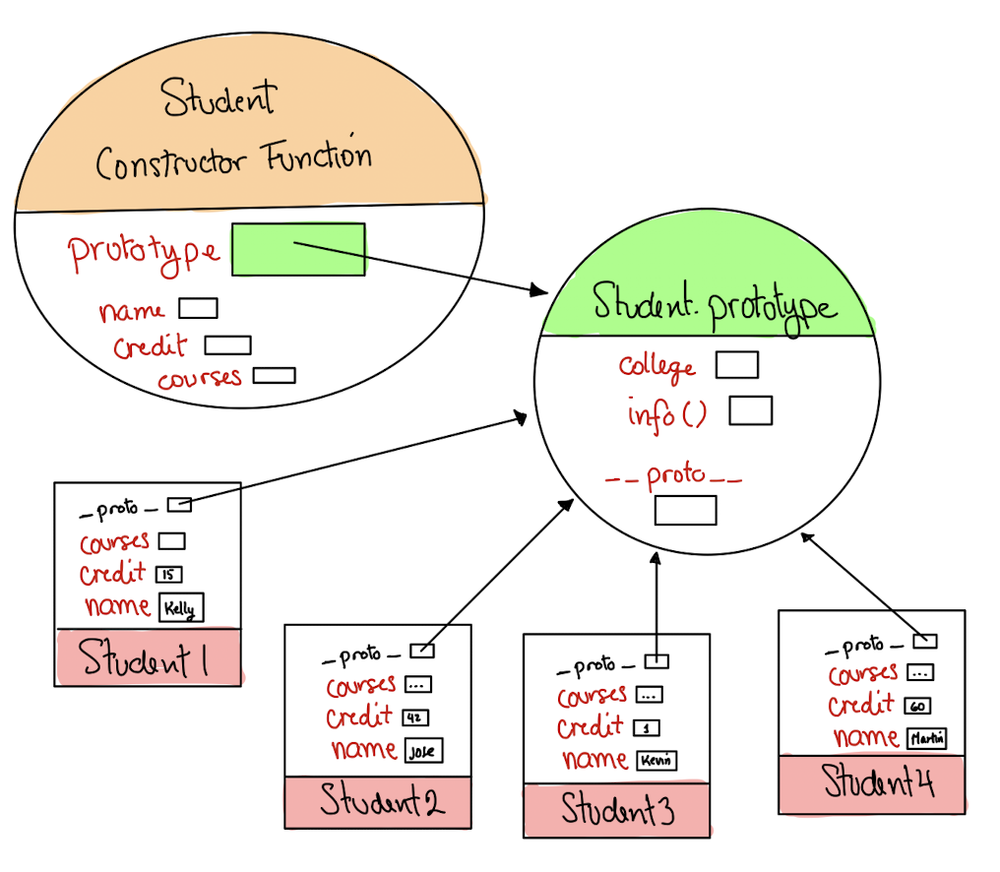

# JS Objects/Custom Types

📚Class: CMSC 335 Web Dev with Javascript

📘Subject: <a href="https://github.com/lamula21/cheat-sheets/blob/main/Javascript">Javascript</a>

✏️Section: 0101

🗓️Date: 2023-03-27

---

# 🎬 Intro
Before `Class` was introduced to Javascript, programmers had to use Objects Types in order to achieve Object Oriented Programming (OPP). This concept will allow us to go deeply on the fundamentals of Objects and understand how Objects are created and linked to each other.
<br>

# 📦 Object Type
- In JavaScript, ***functions are objects***
- There are several constructor functions (e.g., Object, Array, Function, Boolean)
- Object:
	- Constructor function (an object itself) that supports object creation. 
	- If you enter `type Object`, returns: 'function' 
	- If you enter `Object`, returns: ƒ Object() { [native code] } 

- An Object (even though it is a function) can have several properties
	- Object.assign
	- Object.create
	- Object.hasOwn
	- Object.freeze
	- Object.seal
	- much more!

- Every Object has a `prototype` property
	- `Object.prototype`:
		- constructor()
		- defineGetter
		- defineSetter
		- hasOwnProperty
		- isProtoTypeOf
		- much more!

<br>

# 🆕 Object Creation

`constructor function`
- It's the builder of all Objects (Already created by default)
- Creates the `prototype` object
- It has a property called `prototype` that points to a `Object.prototype`

<br>

`Object.prototype`
- It's the parent of all Objects. There is only one `Object.prototype` (Already created)
- All new Objects should point to this
- It has the default properties of an object, which can be overriden by a new Object (***Inheritance!!***)
- It has a property called `__proto__` set to **NULL**

<br>

`new Object`
- Allows to create a new Object based on the `constructor function`
```js
let object1 = new Object();
let object2 = new Object();
```

<br>

`Process of Creating`: 
- New `object1` is created with a property: `__proto__`
- `__proto__` object points to its parent `Object.prototype`  
- All new Objects created share the same `Object.prototype`



<br>

# ⛓️ Chain of Properties
- All new Objects share same `properties` from `Object.prototype`
- Assume a `new Object3` points to another `new Object1`, which points to `Object.prototype`
- We want to access the property `.toString`, which is not declared in any of the new Objects created
- To search this property, traversing is done from bottom(child) to up(parent) to find `.toString` property
- `Object.prototype` is the end of the traverse (end of the chain)

<br>

## Example
- Let's figure out where `.toString` is found in the chain of Objects

<br>

`object3.toString`?



<br>

## Code
```js
function findProperty(src, toString) {
    let currObj, answer;

    /* Traversing the prototype chain */
    currObj = src;
    while (currObj !== null) {
        let currObjProperties = Object.getOwnPropertyNames(currObj);
        if (let found = currObjProperties.find( elem => elem === toString) {
            answer = found
            return answer;
        }
        currObj = Object.getPrototypeOf(currObj); // go parent object
    }
    return answer; // if not found, return undefined
}
```

**Note**:
If the property `toString` is not found, then returns undefined.

<br>

## Useful Object functions
Assume the Prototype Chain (LinkedList): 
$$cheesecake \rightarrow dessert \rightarrow Object.prototype$$

<br>

### `Object.create(obj)`
- Allows to create a child Object from a parent Object
- Inheritance?
```js
let cheesecake = Object.create(dessert);
```

<br>

### `Object.getOwnPropertyNames(obj)`
- Returns all properties of the object passed
- Returns string[]
```js
Object.getOwnPropertyNames(cheesecake)
// [name, calories, minCalories, displayDessert, constructor, ...]

Object.getOwnPropertyNames(dessert)
// [minCalories, displayDessert, showDessert, constructor, ...]

Object.getOwnPropertyNames(Object.prototype)
// constructor __defineGetter__, __defineSetter__, hasOwnProperty, ...]
```

<br>

### `Object.getPrototypeOf(obj)`
- Return the Prototype of the object passed
```js
Object.getPrototypeOf(cheesecake) // returns dessert
Object.getPrototypeOf(dessert) // returns Object.prototype
```

<br>

### `Object.isPrototypeOf(obj)`
- Return True/Flase
```js
dessert.isPrototypeOf(cheesecake) // True
Object.prototype.isPrototypeOf(dessert) // True
cheesecake.isPrototypeOf(Object.prototype) // False
```

<br>

# 📥 Function Properties

## `arguments.length`
- Returns the number of arguments provided by the user
```js
generateResults();        // Output: 0, undefined, undefined
generateResults("Hello"); // Output: 1, "Hello", undefined
generateResults(1,2);     // Output: 2, 1, 2

function generateResults(x,y) {
    document.writeln(arguments.length)
    document.writeln(arguments[0]);
    document.writeln(arguments[1]);
}
```

<br>

## `function.length`
- Returns the amount of parameters of the function
- **Note**: Different from `arguments.length`
```js
function generateResults(x) {
    document.writeln(x);
}
generateResults.length // 1

function moreResults(x,y) {
    document.writeln(x, y);
}
moreResults.length // 2
```

<br>

## `function.valueOf()`
- Returns the function in plain text
```js
generageResults.valueOf()
// Output:
// function generateResults(x) { document.writeln(x); }
```

<br>

## `this`
- In Java, `this` references the current Object we are operating. `this` is fixed (does not change) 
- In Javascript, similar but not the same. `this` changes where is pointing to
- References to the context object the function is operating on.
- **Note**: By default `this` is referencing to `window`
- Allows associating functions to an object at runtime    
- You can set this using apply(), call(), or bind()
```js
window.singer = "Lionel"

function printInfo() {
    document.writeln(this.singer); 
    // this -> the context where this function will work
    
}

function main() {
    printInfo() // "Lionel"
    // this -> references -> window

    let obj = new Object();
    obj.singer = "Elvis"
    obj.singerInfo = printInfo()
    obj.singerInfo() // "Elvis"
    // this -> references -> object
}

```

<br>

## `apply()`
`<function>.apply(<object>/this , args)`
- Allows us to specify to the function what `this` is refering to
- In Java, it's the way around, we have an object and use `this` to call its function
- By default `this` refers to window
- `.apply()` accepts two arguments
	- `this` will refer to window obj. Or, pass any obj to make `this` refer to
	- `arguments` for `<function>`
```js
let obj = new Object()
obj.terpConstant = 20
window.terpConstant = 10
function product(x,y){ return x * y * this.terpConstant }

product(2,5) // `this` referes to `window` // 2*5*10 = 100
product.apply(this, 3, 3) // `this` refers to `window` // 3*3*10 = 90
product.apply(obj, 3, 3) // `this` refers to obj // 3*3*20 = 180
```

<br>

## `call()`
`<function>.call(<object>/this , args)`
- Same as `.apply()`
- Useful for **Inheritance** to populate superclass/parent-class
```js
product.call(this, 3, 3) // `this` refers to `window` // 3*3*10 = 90
product.call(obj, 3, 3) // `this` refers to obj // 3*3*20 = 180
```

<br>

`<function>.bind(<object>/this , args)`
- Similar approach to Java, function and object are tied. Cannot break association
- Binds a function to an object, so that `this` always refers to the object binded.
	- Fixes `this` to the object.
- `.bind()` returns a function binded with an object
```js
obj.terpConstant = 2;
objFuncBinded = product.bind(obj) // returns a function
objFuncBinded(2,5) // 2*5*2 = 20
```

<br>

# 🔨 Function Class without `class` keyword
- `function` can also work as a `Class`
- Represents a `type` for `Computer`
- Also called as **Custome Type**
- **Convention**: function name start with Capital Letter to define a `Class`
- **Note**: 
	- If we were creating 50 instances of `Computer`, then we were creating 50 instances of `getMemory` and `setMemory` functions.
	- So this method is inefficient.
	- Can we do better? Sharing Prototypes
```js
// constructor function / Custom Type for Computer
function Computer(model, memory) {
    this.model=model;
    this.memory=memory;
    // DO NOT USE LAMBDA WITH 'THIS'
    this.getMemory = function(){ return this.memory }
    this.setMemory = function(newMemory){ this.memory=newMemory }
}

Computer("mac", 100); // properties are set to 'window' object

// Create an object from constructor function
let pc = new Computer("PC", 30); // properties are set to 'pc' object
pc.setMemory(100); // property set to 'pc' object
 ```

# 🤝 Sharing Prototypes
- We can set these `instances functions` to the parent Object.prototype, so that all new objects created shares the same common `function`'s, without repeately creating one each time a new object is created.
- **Note**: Only set to `.prototypes` properties that share in common between all objects
	- If want to set a property that is unique between all objects, set it into `function constructor`
```js
/* function constructo / Custom Type for Car */
function Car(model, year) {
    this.model=model;
    this.year=year;
}
// Car.prototype.model = "ford" // DO NOT DO THIS
// Car.prototype.year = "2020" // DO NOT DO THIS
Car.prototype.getYear = function(){ return this.year }
Car.prototype.setYear = function(newYear){ this.year=newYear }
```

## Example



<br>

# 🤷🏻‍♂️ How Actually Defining a Function Class
- A long story just to get here. Defining a function class, the right way!, without `class` keyword

```js
// Constructor function / Custom Type for Student
function Student(name, credits, courses){
    this.name=name;
    this.credits=credits;
    this.courses=[...courses];
}

// Set Common Properties for all Objects / Static members / Class variables
Student.prototype = {
    constructor: Student, // it says: I belong to this constructor
    college: "UMCP",
    info: function() {
      document.writeln(`
        ${this.name}, ${this.credits}, ${this.courses}, ${this.college} `)
    }
};

// Create Unique Students
let student1 = new Student("Kelly", 15, [414,420]);
let student2 = new Student("Jose", 42, [414,420]);
let student3 = new Student("Kevin", 1, [414,420]);
let student4 = new Student("Martin", 60, [414,420]);
```

## Diagram



# 👨‍👦 Function Inheritance
- To understand Inheritance, imagine two `classes/custom type`, one is a subset of another
- All common properties of a `Student` are shared with `GradStudents`, such as
	- ID
	- Name
	- Credits
- But `GradStudents` may have properties that doesn't have all `Students` 
	- Office Room
	- Office Hours
	- Bachelor's degree
- Thus, `GradStudent` is a subset of `Student` set.
```js
/*------ Student Class / Custom Type for Student ------*/
function Student(name, credits, courses){
    this.name=name;
    this.credits=credits;
    this.courses=[...courses];
}

// Set Common Properties for all Objects / Static members / Class variables
Student.prototype = {
    constructor: Student, // it says: I belong to this constructor
    college: "UMCP",
    info: function() {
    document.writeln(`
        ${this.name}, ${this.credits}, ${this.courses}, ${this.college} `)
    }
};

/*------ Grad Class / Custom Type for Grad ------*/
function GradStudent(name, credits, courses, advisor) {
    // Calls super class constructor
    Student.call(this, name, credits, courses);
	// This says: call Student Class, this = GradStudent, pass arguments

    this.advisor = advisor;
}

// Set Static members for all instances GradStudent
GradStudent.prototype = new Student();
GradStudent.prototype.constructor = GradStudent;
GradStudent.prototype.getAdvisor = function() { return this.advisor; }

// Create Unique Grads
let graduateStudent1 = new GradStudent("Kelly", 15, [414, 420], "Dr. Smith");
let graduateStudent2 = new GradStudent("Wiley", 15, [631, 632], "Dr. Will");
```

## DO NOT FORGET
- To set the parent class into the child's `prototype` (allows Inheritance)
- To set the child constructor to the child's `prototype`
```js
GradStudent.prototype = new Student(); // Allows Inheritance
GradStudent.prototype.constructor = GradStudent; // Set constructor
```


# ⛔️ Restrict Object Behavior
- In JavaScript, you can add properties and methods to an object at any time (**extensible**)
- How can we stop this?

## Nonextensible Object
- We can restrict **adding** properties and methods  by using `Object.preventExtensions()`
- But we can modify the existing properties and methods

**Rule**:
`<class>.preventExtensions(<instaceToBePrevented>)`
```js
let student = new Object();
student.name = "Rose";

Object.preventExtensions(student); // Prevent Adding
student.gpa = 3.2; // ADDING, NOT Allowed
student.name = "Mark"; // MODIFYING, Allowed

Object.isExtensible(student) // False
```

## Seal Object
- What if you don’t want properties deleted as well? Seal the Object

**Rule**:
`<class>.seal(<instaceToBeSealed>)`
```js
let game = new Object();
game.name = "SuperTetris";

Object.seal(game); // Prevent deleting 
delete game.name; // NOT Allowed

Object.isSealed(game) // True
```

## Freeze Object
- Strictest protection
- Not extensible, sealed, and data properties can not be modified

**Rule**:
`<class>.freeze(<instaceToBeFreezed>)`
```js
let school = new Object();
school.name = "UMCP";
school.city = "College Park";

Object.freeze(school); // no modifying, no deleting, no adding
school.name = "UMD"; // MODIFYING, NOT Allowed (Generates error)
delete school.city; // DELETING,  NOT Allowed (Generates error)
school.mascot = "terp"; // ADDING, NOT Allowed (Generates error)
```


# ⚠️ Issue when Using an Object on `click` Event
- When using `.addEventListener()` and creating a new instance of a Object, arises an issue with the `this` reference
- `this` is referencing the `window` object
- To fix it, no longer use `this`, use another variable that points to `this`

```js
function SalaryValue() {
    // Renaming 'this' to another variable name to avoid using 'this'
    let that = this;
    that.salary = 0;
  
    that.setSalary = function () {
        that.salary = 8888;
        alert(`in setSalary() method: ${that.salary}`);
    };
    
    that.getSalary = function () { return that.salary; };
}

document.getElementById("testSalaryValue")
.addEventListener("click", function () {
    const salaryValue = new SalaryValue();
    salaryValue.setSalary(); 
    // setSalary will be set to 'salaryValue' object instead of 'window' object
});
```