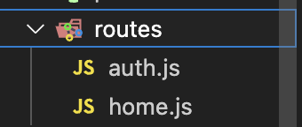
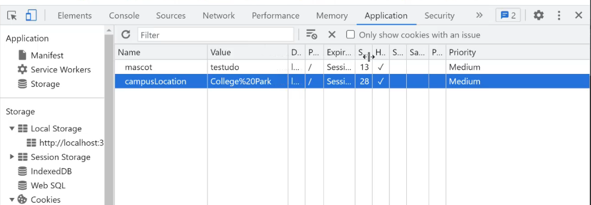

# JS Express II

📚Class: CMSC 335 Web Dev with Javascript

📘Subject: <a href="https://github.com/lamula21/cheat-sheets/blob/main/Javascript">Javascript</a>

✏️Section: 0101

🗓️Date: 2023-04-17

---

# Express Application Generator
It's a express module that creates quick app skeleton with the folders: public, routes, views, app.js

- Install module Express generator to quickly create an application skeleton for your project.
```bash
sudo npm install -g express-generator
```

- Create app, with a name `myapp` and view engine `ejs`
```
express --view=ejs myapp
```


# 🛏️ REST (Represenatational State Transfer)
- An URL that process one or more of the HTTP methods (GET, POST, PUT, DELETE, etc)
- That combination allows to make a REST application
- Project 5 is an REST app, where an URL has `get` and `post`
- Allows different data formas (html, text, JSON)

## GraphQL (alternative)
- [Source](https://www.youtube.com/watch?v=eIQh02xuVw4&ab_channel=Fireship)


# 🗄️ Modules
- A Javascript file
- Can definitions of variables, constants, classes

- Two types of JS module systems
	- **CommonJS** - used by Nodejs `require()`
	- **ES6** - used for server/client `import()`

## CommonJS
- Node app uses CommonJS by default
- Suppose utjis.mjs that has `add()`, `multiply()` functions
- Two ways to import:
```js
// Note here we use a variable utils
const utils = require('./utils')
console.log(utils.add(1,2))
console.log(utils.multiply(3,2))
```

```js
// Note here we use the functions directly
const { add, multiply } = require('./utils')
console.log(add(1,2))
console.log(multiply(3,2))
```

## ES6
- NodeJs does not use EJS6 unless we specify it in the `package.json`
```js
{ // package.json
  ...
  "type": "module",
  ...
}
```

- If we are using ES6 module on HTML script
```html
<script type="module">...code...</script>
```


- Suppose utils.mjs has `add()`, `multiply()` functions
- You can use modules in the browser and in Nodejs
```js
// Note add fucntion can be changed to addAll
import { add as addAll, multiply} from './utils.mjs'
console.log(add(1,2))
```


# 🚆 Router
- Route/endpoint/URL stands for the same
- If we have a big app, we will have tons of `app.get()`, `app.post()`, etc in the `index.js`
- To avoid this issue, we introduce the `routes` folder!
- We organize the routes for specific URL
	- auth.js - will contain all `app.post()`, `app.get()` for http://localhost:3000/auth/
	- home.js - will contain all `app.post()`, `app.get()` for http://localhost:3000/



- To let our app know that our routers are located in another file, we need to middleware and import them
	- `app.use()` - middleware
	- `require('./routes/auth')` - Here we import `router`
```js
// In index.js
const express = require('eexpress')
const app = express()

app.use("/", require('./routes/home') ) 
app.use("/auth", require('./routes/auth')) // importing routes from routes/auth.js
```

- Note that here we export `router` as a module so that `index.js` can import it.
```js
// In /routes/auth.js
const express = require('express');
const router = express.Router()

// http://localhost:3000/auth/login
router.get("/login", ...)

// http://localhost:3000/auth/register
router.post("/register", ...)   

// important
module.exports = router; // export router as require('./routes/home')
```


# 🍪 Cookies
- To store little pieces of information
- Browser can keep this info **internally** (browser's memory) or in a **file** (hard drive)
- Available client-side and server-side
- Supports up to 4 KB of data
- Cookie format - name/value pairs
- Cookies scope are gobably - all routes can access these cookies
- Usefulness - 
	1. Session management: keep track of user sessions and auth info, stay logged in even if they navigate away from the website and come back later.
	2. Personalization: store user preferences and settings, such as language preferences or theme choices, and customize the user experience. 
	3. Tracking: track user behavior on a website, such as which pages they visit and how long they stay on each page, to help optimize the website for user engagement.
	4. Advertising: serve targeted advertising to users based on their browsing history and behavior.
	5. Analytics: collect data on website usage and traffic patterns, which can be used to inform website design and marketing strategies.

## Expiration Date
- Cookies without expiration date - once browser is closed, the cookie is thrown away :(
- Cookies with expiration date - no thrown away, it will expire when it's time to expire
```js
response.cookie() // set a cookie
request.cookies.cookieName // access a cookie
```

## How Set a Cookie
```js
const cookieParser = require('cookie-parser')

// set cookies parser in our app with .use() middleware
app.use(cookiePraser())

app.get('/', (request,response) => {
  response.cookie("mascot", "testudo", {httpOnly:true})
  response.cookie("campus", "College Park", {httpOnly:true})
})

// Note: another route can access this cookie
app.get('/check', (request,response) => {
  console.log(request.cookies.mascot) // testudo
  console.log(request.cookies.campus) // College Park
})
```

## See Cookies in Browser
- Open browser console $\rightarrow$ Application $\rightarrow$ Cookies



# 📀 Local Storage
- Another way to store information (larger ammounts) but locally
- More secure than cookies
- Local storage not available server-side. Only client-side
- Not tied to any specific session.
- Source: <a href="https://github.com/lamula21/cheat-sheets/blob/main/Javascript/JS%20Local%20Storage.md">Local Storage</a>

# 👥 Sessions
- Cookies allows us to identify the session from each user.
- **Sessions** - time period during which an user views several different web pages in a browser and then quits

- **What is the issue?**
	- HTTP is stateles
	- Meaning every page request is independent
	- They dont remember what actions you did in a particular time.
	- For example, adding a product to your shopping cart is not saved

- **What sessions useful?** Keep track of information thru the session
	- track of color preferences
	- usernames
	- data selection, etc

## Middleware express-session
- The middleware `express-session` stores **session data** in the server
- Only saves session ID in the cookie but not session full data
- Uses the memory storage, which means when server is restarted, data is erased. 
- Not recommended in **production environment (testing code)** since server is restarted everytime.
- We gonna use Insommia to simulate forms

**Setting session in our app**:
```js
const session = require('express-session');

// Middleware for session - we can use req.session
app.use(
  session({
    resave: true,
    saveUnitialized: false,
    secret: "somethingSecretHereDontShow", //use dotenv for secret thing
  })
)
```

**When user sends form to log in, validate, set session**:
```js
app.post("/login", (request, response) => {
  // Here we usually check if user exists in Database
  if (request.body.user == username && request.body.password == password) {
     request.session.user = username;
     request.session.cart = ''; // simulates a shopping cart
     request.session.save()
     message = 'Logged in'
  } else {
    message = 'Invalid user'
  }

  reponse.send(message)
})
```

**When user wants to buy**:
```js
app.post('/buy', (request, response) => {

  // Check if there is a session active
  if (request.session.user != undefined) {
    requestion.session.cart += request.body.item + " ";
    message = `${request.body.item} added item to ur cart`
  } else {
    message = 'You have not logged in'
  }

  response.send(message)
})
```

**When user wants to checkout items**:
```js
app.post('/checkout', (request, response) => {

  // Check if there is a session active
  if (request.session.user != undefined) {
    message = `$Items buying ${request.body.cart}` // tv chair
  } else {
    message = 'You have not logged in'
  }

  response.send(message)
})
```

**When users wants to log out**:
```js
app.post('/logout', (request, response) => {

  // Check if there is a session active
  if (request.session.user != undefined) {
    request.session.destroy()
    message = `You have logged out`
  } else {
    message = 'You were not logged in'
  }

  response.send(message)
})
```


# 📚 Software Stack
- **MERN Stack** (MongoDB, Express, React, NodeJS)
- **LAMP Stack** (Linux, Apache, MySQL, Perl, Python, PHP)
- **MEAN Stack** (MongoDB, Express, Angular, Node)


# 📪 NodeFetch on NodeJS
- Another way to get JSON files from a server, instead of `fetch()`
- Previously, people used to use `node-fetch` module to fetch
- It is good to know, but use `fetch()`

## NodeFetch Async
- Make an ansynchronous task with `nodeFetch`
- Program will continue running the next codes, while `getJSON()` is processing
```js
function getJSON() {
  const json = nodeFetch(url).then(response => response.json())
}
```

## NodeFetch Async-Await
- In order to make the program to **WAIT** for this function (since it may take time getting a response from server), we use `await` keyword but also we need `async` in the top level function (**required**)
```js
const nodeFetch = require("node-fetch");

async function getJSON() { // async
  const result = await nodeFetch(url); // await
  const json = await result.json();
  return json
}
```


**Calling getJSON()**:
```js
async function main () { // async
  try {
    const data = await getJSONData(); // await
  } catch (e) {
    console.log(e)
  }
}
```

- However, can we do without main? Yes, with Immediately Invoke Function Expression

## Async-Await with IIFE (Exam III question)
- We can avoid having a top level function
- Syntax `(async () => {code} )()`
- Instructor says: Useful when using MongoDB 

```js
( async () => {
    try {
      const data = await getJSONData();
    } catch (e) {
      console.log(e)
    }
  }
)()
```


You may asked, what if we do this? Error! because there is not a top level function with async
```js
try {
  const data = await getJSONData();
  } catch (e) {
    console.log(e)
  }
}
```

# ⚠️ Problem with Async
Since it may take 2s, 5min, 10min to complete the task
- Cannot use `return` 
- Cannot use `try-catch` blocks
- Solution? Callbacks

## Callbacks
The `callback(p1,p2)` can take two parameters:
- `p1`: usually an error to be returned in the callback (like catch-try)
- `p2`: value to be returned in the callback 
```js
function asyncFunc(callback){ // notice we passed callback

  setTimeout( () => {
    let answer = 20;
    if (answer >= 10) { callback(null,answer) } // return callback
    else{ callback(new Error("Invalid value"), answer) } //return callback
  }, timeInMilliSeconds)
  
}
```

Calling function:
```js
asyncFunc( (error,result) => { // notice: passing parameters for the callback

  // error and result will be populated from the callback
  if(error) { console.error(error) }
  else{ console.log(result) }
})
```

## Issue with Callbacks
- Ok, we found a solution to this issue of returning in a Asynchronous task.
- What if we have more asynchronous tasks inside the `function asyncFunc`? **Pyramid of Doom** or **Callback Hell**
- We are going to have a nested pyramid of code 
```js
asyncFuncA( (error1,result1) => {
  //callbackA code
  asyncFuncB( (error2,result2) => {
    //callbackB code
    asyncFuncC( (error3,result3) => {
      ...
    })
  })
})
```

- Is there a better way? Promises!!! 


# 🙏 Promise
- Let's take the same code from previous issue and re-code in a better way
- We use the `Promise` class, which takes two arguments functions
	- `resolve(value)` - usually linked to the return value
	- `reject(error)` - an error to be returned

```js
function asyncFunction() {
  // Create promise
  const promise = new Promise( (resolve,reject) => {
    
    setTimeout( () => {
      let answer = 20;
      if (answer >= 10) { resolve(answer) } // return answer
      else{ reject(new Error("Invalid value")) } // return error
    }, timeInMilliSeconds)
    
  });

  return promise
}
```
- Notice that the whole setTimeout is inside `Promise`

## **Calling function**
- The `.then()` can receive two callbacks as arguments
	- `arg1`: the return result
	- `arg2`: the return error
- Use `.then()` on `promise` to see if call was succesful or not, and returns two callbacks arguments
	- `(result) => do_smth` if succesful
	- `(error) => do_smth` if error
	- Can continue with another .then()
- No more **Pyramid of Hell**!!!
```js
const promise = asyncFuncPromise();
promise.then(
  (result) => console.log(result),
  (error) => console.error(error)
).then(
  ...code...
)
```

Can we split the two callbacks `(result)` and `(error)` functions to make it pretty? Yes!!
- This is very very familar. Looks like when we do `fetch()`. 
- Yes it is the same.
```js
promise
       .then( result => console.log(result)) // return this to the next '.then'
       .catch( err => console.log(err)) // catch error if any otherwise continue
       .then( ...code... ) // so on
```


## Two Ways Creating and Calling Promise

Huh?
```js
function getSqrtPromise(x, resolveSqrt) { // Notice we now using parameters here
  let answer;
  let promise = new Promise( resolve => { // notice we passed only resolve
    setTimeout( () => {answer=Math.sqrt(x); resolve(answer)}
                , 2000 )
  })

  // return 
  promise.then(resolveSqrt) // notice now we using parameter 
}

// Calling
getSqrtPromise(4, value => console.log(value))
```

Better?
```js
function getSqrtPromise(x) {
  let answer;
  let promise = new Promise( resolve => { // notice we passed only resolve
    setTimeout( () => {answer=Math.sqrt(x); resolve(answer)}
                , 2000 )
  })

  // return
  return promise // notice we now using return
}

// Calling
getSqrtPromise(4).then(value => console.log(value))
```

