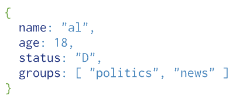

# JS MongoDB with Mongoose

📚Class: CMSC 335 Web Dev with Javascript

📘Subject: <a href="https://github.com/lamula21/cheat-sheets/blob/main/Javascript">Javascript</a>

✏️Section: 0101

🗓️Date: 2023-04-20

---
# 🗓 Intro to MongoDB

MongoDB is a database program that allows you to store data in the cloud

[Login to MongoDB Atlas:](https://cloud.mongodb.com/)
* Create free account
* Set up Network Access
* Set up Database Access. **Store username and password**
* Then, Database tab $\rightarrow$ Connect $\rightarrow$ Connect Application $\rightarrow$ Copy connection string
* Create an enviroment variable: `.env` file
```
URI= "mongodb+srv://</user/>:</password/>@[HOST]/[dataBaseName]?..."
```
* Create .gitignore - add `node_modules` and `.env` to ignore these files when uploaded to github
* Make sure `node_modules` and `.env` are not highlighted by vscode

## Connect to MongoDB
- Before connecting DB, we need to set up our credentials. 
- However, we don't want these credentials to be public if we are to upload the project on GitHub. 
- DotEnv is here for the rescue!

### First Step: DotEnv
- Allows to set environment variables
- Hide sensitive information
- Install dotenv 
```bash
npm i dotenv
```
*Note: Add `.env` in `nodemon.json` so nodemon can know file changes*

- Store sensitive information in `.env`
```js
MONGO_DB_USERNAME = "SOME USERNAME"
MONGO_DB_PASSWORD = "SOME PASSWORD"
// OR
URI = "mongodb+srv://<username:<password>[DBhost]/<databaseName>?retryWrites=true&w=majority"
```
*Note: username and password can be found in Security/Database Access*

### Second Step: Connecting to MongoDB
- `require("dotenv").config()` will allow access of environment variables via `process.env.VARIABLE_NAME`. 
* Create folder /database/db.js
* In `db.js`, connect to MongoDB with URI from `.env` file.
* **URI** can be found in MongoDB Atlas website in Deployments/Database/Connect/Drivers
* Use mongoose to connect to MongoDB (very easy
```bash
npm i mongoose
```

```js
const mongoose = require('mongoose') // npm i mongoose

mongoose
  .connect(process.env.URI)
  .then(() => console.log(`Connected DB 🔥`))
  .catch((e) => console.log(`Connection to DB failed 🤡` + e))
```


### Third Step: Set up App.js
- In `app.js`, 
- Import `dotenv` and `db`
```js
const path = require("path");

// If we are placing .env in another folder (OPTIONAL)
// require("dotenv").config({ path: path.resolve(__dirname, 'FOLDERNAME/.env') })

// If we are placing .env in the root directory (BEST)
require("dotenv").config() // Import to Set the environment variable
require('./database/db') // Import to read connection from MongoDB
```


# 📑 Schemas and Models

## Documents
- Equivalent to a row in a SQL
- In MongoDB, these rows are represented as key-value pair object
- As example, this collection represents a user, a row in a table, where it has 4 columns
	- name
	- age
	- status
	- groups




## Collection
- Equivalent to a table in SQL
- A collection has many rows or  `documents` 


## Schemas
- Schemas is the format
- Forcing some structure on the `document`
- Tells and enforce the data types on each field in the Collection
	- name: String
	- age: Int
	- status: Integer
	- groups: Array
```js
// Creating a Schema, Table Schema
const tableSchema = new Schema({ 
  user: { type: String, required: true }, 
  company: { type: String, required: true },  
  age: { type: Number, required: true }, 
});
```

## Model
- A model (in Mongoose) is a constructor function that provides an interface for creating, querying, updating, and deleting documents in a MongoDB collection. 
- It is created by compiling a schema and providing it with a collection name.
```js
// Creating a document, Table Model
const table = new Table({
  name: "Jhon",
  company: "Atlantic Contractor",
  age: 20,
})
table.save() // save document
```

## Schemas vs Model
- A schema defines the structure of a document and its fields, while a model provides an interface for working with documents in a collection.

# 📅 Mongoose
- Engine to connect to the MongoDB
- Mongoose is an ODM **(Object Data Model)** that allows us to 
	- build schemas 
	- connect to DB
	- create models
	- have many functions to access DB that allows us update, delete, insert data etc. **(CRUD operations)**


# ✏️ CRUD Operations
- CRUD - Create, Read, Update, Destroy (or Delete) `documents`
- We will use mongoose for CRUD operations
- *Note: nomally `db.collection` is replaced with the name of the Schema for that collection*

## Queries
- Some query operators: $eq, $gt, $lt, $lte, $ne (not equal)
```js
db.collection.find({age: {$gte: 30}}) // Find by age >= 30
```

## 🆕 Create Collection

### `insertOne()` 
- Insert a single document into a collection.
```js
db.collection.insertOne({name: "John Doe", age: 25, email: "john@example.com"})
```

### `insertMany()`
- Insert multiple documents at once
```js
const manyUsers = [
	{name:"John", ...},
	{name:"Alice", ...},
	{name:"Sofia", ...}
]
db.collection.insertOne(manyUsers)
```


## 👓 Read Collection from Database

### `findOne()` 
- Returns first document matched by a query. If multiple documents match the query, only the first one will be returned.
```js
db.collection.findOne({user: "John"}) // Find by username
```

### `distinct()` 
- Returns an array of unique values for a specified field in a collection.

### `count()`
- Returns the number of documents that match a specified query.

### `aggregate()`
- Perform more complex queries and aggregations on data in a collection.


## ⬆️ Update Collection from Database

### `updateOne()` 
- Update a single document
```js
db.collection.updateOne({name: "John Doe"}, {$set: {age: 30}})

```

### `updateMany()`
- update multiple documents that match a specified query. 
- two arguments: 
	- a query object to find the documents to update
	- an update object to specify the changes to make.
```js
db.users.updateMany(
  { age: { $gt: 30 } },    // query to match documents
  { $set: { status: "active" } },   // update to make
)
```

### `replaceOne()`
- This method replaces a single document that matches a specified query with a new document. The new document must have the same `_id` field as the old document.
```js
db.users.replaceOne(
  { email: "jane@example.com" },    // query to match document to replace
  { name: "Jane Smith", age: 35, email: "jane@example.com", status: "active" }   // new document to replace with
)
```

## 🚫 Delete Collection from Database    

### `deleteOne()` 
- Deletes a single document that matches a specified query.
```js
db.users.deleteOne(
  { email: "jane@example.com" }   // query to match document to delete
)
```

###  `deleteMany()`
- Deletes multiple documents that match a specified query.
```js
db.collection.deleteMany({age: {$gte: 30}})
```
