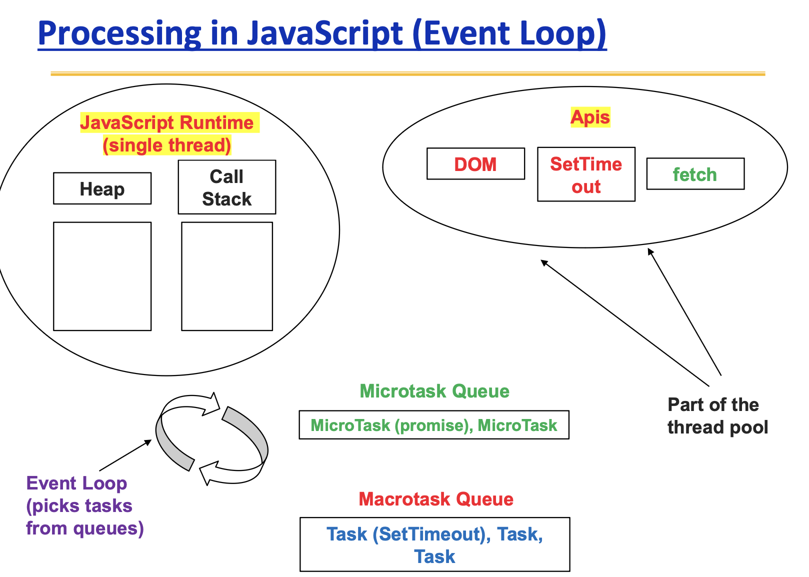

# JS Nodejs

📚Class: CMSC 335 Web Dev with Javascript

📘Subject: <a href="https://github.com/lamula21/cheat-sheets/blob/main/Javascript">Javascript</a>

✏️Section: 0101

🗓️Date: 2023-04-05

---
# 🎬 Intro to Nodejs
- Allows developers to use JavaScript on the server-side to build scalable and high-performance network applications such as databases, messaging queues, and cloud services.
- Ideal for building real-time applications, APIs, and microservices.
- Written in C++
- Donwload [NodeJs](https://nodejs.org/en/download) on your OS 
	- The installer will install `npm` package manager by default
- `npm` is a package manager (a command) that allows install tons of libraries from NodeJs

Example:
```bash
npm i express
```


# ✅ Create Project
To create the project:
- Create a folder
- In this directory, execute
```bash
npm init
```
- A package.json is created
- Every Node project has a **package.json** providing information such as project’s name, author, version, and dependencies.

# ✅ Start a Project
- If you are to start a Nodejs project already created, you need to install dependencies first.

To installl all dependencies of the project (**node_modules**)
- Basically means install all the libraries with their specific version that this project uses
```bash
npm i
```

# ✅ Run Project
- If you want to run your project, already set up. We can use the next command:
```bash
node <mainJSFile>.js
```
*Note: usually called index.js or other name but must have the app.listen(PORT) in it. We will discuss how to set the PORT later*

# 💨 Nodemon (Live Server)
- Another alternative to run our projects, Nodemon
- Nodemon is like **Live Server** but in Node.js
- Normally, to see our changes in a Nodejs project, we would need to shut down server and start it again
- Nodemon does this automatically, save our lifes!

Install Nodemon
```bash
npm i nodemon
```

Once installed, add these lines to the **"package.json"** $\rightarrow$ **"scripts"**
```json
...
"scripts" : {
  //"dev": "nodemon index.js",
  "start": "nodemon index.js"
},
...
```
_Note: Create index.js/other_name.js. Here must have your app.listen(PORT)_

Now, we can **RUN** our project with Nodemon
```bash
npm run start
```

## Warning
If we are working with template engines, the template engine may not update because nodemon does not know this new template engine extension (We will discuss what is template engines on JS Express). For example: If we are working with `.ejs`  or `.hbs` files, so we must add this.

To fix this:
- Create in root directory: `nodemon.json`
- Add a JSON
```json
{
  "ext": "js,json,ejs,hbs, <otherFileExtensions>"
}
```
- Restart server to take effect: `Ctrl+C` then `npm run start`


# 🔨 Setting PORT
We usually run our project on a server. For example, Live Server uses PORT 3000 so we can view our project on `localhost:3000`.

In NodeJS, we must set up manually. In index.js:
```js
const express = require('express')
const app = express()

const PORT = 3000 // Can use any port number
app.listen(PORT, () => console.log(`Server: http://localhost:${PORT}`))
```


# 🔄 Node Asyn and Sync
Node supports both synchronous and asynchronous
- Synchronous Programming
	- Code that performs one task after another, waiting for one to complete before starting another  
- Asynchronous Programming  
	- We don’t wait for the code to finish, it's async

## How these tasks work?



## Event Loop
Responsible for managing tasks in the queues, and decides which task execute next in the Call Stack.

The Event Loop does the following process:
- Takes a `MacroTask` from the queue and execute
- Next, takes a `microTask` from queue and execute
	- keeps executing `microTasks` until there is none
	- No `MacroTask` is selected until `microTasks` are done
- Once `microtask` are done, next a new `MacroTask` takes in to be process 


# 🆚 Front-End vs Back-End
Front-End is mostly coded in HTML and **CAN** be accessed by the user
- Create `public` folder for the front-end

Back-end is coded in Javascript and **CANNOT** be viewed by the user
- Normally is coded in `index.js`
- Create `middleware` in express to create routes for the website
	- e.g routes of a website: 
		- htttps://mywebsite.com/home
		- htttps://mywebsite.com/user/account