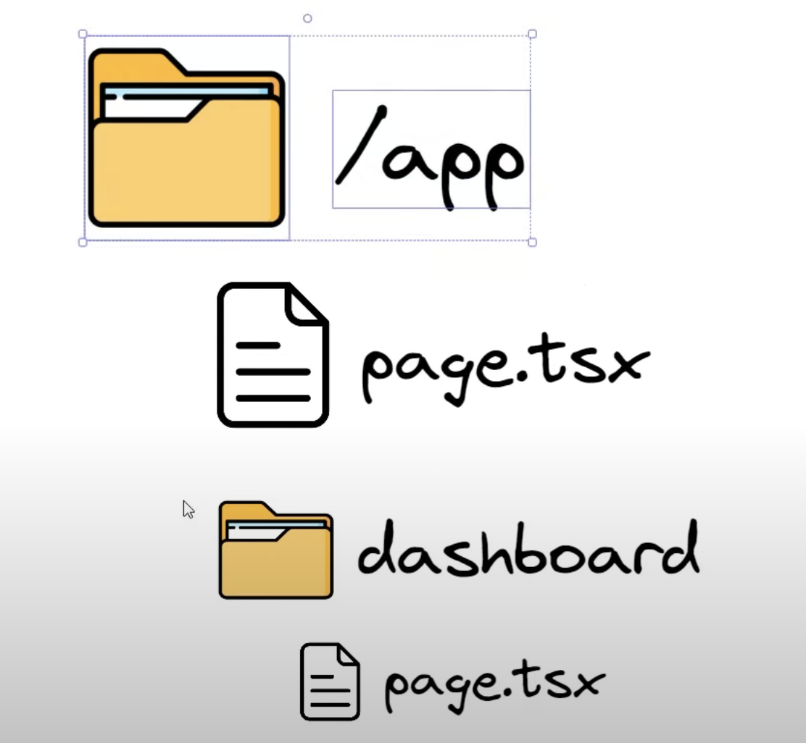

# Next JS

📚Class: 

📘Subject: <a href="https://github.com/lamula21/cheat-sheets/blob/main/"></a>

🗓️Date: 2023-06-24

---

# What is NextJS 
- A framework for React
- NextJS is the ultimately modern framework for backing a web application. 
- Replaces NodeJs and Express 
- Handles routing with a file based routing system. 
- Provides Server-Side Rendering (SSR), Single Page Rendering (SPR)

# Routing
- **/app** represents localhost:3000/
	- **page.tsx** is HTML displayed at localhost:3000/
- /dashboard represents localhost:3000/dashboard
	- **page.tsx** is HTML displayed at localhost:3000/dashboard





# Get Started

- Set up new project with NextJS
```bash
npx create-next-app@latest
```
