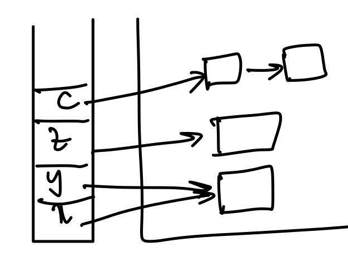
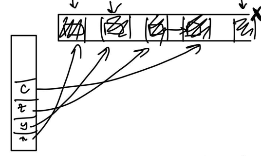
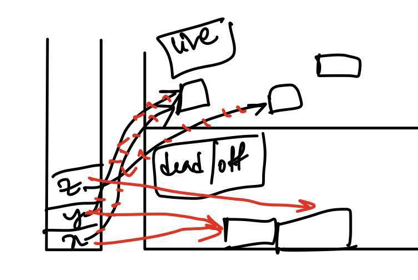

# OCAML Garbage Collector

📚Class: CMSC 330 Organization of Programming Languages 

📓Subject: OCAML 

✏️Section: 0105 

🗓️Date: 2023-04-13

---

# Intro Garbage Collector

- Manages the allocation and deallocation of memory used by a program. 
- Its primary purpose is to free the programmer from the responsibility of explicitly deallocating memory that is no longer needed, which can be error-prone and time-consuming.
- Scans the program's memory and identifying blocks of memory that are no longer reachable or used by the program. 
- Then frees up these blocks of memory for reuse.
- Garbage collection is typically performed dynamically at runtime
- Large programs FANG (Facebook, Amazon, Netflix, and Google), typically involve managing very large amounts of data and complex data structures. Garbage collection can simplify this process by automatically managing memory usage, reducing the likelihood of memory leaks and other issues that can lead to crashes or other errors.

**Advantages**:
- Simplified memory management, 
- reduced likelihood of memory leaks
- improved program performance

**3 Types of Memory Storage**:
1. Reference counting
2. Mark and Sweep
3. Stop + copy algorithm

# 🖕 Reference Counting

## Method
Counts number of references to an object and if counts reaches 0, collects all garbage

## Pros
- Fast
- Does not stop program

## Cons
- Requires memory
- error in reference counter when exploit attack
- cannot deal with cycles (Linked List $\rightarrow$ cycle)

# 🧹 Mark and Sweep

## Method
- Stop program
- Goes over object in the heap
- "marks" all that cannot be referenced
- Sweep away the garbage

## Pros
- No extra memory/space

## Cons
- Inefficient
- Heap could be large
- Fragmentation (after freeing does not reformat objects so leaves weird spaces between objs )
- Freezes program

# 🛑 Stop + Copy Algorithm

## Method

- Stops program
- Copy all live data
- Collect all objs left of garbage

## Pros
- No more fragmentation

## Cons
- Copying is expensive (too much time)
- Limits heap (can only use half heap)
- Stops program to Garbage Collector to happen
