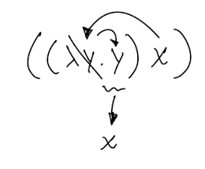
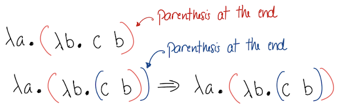
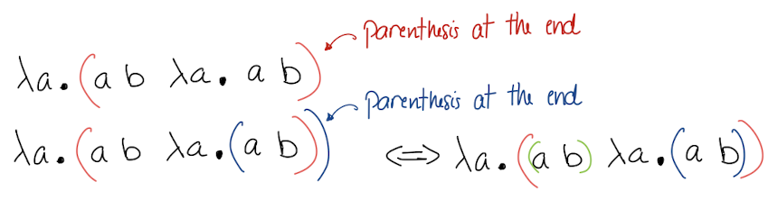
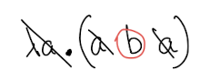
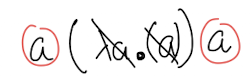
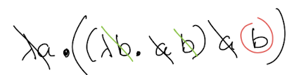
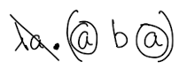
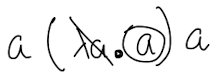
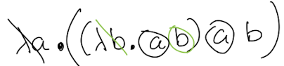

# OCAML Lambda Calculus

📚Class: CMSC 330 Organization Programming

📘Subject: <a href="https://github.com/lamula21/cheat-sheets/tree/main/Ocaml">OCAML</a>

✏️Section: 0105

🗓️Date: 2023-04-13

---

# 🎬 Intro to Lambda Calculus
Lambda Calculus is a mathematical system that serves as a foundation for functional programming. OCaml is a functional programming language that supports Lambda Calculus.

In Lambda Calculus, functions are defined as expressions that take input values and produce output values. The syntax for defining a function in Lambda Calculus is:
```
λ(parameter).(expression)
```

In OCaml, Lambda Calculus can be used to define functions using anonymous functions, which are functions that do not have a name. Anonymous functions are defined using the `fun` keyword.

For example, the following code defines an anonymous function that takes an integer as input and returns the square of that integer:
```ocaml
let square = fun x -> x * x;;
```

This function can be called with an input value like this:
```ocaml
square 3;;
```

This is overall idea of Lambda in OCAMLOT but in this class we will work with lambda and its different types of evaluation as well as parenthesize a lambda expression.

# ✏️ Evaluating Lambda Expression

## 1️⃣ Call by Value "eager evaluation"

In this type of evualuation, we take an inner pair expression and evaluate it.

(λz. z) ((λy. y) x)
- An inner pair is ((λy. y) x) so we evaluate it. So, x replaces λy so replaces y



- We are left with (λz. z) x. So x replaces λz so replaces z. Final result is:
- x

## 2️⃣ Call by Name "lazy evaluation"
This type of evaluation we take the right-most outer expression and evaluate it with the left-most expression.

(λz. z) ((λy. y) x) 
- We take ((λy. y) x) and evualuate it with (λz. z). So ((λy. y) x) replaces λz so replaces z. Resulting, (λy. y) x 
- We take x and evaluate with (λy. y). So x replaces λy so replaces y. Resulting x

  
# ✍️ Parenthesize Lambda Expression

## Make the parentheses explicit

### **expressions**
When we deal with **expressions**. We parenthesize in pairs from the left to right
1) a b c
$\implies$ (a b) c

2) a b c d
$\implies$ (a b) (c d)
  
3) a b c d e
$\implies$ ((a b) (c d)) e

### **parameters + expressions**
When we deal with parameters and expressions we add a left parenthesis `(` after the λ(parameter). and right parenthesis `)` at the very end
1) λa. λb. c b



Do not confuse the group parenthesis `( )` does not match the color. This method placing at the end is very convenient when working with pen. Notice that later when we change parenthesis color, the parenthesis matches

3) λa. a b λa. a b




## Identify the free variables 
Remember:
```
λ(parameter). (expression)
```

The key here is to delete `λ(parameter)` and delete all same `parameter` inside its lambda's `expression`. What is left, are called **free variables**. 

Remember, only delete what is in the lambda's expression scope (example #3). Making the parethensis is recommended.

**Also start from the inner most group of the lambda scope.**

1) λa. a b a


  

2) a (λa. a) a



  

3) λa. (λb. a b) a b
**Note**: Scope of λb is (λb. a b) thats why the outer b is not deleted.




## Identify the bound variables
The parameters you deleted previously in free variables section, are called **bound variables**.

1) λa. a b a




2) a (λa. a) a



3) λa. (λb. a b) a b




# 🔄 Alpha/Betha Conversions

## Alpha-conversion
Now that we know how to identify bound variables, we can change the `parameter` of the lambda to another `parameter`. Simply, renaming the `parameter` to another letter.

**Note**: 
- If we have same `parameter` letter in the whole lambda expression. The first bounding is always the inner-most lambda group, then we renaming them to another letter,
- Continue to the next outer lamba expression group to rename it (Example #1 #3).
- Be aware of the scope.

1) λa. λa. a
$\implies$ λa. (λa. a)
$\implies$ λa. (λb. b)
$\implies$ λa. λb. b
  

2) (λa. a) a b
$\implies$ (λc. c) a b
   

3) (λa. (λa. (λa. a) a) a)
$\implies$ (λa. (λa. (λb. b) a) a)
$\implies$ (λa. (λc. (λb. b) c) a)


## Beta-reduction
Beta reduction is just simply to apply **Call By Value** or **Call By name** (Lazy method) until it is reduced to minimum

1) (λa. a b) x b
$\implies$ x b b (using Call by Name, x b replaces λa so replaces a )
$\implies$ (x b) b (parenthesizing)

2) (λa. b) (λa. λb. λc. a b c)
$\implies$ b (using Call By Name, (λa. λb. λc. a b c) replaces λa but there is not `a` parameter just `b`, so the output is just `b`)

3) (λa. a a) (λa. a a)
$\implies$ (λa. a a) (λa. a a) (using Call by Name, (λa. a a) replaces  λa so replaces the two `a`)
$\implies$ (λa. a a) (λa. a a) (using Call by Name, (λa. a a) replaces  λa so replaces the two `a`)
$\implies$ This becomes infinite loop
