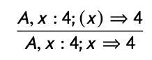
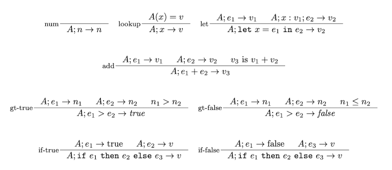
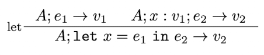
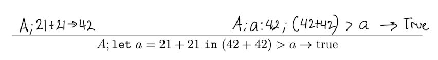

# OCAML Operational Semantic

📚Class: CMSC 330 Organization of Programming Languages 

📓Subject: OCAML 

✏️Section: 0105 

📅Date: 2023-03-28

---

# Intro  to OPSEM

In OCaml, operational semantics refers to the rules that define how the expressions in the language are evaluated. These rules specify the behavior of the language's constructs and how they interact with each other during execution.

Let's explain what each terms means before going into the action!

Suppse we have the following OPSEM

- `A` represents the store, which is a mapping from variable names to their current values. 
	- Used to keep track of the values of variables as they are assigned and manipulated during the execution of a program.

- `x:4` represents an update to the store, where the value of the variable `x` is set to `4`. 
	- Indicates that the store `A` has been updated to a new store `A[x↦4]` that maps `x` to `4`.

- `(x)⇒4` represents a reduction step. 
	- Indicates expression `x` reduces to **the value** `4` in the context of the store `A`.

- `x⇒4` represents a reduction step for a **single variable** rather than an expression. 
	- It indicates that the value of the variable `x` in the store `A` is `4`.

# Construct Proof
Let's see how we can construct a full proof given the rules, step by step:

Given the following rules, construct a proof to the following proposition:

`Step 1`: Identify the rule
Here we have our proposition that we must construct

We must identify which rule to use. My intuition here is to choose the rule that has more precedence. If I were OCAML, I would split the operations into:
- `expression1`: let a = 21 + 21
- `expression2`: (42+42) > a
- `expressiont3`: true
- All together: `expression1` **in** `expression2` $\rightarrow$ `expression3`

We can see that the only rule that involes `in` is the *let rule*. So we use that rule.

We are given bottom proposition. With that one, we can construct the top one. 
To do so, 
- We first identify our expressions from the bottom proposition
- Continue `step 2`
$$Bottom\>Rule\>:\>\>\> A;\>let\>x=e_{1}\>\> in\>\> e_{2} \rightarrow v_{2}$$
$$Our\>Proposition\>:\>\> A;\>let\>a=21 + 21\>\> in\>\> (42+42) >a\rightarrow true$$
Getting expressions:
- A;
- x = a
- $e_{1}$ = $21 + 21$
- $e_{2}$ = $(42+42) > a$
- $v_{2}$ = true

`Step 2:` Construct proof based on rule
Now that we have our expressions indentified, we can proceed to build the **top proposition** with the **top rule**
$$Top\>Rule\>:\>\> A; e_{1} \rightarrow v_{1} \>\>\> A;x:v_{1};e_{2} \rightarrow v_{2}$$
Building top proposition with previous expressions and top rule:
- $A;e_{1} \rightarrow v_{1}$ $\iff$ $A; 21+21 \rightarrow 42$
- So $v_{1} = 42$
- $A;x\>:\>v_{1};\>e_{2} \rightarrow v_{2}$  $\iff$ $A;a\>:\>42;\>(42+42)>a \rightarrow 82$

Finally, we'll get something like this:

`Step 3:` 
Repeat same process: 
- Identify the rule
- Construct proof based on rule