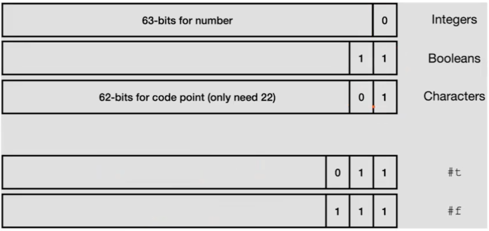

# Dodger: Adding Characters

Now we can add characters to our compiler, with type checking, with the following operations:

- `char?`: checks if it's a character
- `integer->char`: convert integer to char
- `char->integer`: convert char to integer

Since we need to add types for characters, our bit representation will change a bit



So, our compiler will store these raw values as example

| Values | Bits          | Decimal (stored in register) | decoding                   |
| ------ | ------------- | ---------------------------- | -------------------------- |
| 0      | 000[0]        | 0                            | >> 1 -> 000 -> 0           |
| 1      | 001[0]        | 2                            | >> 1 -> 001 -> 1           |
| 2      | 010[0]        | 4                            | >> 1 -> 010 -> 2           |
| #t     | 0011          | 3                            |
| #f     | 0111          | 7                            |
| #\a    | 1 1000 01[01] | 389                          | >> 2 -> 1100001 -> 97 -> a |

## AST

No changes here

```racket
; ast.rkt

#lang racket
(provide Lit Prim1 If)

(struct Lit (i) #:prefab)
(struct Prim1 (p e) #:prefab)
(struct If (e0 e1 e2) #:prefab)
```

## Parser

```racket
; parser.rkt
(define (parse s)
  (match s
  [(? datum?) (Lit s)]
  [(list (? op1? o) e) (Prim1 o (parse e))]
  [(list 'if e0 e1 e2)
    (If (parse e0) (parse e1) (parse e2))]

  [_ (error "Parse error")]
))

;; 🆕 should able to parse: integer, boolean, chars.
(define datum? x
  (or (exact-integer? x)
  (boolean? x)
  (char? x)))

;; 🆕 add new functions to the operator list
(define (op1? x)
  (memq x '(add1 sub1 zero? char? char->integer integer->char)))
```

## Interpreter

```racket
; interp.rkt

;; Expr -> Integer
(define (interp e)
  (match e
  [(Lit i) i]
  [(Prim1 p e) (interp-prim1 p (interp e))]
  [(If e1 e2 e3)
    (if (interp e1) (interp e2) (interp e3))]
  [_ (error "interp error")]
))

;; 🆕
(define (interp-prim1 op v)
  (match op
    ['add1 (add1 v)]
    ['sub1 (sub1 v)]
    ['zero? (zero? v)]
    ['char? (char? v)]
    ['interger->char (integer->char v)]
    ['char->integer (char->integer v)]
    ))
```

We can test the interpreter and the output must be the same as the compiler run at the runtime

```racket
(require "parse.rkt" "interp.rkt")
(interp (parse '(char? #\a)))
-> #t

(interp (parse '(integer->char 98)))
-> #\b
```

## Compiler

```racket
;; compile.rkt

(define (compile e)
  (prog
   (Global 'entry)
   (Label 'entry)
   (compile-e e)
   (Ret)
   ))


(define (compile-e e)
  (match e
    [(Lit i) (compile-value i)]
    [(Prim1 p e) (compile-prim p e)]
    [(If e0 e1 e2) (compile-if e0 e1 e2)]
  ))

(define (compile-value v)
  (seq (Mov rax (value->bits v))))


(define (compile-prim1 p e)
  (seq
    (compile-e e)
    (compile-op1 p))) ;; need to modify


(define (compile-op1 p)
  (match p
    ['add1 (Add 'rax 1)]
    ;; 🆕 to be addded
  ))


(define (compile-if e0 e1 e2) (
  (let (
    (l1 (gensym 'if))
    (l2 (gensym 'end))
    )
    (seq
      (compile-e e0)
      (Cmp rax (value->bits #f)) ; if rax = false
      (Je l1)
      (compile-e e1)
      (Jmp l2)
      (Label l1)
      (compile-e e2)
      (Label l2)
    ))
))
```

We need to modify `compile-op1`:

```racket
(define (compile-op1 p)
  (match p
  ['add1 (Add rax (value->bits 1))]
  ['sub1 (Sub rax (value->bits 1))]
  ['zero?
    (seq
      (Cmp rax 0)
      if-equal
    )]

  ;; 🆕
  ['char?
    (seq
      (And rax #b11) ;; ... 1001 & ... 0011 -> .... 0001
      (Cmp rax #b01) ;; is 0001 = 0001? yes -> it's char
      if-equal ;; refactored
    )]

  ;; 🆕
  ['char->integer
    ;; char ends with ...01
    ;; integer ends with ...0
    ;; from char to int -> >> 1 -> ...0
    (seq (Sar rax 1))]

  ;; 🆕
  ['integer->char
    ;; integer ends with ...0
    ;; char ends with ...01
    ;; from int to char -> << 1 -> ...00 xor ...01 -> ...01
    (seq  (Sal rax 1)
          (Or rax 1))] ;; make the last bit to 0
  ))

  (define if-equal
    (seq  (Mov rax (value->bits #f))
          (Mov r9 (value->bits #t))
          (Cmove rax r9)))
```

Now we can test this:

```racket
;; testing char?
(require a86)
(asm-display (compile-e (parse '(char? 1))))
->  mov rax  2   ;; ..10
    and rax  3   ;; ..10 & ..11 -> 10
    cmp rax  1   ;; ..10 = ..01? no
    mov rax  7   ;; 7 -> ..111 ✅
    move r9  3   ;; 3 -> ..011
    cmove rax r9 ;; rax = 7 -> 0111 represents #f
```

```racket
(bits->value (asm-interp (compile (parse '(integer->char 97)))))
-> #\a
```
