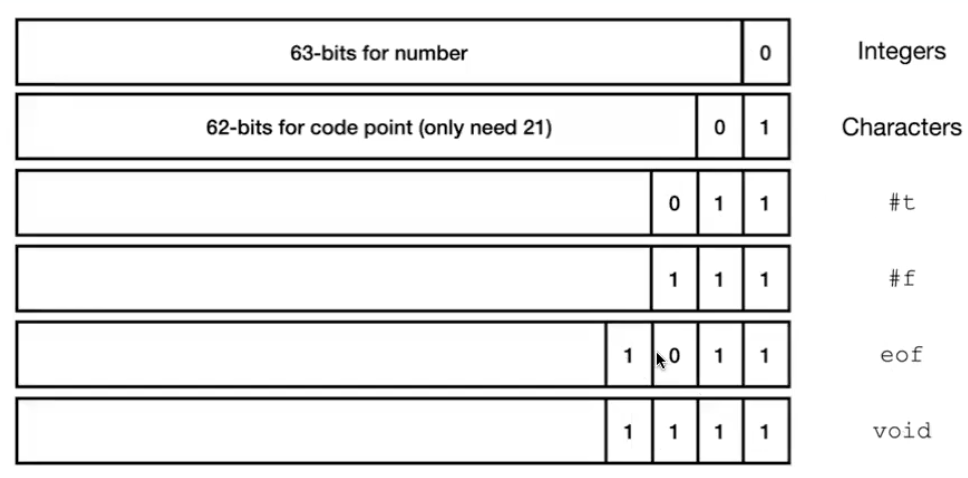
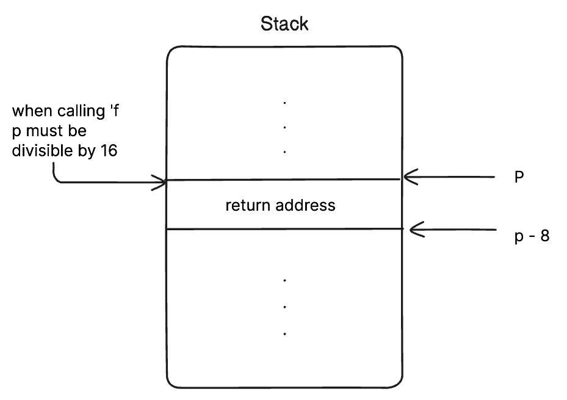

# Evildoer: Calling external functions

Add functionalities such as calling external functions, for example, read from std input and write to buffers

A new encoding for these functions:



## AST

```racket
; ast.rkt

#lang racket
(provide Lit Prim1 If)

(struct Lit (i) #:prefab)
(struct Prim1 (p e) #:prefab)
(struct If (e0 e1 e2) #:prefab)
(struct Begin (e1 e2) #:prefab) ;; 🆕 evaluates e1 then e2
(struct Eof () #:prefab)
```

## Parser

```racket
; parser.rkt
(define (parse s)
  (match s
  [(? datum?) (Lit s)]
  [(list (? op1? o) e) (Prim1 o (parse e))]
  [(list 'if e0 e1 e2)
    (If (parse e0) (parse e1) (parse e2))]
  [_ (error "Parse error")]
))

(define datum? x
  (or (exact-integer? x)
  (boolean? x)
  (char? x)))


;; operations with zero arguments
(define (op0? x)
  (memq x '(read-byte peek-byte void)))


;; operations with one arguments
(define (op1? x)
  (memq x '(add1 sub1 zero? char? char->integer integer->char
    write-byte eof-object?))) ;; 🆕
```

## Interpreter

```racket
; interp.rkt
(define (interp e)
  (match e
  [(Lit i) i]
  [(Prim1 p e) (interp-prim1 p (interp e))]
  [(If e1 e2 e3)
    (if (interp e1) (interp e2) (interp e3))]

  ;; 🆕
  [(Eof) eof]

  [(Prim0 p) (interp-prim0 p)]
  [(Begin e1 e2) (begin (interp e1) (interp e2))]

  [_ (error "interp error")]
))

;; interp-prim.rkt
(define (interp-prim0 op)
  (match op
    ;; 🆕
    ['read-byte '(read-byte)]
    ['peek-byte '(peek-byte)]
    ['void '(void)]
    ))

(define (interp-prim1 op v)
  (match op
    ['add1 (add1 v)]
    ['sub1 (sub1 v)]
    ['zero? (zero? v)]
    ['char? (char? v)]
    ['interger->char (integer->char v)]
    ['char->integer (char->integer v)]

    ;; 🆕
    ['write-byte '(write-byte v)]
    ['eof-object? '(eof-object? v)]
    ))
```

A little bit of testing:

```racket
(interp (parse '(read-byte)))
b
-> 98

(interp/io (parse '(read-byte)) "abc") ;; reads the first byte `a`
-> '(97 . "")

;; returns void
(interp/io (parse '(write-byte 97))) ;; writes to stdout
```

## The 16-byte Issue

Evildoer also intergrates the functionality of calling a function in a86 i.e `Call 'f`.

However, by convention, before calling this function, the stack must be aligned to a 16-byte boundary.



Once `'f` is called, the `rsp` will point to the next block i.e `p - 8` (remember `Call` is `Push` and `Jmp`).

If we were to call again, let's say a function `'g`, we must substract the `rsp` by 8.

Why? By convention, the stack must be 16-byte aligned. So, `p - 16` is divisible by 16. Then we are allowed to call a function.

Things to know:

- Volatile (caller-saved): rax, rcx, rdx, r8, r9, r10, r11
- Non-volatile (callee-saved): rbx, rbp, rdi, rsi, rsp, r12, r13, r14, r15

## Compiler

```racket
;; compile.rkt

(define (compile e)
  (prog
   (Global 'entry)

   ;; 🆕 Externs means: wait for this function, it'll come when you link it.
   (Extern 'peek_byte)
   (Extern 'read_byte)
   (Extern 'write_byte)

   (Label 'entry)
   ;; 🆕 16-byte aligned stack
   (Sub rsp 8)
   (compile-e e)
   (Add rsp 8)

   (Ret)
   ))


(define (compile-e e)
  (match e
    [(Lit i) (compile-value i)]
    [(Prim0 p) (compile-prim0 p)]
    [(Prim1 p e) (compile-prim1 p e)]
    [(If e0 e1 e2) (compile-if e0 e1 e2)]
    [(Begin e1 e2) (compile-begin e1 e2)]
  ))

(define (compile-value v)
  (seq (Mov rax (value->bits v))))

;; 🆕 features with 0 arguments
(define (compile-prim0 p)
  (compile-op0 p))

;; 🆕 added
(define (compile-op0 p) ...)


(define (compile-prim1 p e)
  (seq
    (compile-e e)
    (compile-op1 p))) ;; 🆕 modified

(define (compile-op1 p)
  (match p
    ['add1 (Add 'rax 1)]
  ))


(define (compile-if e0 e1 e2) ...)
```

We need to add `compile-op0` and modify `compile-op1`:

```racket
(define (compile-op0 p)
  (match p
    ['void      (Move 'rax (value->bits void))] ;; or mov rax 15 (since void->bits is 11)
    ['read-byte (Call 'read_byte)]
    ['peek-byte (Call 'peek_byte)]
  ))


(define (compile-op1 p)
  (match p
    ['add1 (Add 'rax (value->bits 1))]
    ['sub1 (Sub rax (value->bits 1))]
    ['zero? (seq (Cmp rax 0) if-equal)]
    ['char?
      (seq  (And rax mask-char)
            (Cmp rax type-char)
            if-equal)]
    ['char->integer
      (seq  (Sar rax char-shift)
            (Sal rax int-shift))]
    ['integer->char
      (seq  (Sar rax int-shift)
            (Sal rax char-shift)
            (Xor rax type-char))]

    ;; 🆕
    ['eof-object?
      (seq  (Cmp rax (value->bits void)
            if-equal))]
    ['write-byte
      (seq  (Mov 'rdi 'rax) ;; populate the argument value
            (Call 'write_byte))] ;; pass rdi as argument to 'write_byte
  ))


```

Some tests:

```racket
(require a86 "parse.rkt" "compile.rkt")
(current-objs '("runtime.o"))

(asm-interp (compile (parse '(void))))
-> 15

(bits->value (asm-interp (compile (parse '(void)))))
->

(void? (bits->value (asm-interp (compile (parse '(void))))))
-> #t
```
