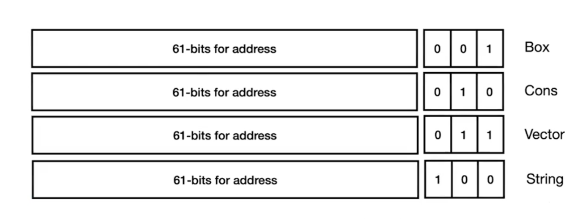

# Hustle: Heaps and Lists

Adds fancy data structures like List and Heaps.

We will use some new struct for these called `Box` and `Pairs`.

```racket
(cons v1 v2)
(box v)
```

We cannot store these data structures in the 64-bit register, so we need to rely on the **heap** instead of the **stack**.

New operations and values:

- cons
- car
- cdr
- cons?
- box
- unbox
- empty
- ()'

## New Bit Representation

The last 3 bits tells us that this is a pointer either `Box` or `Cons`.



How is Box represented?
Suppose we have `(box 42)`.


Suppose we have `(Cons 3 4)`


Some examples of what we want to implement in the next sections.

```racket
(box 10)
-> '#&10

(unbox (box 10))
-> 10

(cons 3 (cons 4 (box 10)))
-> '(3 4 . #&10)

(unbox (cdr (cdr (cons 3 (cons 4 (box 10))))))
-> 10
```

## AST

No changes in AST

```racket
; ast.rkt
(struct Eof () #:prefab)
(struct Lit (i) #:prefab)
(struct Prim0 (p e) #;prefab)
(struct Prim1 (p e) #:prefab)
(struct If (e0 e1 e2) #:prefab)
(struct Begin (e1 e2) #:prefab)
(struct Let (x e1 e2) #:prefab)
(struct Var (x) #:prefab)
```

## Parser

```racket
; parser.rkt
(define (parse s)
  (match s
  ['eof                     (Eof)]
  [(? datum?)               (Lit s)]
  [(? symbol?)              (Var s)]
  [(list (? op0? o))        (Prim0 o)]
  [(list (? op1? o) e)      (Prim1 o (parse e))]
  [(list (? op2? o) e1 e2)  (Prim2 o (parse e1) (parse e2))]
  [(list 'begin e1 e2)      (Begin (parse e1) (parse e2))]

  [(list 'if e0 e1 e2)
    (If (parse e0) (parse e1) (parse e2))]

  [(list 'let x (list (list (? symbol? x) e1)) e2)
    (Let x (parse e1) (parse 2))]

  [_ (error "Parse error")]
))

(define datum? x
  (or (exact-integer? x)
      (boolean? x)
      (char? x)))

;; operations with zero arguments
(define (op0? x)
  (memq x '(read-byte peek-byte void)))

;; operations with one arguments
(define (op1? x)
  (memq x '(add1 sub1 zero? char? char->integer integer->char
    write-byte eof-object?
    box unbox empty? box? car cdr cons? ;; 🆕
    )))

;; 🆕
(define (op2? x)
  (memq x '(+ - < =
            eq? cons ;; 🆕
          )))
```

## Interpreter

No changes

```racket
; interp.rkt

(define (interp e)
  (interp-env e '() ))

(define (interp-env e r)
  (match e
  [(Lit i) i]
  [(Eof) eof]
  [(Var x) (lookup r x)]
  [(Prim0 p) (interp-prim0 p)]
  [(Prim1 p e)
    (match (interp-env e r) 
      ['err 'err]
      [v (interp-prim1 p v)])]
  [(Prim2 p e1 e2)
    (match (interp-env e1 r)
      ['err 'err]
      [v1
        (match (interp-env e2 r))
          ['err 'err]
          [v2 (interp-prim2 p v1 v2)]
      ])
  ]
  [(If e1 e2 e3)
    (match (interp-env e1 r)
      ['err 'err]
      [v (if v
             (interp-env e2 r)
             (interp-env e3 r))] 
    )]

  [(Begin e1 e2)
    (match (interp-env e1 r)
      ['err 'err]
      [v (interp-env e2 r)] 
    )]

  [(Let x e1 e2)
    (match (interp-env e1 r)
      ['err 'err]
      [v (interp-env e2 (ext r x v))]
    )]

  [_ (error "interp error")]
))


(define (lookup r x)
  (match r
    ['() 'err]
    [(cons (list y val) r)
        (if (symbol=? x y)
            val
            (lookup r x))]
  ))

(define (ext r x v)
  (cons (list x v) r))
```

We need to modify `interp-prim.rkt` 

```racket
;; interp-prim.rkt

(define (interp-prim0 op)
  (match op
    ['read-byte '(read-byte)]
    ['peek-byte '(peek-byte)]
    ['void '(void)]
    ))

(define (interp-prim1 op v)
  (match (list op v) ;; match against a list
    [(list 'add1 (? integer?))    (add1 v)]
    [(list 'sub1 (? integer?))    (sub1 v)]
    [(list 'zero? (? integer?))   (zero? v)]
    [(list 'char? v)  (char? v)]
    [(list 'interger->char (? codepoint?))    (integer->char v)]
    [(list 'char->integer (? char?))          (char->integer v)]
    [(list 'write-byte (? byte?))             (write-byte v)]
    [(list 'eof-object? v)                    (eof-object? v)]
    [(list 'box v)                            (box v)]    ;; 🆕
    [(list 'unbox (? box?))                   (unbox v)]  ;; 🆕
    [(list 'car (? pair?))                    (car v)]    ;; 🆕
    [(list 'cdr (? pair?))                    (cdr v)]    ;; 🆕
    [(list 'empty? v)                         (empty? v)] ;; 🆕
    [(list 'cons? v)                          (cons? v)]  ;; 🆕
    [(list 'cons v)                           (cons v)]   ;; 🆕
    [_ 'err]
    ))

(define (interp-prim2 p v1 v2)
  (match (list op v1 v2)
    [(list '+ (? interger?) (?integer?))    (+ v1 v2)]
    [(list '- (? integer?) (? integer?))    (- v1 v2)]
    [(list '< (? integer?) (? integer?))    (< v1 v2)]
    [(list '= (? integer?) (? integer))     (= v1 v2)]
    [_ 'err]
    ))

(define (codepoint? v)
  (and  (integer? v)
        (or (<= 0 v 55295) # valid char range unicode
            (<= 57344 v 111411d1))))
```


## Compiler

```racket
;; compile.rkt

(define (compile e)
  (prog
   (Global 'entry)
   (Extern 'peek_byte)
   (Extern 'read_byte)
   (Extern 'write_byte)
   (Extern 'raise_error)
   (Label 'entry)

   ;; <- stack is 8-byte aligned here

   ;; save callee-saved register
   (Push r15) ;; stack 16-byte aligned ✅
   (Push rbx) ;; 🆕
   
   (compile-e e '()) 

   ;; restore callee-save register
   (Pop rbx) ;; 🆕
   (Pop r15)
   (Ret)

   ;; Error handler
   (Label 'err)
   pad-stack  ;; 🆕
   (Call 'raise_error)
   ;; don't have to unpad since it's error, program termines
   ))


(define (compile-e e c) 
  (match e
    [(Lit i)          (compile-value i)]
    [(Eof)            (compile-value eof)]
    [(Var x)          (compile-variable x c)]
    [(Prim0 p)        (compile-prim0 p)]
    [(Prim1 p e)      (compile-prim1 p e c)] 
    [(Prim2 p e1 e2)  (compile-prim2 p e1 e2 c)]
    [(If e0 e1 e2)    (compile-if e0 e1 e2 c)]
    [(Begin e1 e2)    (compile-begin e1 e2 c)]
    [(Let x e1 e2)    (compile-let x e1 e2 c)]
  ))


(define (compile-value v)
  (seq (Mov rax (value->bits v))))

;; lookup the environment and get the index i
;; store in rax the index position i from the stack
(define (compile-variable x c)
  (let ((i (lookup x c)))
        (seq (Mov rax (Offset rsp i)))
        ))

(define (compile-prim0 p)
  (compile-op0 p))


(define (compile-prim1 p e c) 
  (seq
    (compile-e e c)
    (compile-op1 p)))

(define (compile-prim2 p e1 e2 c)
  (seq
    (compile-e e1 c)
    (Push rax) ;; since e1 and e2 evaluated needs rax, we push the first to stack to keep track
    (compile-e e2 (const (gensym) c)) ;; 🆕 e2 evualted stored in rax
    (compile-op2 p))) ;; call operant, i.e +, takes both args1 (in stack) and arg2 (in rax)


(define (compile-if e1 e2 e3c)
  (let (
          (li (gensym 'if))
          (l2 (gensym 'if))
       )
    ;; in
    (seq  (compile-e e1 c)
          (Cmp rax (value->bits #f))
          (Je l1)
          (compile-e e2 c)
          (Jmp l2)
          (Label l1)
          (compile-e e3 c)
          (Label l2)
    )))


(define (compile-begin e1 e2 c)
  (seq  (compile-e e1 c)
        (compile-e e2 c)))

(define (compile-let x e1 e2 c)
  (seq  (compile-e e1 c) ;; let x = 10 + 20
        (Push rax)       ;; push 30 (we need value later)
        (compile-e e2 (cons x c))
        (Add rsp 8) ;; we could (Pop rax) but we dont want to replace rax
  ))


(define (lookup x cenv)
  (match cenv
    ['() (error "undefined variable:" x)]
    [(cons y rest)
        (match (eq? x y)
          [#t 0]
          [#f (+ 8 (lookup x rest))]
        )]
  ))
```

We need to add `cons` and `box` in `compile-ops.rkt`.

```racket
;; compile-ops.rkt

(define (compile-op0 p)
  (match p
    ['void      (seq (Move 'rax (value->bits void)))]

    ['read-byte
        (seq  pad-stack
              (Call 'read_byte)
              unpad-stack)]

    ['peek-byte
        (seq  pad-stack
              (Call 'peek_byte)
              unpad-stack)]
  ))


(define (compile-op1 p)
  (match p
    ['add1
      (seq  (assert-integer rax)
            (Add 'rax (value->bits 1)) ;; ✅ int, evaluate
      )]

    ['sub1
      (seq  (assert-integer rax)
            (Sub 'rax (value->bits 1)))]

    ['zero?
      (seq  (assert-integer rax)
            (Cmp 'rax 0)
            if-equal)]

    ['char?
      (seq  (And 'rax mask-char)
            (Cmp 'rax type-char)
            if-equal)]

    ['char->integer
      (seq  (assert-char rax)
            (Sar 'rax char-shift)
            (Sal 'rax int-shift))]

    ['integer->char
      (seq  (assert-codepoint)
            (Sar 'rax int-shift)
            (Sal 'rax char-shift)
            (Xor 'rax type-char))]

    ['eof-object?
      (seq  (Cmp 'rax (value->bits void)
            if-equal))]
    ['write-byte
      (seq  (assert-byte)
            (Mov 'rdi 'rax) ;; populate the argument value
            (Call 'write_byte))] ;; pass rdi as argument to 'write_byte

    ;; 🆕 creating a box
    ['box 
      (seq  (Mov (Offset rbx 0) rax)
            (Mov rax rbx) ;; put box address in rax
            (Or rax type-box) ;; add box tag (type-box=#b001)
            (Add rbx 8))]     ;; make heap points the next available space
            ;; 
      
      
    
    ;; 🆕 unwrapping a box
    ['unbox
      (seq  (assert-box rax) 
            (Xor rax type-box)  ;; xor to convert it a pointer (pointer = ...000)
            (Mov rax (Offset rax 0)))]  ;; grab the value of the pointer and store in rax
    ;; 🆕
    ['cons 
      (seq  (Mov (Offset rbx 0) rax) ;; store the first value of cons in heap
            (Pop rax)   ;; get second value of cons
            (Mov (Offset rbx 8) rax)  ;; store the second value of cons in heap
            (Mov rax rbx)  ;; store the address from the heap in rax
            (Or rax type-cons)   ;; create cons with tag (cons=..address..010)
            (Add rbx 16) ;; make heap points to the next available space
      )]

    ['car
      (seq  (assert-cons rax)
            (Xor rax type-cons)
            (Mov rax (Offset rax 8))
      
      )]

    ['cdr
      (seq  (assert-cons rax)
            (Xor rax type-cons)
            (Mov rax (Offset rax 0))
      
      )]
      
  ))

(define (compile-op2 p)
  (math p
    ['+
      (seq  (Pop r8)
            (assert-integer r8)
            (assert-integer rax)
            (Add rax r8))]
    ['-
      (seq  (Pop r8)
            (assert-integer r8)
            (assert-integer rax)
            (Sub r8 rax)
            (Mov rax r9)
            )]
    ['<
      (seq  (Pop r8)
            (assert-integer r8)
            (assert-integer rax)
            (Cmp r8 rax)
            if-lt)]
    ['=
      (seq  (Pop r8)
            (assert-interger r8)
            (assert-integer rax)
            (Cmp r8 rax)
            if-equal)]
    ))

(define if-equal
  (seq  (Mov rax  (value->bits #f))
        (Mov r9   (value->bits #t))
        (Cmove rax r9)
        ))

(define if-lt
  (seq  (Mov rax  (value-> bits #f))
        (Mov r9   (value-> bits #t))
        (Cmovl rax r9)
        ))


(define pad-stack
  (seq  (Mov r15 rsp)
        (And r15 #b1000)
        (Sub rsp r15)))

(define unpad-stack
  (seq  (Add rsp r15)))

(define assert-integer
    (assert-type mask-int type-int)) ;; this case, mask=1, type=0

(define assert-char ;; understand the syntax
    (assert-type mask-char type-char))

(define (assert-type mask type)
  (lambda (arg) ;; rax is passed as arg
    (seq  (Mov r9 arg)
          (And r9 mask)
          (Cmp r9 type) ;; if r9=0, then it's integer
          (Jne 'err)))) ;; ❌ not int, jmp to label error (which calls an external error function)

(define assert-byte
  (seq  (assert-integer rax)
        (Cmp rax (value->bits 0))
        (Jl 'err)
        (Cmp rax (value->bits 255))
        (Jg 'err)
  ))


;; codepoint from interpreter but in low level
(define (assert-codepoint)
  (let ([ok (gensym)])
    (seq  (assert-integer rax)
          (Cmp rax (value->bts 0))
          (Jl 'err)
          (Cmp rax (value->bits 1114111))
          (Jg 'err)
          (Cmp rax (value->bits 55295))
          (Jl ok)
          (Jmp 'err)
          (Label ok)
    )))

```

Testing for `box`
```racket
(asm-display (compile-e (parse '(box 42)) ' ()))
->  mov   rax, 672
    mov   [rbx + 0 ], rax
    mov   rax, rbx
    or    rax, 1
    add   rbx, 8

(run (compile (parse '(box 42))))
-> #&42
```

Testing

```racket
(require a86 "run.rkt" "parse.rkt")
(run (compile (parse '(unbox (cdr (cdr (cons 3 (cons 4 (box 10)))))))))
-> 10
```