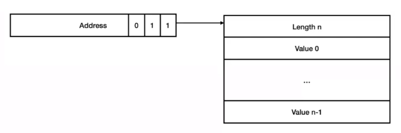
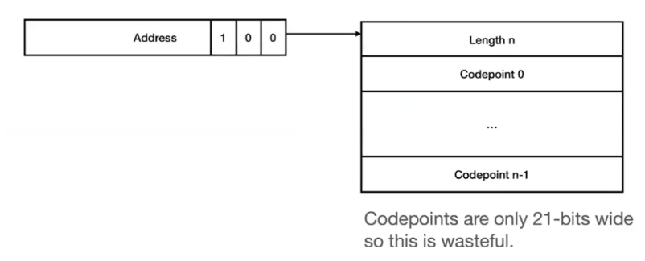
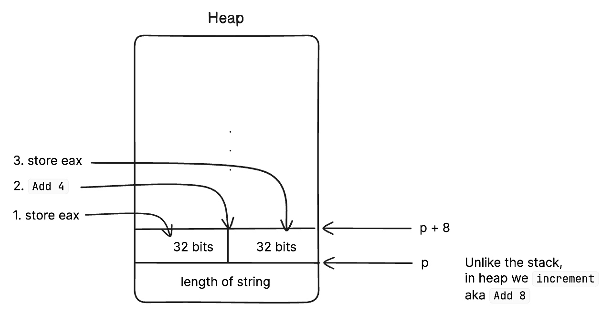
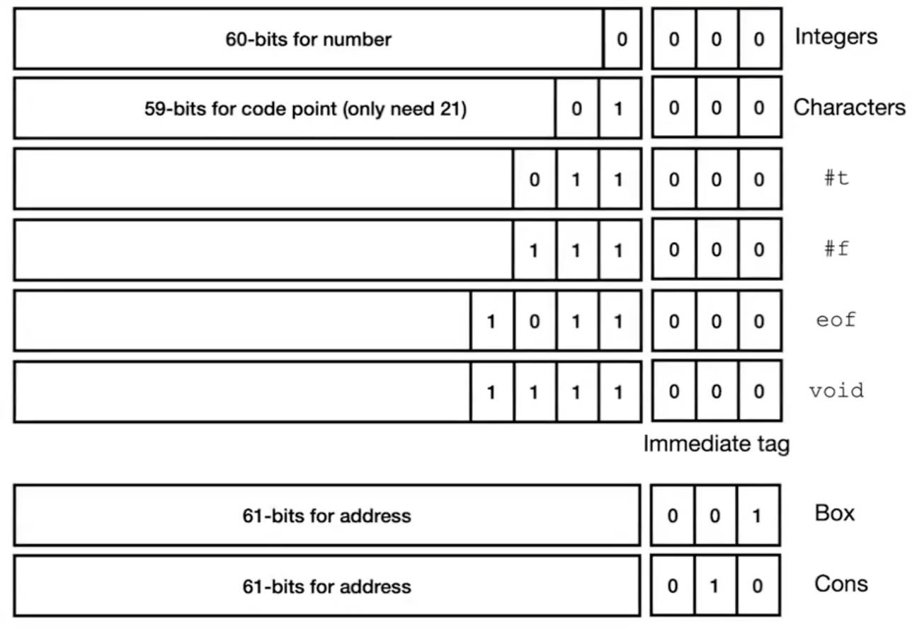
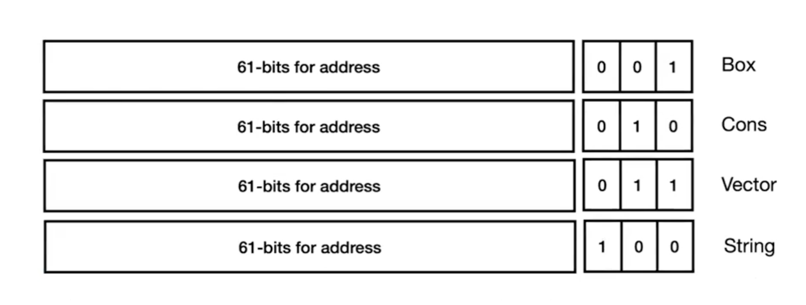

# Hoax: Vectors and Strings

Besides List and Heaps, we will add Vectors (like arrays) and Strings.

We also add new functions for vectors and strings

## What are vectors

Vectors are arrays that carry their size. Vectors are mutable.





## Strings

String are codepoint arrays that carry their size. Strings are immutable.



However, each block of memory is 64-bit (8 bytes) and we only have to store 21-bits for each character. 

Storing each character in a 64-bit block memory adds complexity. But we can do better.




We can split the memory into two 32-bits and store the 21-bit character in each one.

`eax` will store its value in a 32-bits space from a 64-bits block.


## Bit Representation

Here is the new bit representation for our compiler





## AST

```racket
; ast.rkt
(struct Eof () #:prefab)
(struct Lit (i) #:prefab)
(struct Prim0 (p e) #;prefab)
(struct Prim1 (p e) #:prefab)
(struct Prim2 (p e1 e2) #:prefab)
(struct Prim3 (p e1 e2 e3) #:prefab)
(struct If (e0 e1 e2) #:prefab)
(struct Begin (e1 e2) #:prefab)
(struct Let (x e1 e2) #:prefab)
(struct Var (x) #:prefab)
```

## Parser

```racket
; parser.rkt
(define (parse s)
  (match s
    ['eof                (Eof)]
    [(? datum?)          (Lit s)]
    [(? symbol?)         (Var s)]
    [(list 'quote (list)) (Lit '())]
    [(list (? op0? o))   (Prim0 o)]
    [(list (? op1? o) e) (Prim1 o (parse e))]
    [(list (? op2? o) e1 e2) (Prim2 o (parse e1) (parse e2))]
    
    [(list (? op3? o) e1 e2 e3) (Prim3 o (parse e1) (parse e2) (parse e3))] ;; 🆕

    [(list 'begin e1 e2) (Begin (parse e1) (parse e2))]
    [(list 'if e1 e2 e3)
     (If (parse e1) (parse e2) (parse e3))]
    [(list 'let (list (list (? symbol? x) e1)) e2)
     (Let x (parse e1) (parse e2))]
    [_ (error "Parse error")]))

(define datum? x
  (or (exact-integer? x)
      (boolean? x)
      (char? x)))

;; operations with zero arguments
(define (op0? x)
  (memq x '(read-byte peek-byte void)))

;; operations with one arguments
(define (op1? x)
  (memq x '(add1 sub1 zero? char? integer->char char->integer
                 write-byte eof-object?
                 box unbox empty? cons? box? car cdr
                 vector? vector-length string? string-length))) ;; 🆕

(define (op2? x)
  (memq x '(+ - < =
            eq? cons 
          )))
```

To see how vector works in racket, we can do the following:

```racket
(let ((x (make-vector 5 1))) (begin (vector-set x 2 10) x))
-> '#(1 1 10 1 1)
```

## Interpreter


```racket
; interp.rkt

(define (interp e)
  (interp-env e '() ))

(define (interp-env e r)
  (match e
  [(Lit i) i]
  [(Eof) eof]
  [(Var x) (lookup r x)]
  [(Prim0 p) (interp-prim0 p)]
  [(Prim1 p e)
    (match (interp-env e r) 
      ['err 'err]
      [v (interp-prim1 p v)])]
  [(Prim2 p e1 e2)
    (match (interp-env e1 r)
      ['err 'err]
      [v1
        (match (interp-env e2 r))
          ['err 'err]
          [v2 (interp-prim2 p v1 v2)]
      ])
  ]

  ;; 🆕
  [(Prim3 p e1 e2 e3)
     (match (interp-env e1 r)
       ['err 'err]
       [v1 (match (interp-env e2 r)
             ['err 'err]
             [v2 (match (interp-env e3 r)
                   ['err 'err]
                   [v3 (interp-prim3 p v1 v2 v3)])])])]

  [(If e1 e2 e3)
    (match (interp-env e1 r)
      ['err 'err]
      [v (if v
             (interp-env e2 r)
             (interp-env e3 r))] 
    )]

  [(Begin e1 e2)
    (match (interp-env e1 r)
      ['err 'err]
      [v (interp-env e2 r)] 
    )]

  [(Let x e1 e2)
    (match (interp-env e1 r)
      ['err 'err]
      [v (interp-env e2 (ext r x v))]
    )]

  [_ (error "interp error")]
))


(define (lookup r x)
  (match r
    ['() 'err]
    [(cons (list y val) r)
        (if (symbol=? x y)
            val
            (lookup r x))]
  ))

(define (ext r x v)
  (cons (list x v) r))
```

We also need to modify `interp-prim.rkt` for vectors and strings

```racket
;; interp-prim.rkt

(define (interp-prim0 op)
  (match op
    ['read-byte '(read-byte)]
    ['peek-byte '(peek-byte)]
    ['void '(void)]
    ))

(define (interp-prim1 op v)
  (match (list op v) ;; match against a list
    [(list 'add1 (? integer?))    (add1 v)]
    [(list 'sub1 (? integer?))    (sub1 v)]
    [(list 'zero? (? integer?))   (zero? v)]
    [(list 'char? v)  (char? v)]
    [(list 'interger->char (? codepoint?))    (integer->char v)]
    [(list 'char->integer (? char?))          (char->integer v)]
    [(list 'write-byte (? byte?))             (write-byte v)]
    [(list 'eof-object? v)                    (eof-object? v)]
    [(list 'box v)                            (box v)]    
    [(list 'unbox (? box?))                   (unbox v)]  
    [(list 'car (? pair?))                    (car v)]    
    [(list 'cdr (? pair?))                    (cdr v)]    
    [(list 'empty? v)                         (empty? v)] 
    [(list 'cons? v)                          (cons? v)]  
    [(list 'box? v)                       (box? v)]
    [(list 'vector? v)                    (vector? v)] ;; 🆕
    [(list 'vector-length (? vector?))    (vector-length v)] ;; 🆕
    [(list 'string? v)                    (string? v)] ;; 🆕
    [(list 'string-length (? string?))    (string-length v)] ;; 🆕
    [_ 'err]
    ))

(define (interp-prim2 p v1 v2)
  (match (list op v1 v2)
    [(list '+ (? interger?) (?integer?))    (+ v1 v2)]
    [(list '- (? integer?) (? integer?))    (- v1 v2)]
    [(list '< (? integer?) (? integer?))    (< v1 v2)]
    [(list '= (? integer?) (? integer))     (= v1 v2)]
    [(list 'eq? v1 v2)                    (eq? v1 v2)]
    [(list 'cons v1 v2)                   (cons v1 v2)]

    ;; 🆕
    [(list 'make-vector (? integer?) _)
      (if (<= 0 v1)
          (make-vector v1 v2)
          'err)]

    ;; 🆕
    [(list 'vector-ref (? vector?) (? integer?))
      (if (<= 0 v2 (sub1 (vector-length v1)))
          (vector-ref v1 v2)
          'err)]
    ;; 🆕
    [(list 'make-string (? integer?) (? char?))
      (if (<= 0 v1)
          (make-string v1 v2)
          'err)]
    ;; 🆕
    [(list 'string-ref (? string?) (? integer?))
      (if (<= 0 v2 (sub1 (string-length v1)))
          (string-ref v1 v2)
          'err)]
    [_ 'err]))

;; 🆕
(define (interp-prim3 p v1 v2 v3)
  (match (list p v1 v2 v3)
    [(list 'vector-set! (? vector?) (? integer?) _)
     (if (<= 0 v2 (sub1 (vector-length v1)))
         (vector-set! v1 v2 v3)
         'err)]
    [_ 'err]))

(define (codepoint? v)
  (and  (integer? v)
        (or (<= 0 v 55295) # valid char range unicode
            (<= 57344 v 111411d1))))
```


## Compiler

```racket
;; compile.rkt

(define (compile e)
  (prog
   (Global 'entry)
   (Extern 'peek_byte)
   (Extern 'read_byte)
   (Extern 'write_byte)
   (Extern 'raise_error)
   (Label 'entry)

   ;; <- stack is 8-byte aligned here

   ;; save callee-saved register
   (Push r15) ;; stack 16-byte aligned ✅
   (Push rbx)

   ;; recv heap pointer
   (Mov rbx rdi)
   
   (compile-e e '()) 

   ;; restore callee-save register
   (Pop rbx)  
   (Pop r15)
   (Ret)

   ;; Error handler
   (Label 'err)
   pad-stack 
   (Call 'raise_error)
   ;; don't have to unpad since it's error, program termines
   ))


(define (compile-e e c) 
  (match e
    [(Lit i)          (compile-value i)]
    [(Eof)            (compile-value eof)]
    [(Var x)          (compile-variable x c)]
    [(Prim0 p)        (compile-prim0 p)]
    [(Prim1 p e)      (compile-prim1 p e c)] 
    [(Prim2 p e1 e2)  (compile-prim2 p e1 e2 c)]
    [(If e0 e1 e2)    (compile-if e0 e1 e2 c)]
    [(If e0 e1 e2 e3)    (compile-if e0 e1 e2 e3 c)] ;; 🆕
    [(Begin e1 e2)    (compile-begin e1 e2 c)]
    [(Let x e1 e2)    (compile-let x e1 e2 c)]
  ))


(define (compile-value v)
  (cond [(string? v) (compile-string v)]  ;; 🆕
        [else        (Mov rax (value->bits v))]))

;; 🆕
(define (compile-string s)
  (let ((len (string-length s)))
    (if (zero? len)
        (seq (Mov rax type-str))
        (seq (Mov rax len)
             (Mov (Offset rbx 0) rax)
             (compile-string-chars (string->list s) 8)
             (Mov rax rbx)
             (Or rax type-str)
             (Add rbx
                  (+ 8 (* 4 (if (odd? len) (add1 len) len))))))))

 ;; 🆕
(define (compile-string-chars cs i)
  (match cs
    ['() (seq)]
    [(cons c cs)
     (seq (Mov rax (char->integer c))
          (Mov (Offset rbx i) 'eax)
          (compile-string-chars cs (+ 4 i)))]))


;; lookup the environment and get the index i
;; store in rax the index position i from the stack
(define (compile-variable x c)
  (let ((i (lookup x c)))
        (seq (Mov rax (Offset rsp i)))
        ))

(define (compile-prim0 p)
  (compile-op0 p))


(define (compile-prim1 p e c) 
  (seq
    (compile-e e c)
    (compile-op1 p)))

(define (compile-prim2 p e1 e2 c)
  (seq
    (compile-e e1 c)
    (Push rax) ;; since e1 and e2 evaluated needs rax, we push the first to stack to keep track
    (compile-e e2 (const (gensym) c)) ;; e2 evualted stored in rax
    (compile-op2 p))) ;; call operant, i.e +, takes both args1 (in stack) and arg2 (in rax)

;; 🆕
(define (compile-prim3 p e1 e2 e3 c)
  (seq (compile-e e1 c)
       (Push rax)
       (compile-e e2 (cons #f c))
       (Push rax)
       (compile-e e3 (cons #f (cons #f c)))
       (compile-op3 p)));; Expr Expr Expr CEnv -> Asm

(define (compile-if e1 e2 e3c)
  (let (
          (li (gensym 'if))
          (l2 (gensym 'if))
       )
    ;; in
    (seq  (compile-e e1 c)
          (Cmp rax (value->bits #f))
          (Je l1)
          (compile-e e2 c)
          (Jmp l2)
          (Label l1)
          (compile-e e3 c)
          (Label l2)
    )))


(define (compile-begin e1 e2 c)
  (seq  (compile-e e1 c)
        (compile-e e2 c)))

(define (compile-let x e1 e2 c)
  (seq  (compile-e e1 c) ;; let x = 10 + 20
        (Push rax)       ;; push 30 (we need value later)
        (compile-e e2 (cons x c))
        (Add rsp 8) ;; we could (Pop rax) but we dont want to replace rax
  ))


(define (lookup x cenv)
  (match cenv
    ['() (error "undefined variable:" x)]
    [(cons y rest)
        (match (eq? x y)
          [#t 0]
          [#f (+ 8 (lookup x rest))]
        )]
  ))
```

Adding in `compile-ops.rkt`
 
```racket
;; compile-ops.rkt

(define (compile-op0 p)
  (match p
    ['void      (seq (Move 'rax (value->bits void)))]

    ['read-byte
        (seq  pad-stack
              (Call 'read_byte)
              unpad-stack)]

    ['peek-byte
        (seq  pad-stack
              (Call 'peek_byte)
              unpad-stack)]
  ))


(define (compile-op1 p)
  (match p
    ['add1
      (seq  (assert-integer rax)
            (Add 'rax (value->bits 1)) ;; ✅ int, evaluate
      )]

    ['sub1
      (seq  (assert-integer rax)
            (Sub 'rax (value->bits 1)))]

    ['zero?
      (seq  (assert-integer rax)
            (Cmp 'rax 0)
            if-equal)]

    ['char?
      (seq  (And 'rax mask-char)
            (Cmp 'rax type-char)
            if-equal)]

    ['char->integer
      (seq  (assert-char rax)
            (Sar 'rax char-shift)
            (Sal 'rax int-shift))]

    ['integer->char
      (seq  (assert-codepoint)
            (Sar 'rax int-shift)
            (Sal 'rax char-shift)
            (Xor 'rax type-char))]

    ['eof-object?
      (seq  (Cmp 'rax (value->bits void)
            if-equal))]
    ['write-byte
      (seq  (assert-byte)
            (Mov 'rdi 'rax) ;; populate the argument value
            (Call 'write_byte))] ;; pass rdi as argument to 'write_byte

    ['box 
      (seq  (Mov (Offset rbx 0) rax)
            (Mov rax rbx) ;; put box address in rax
            (Or rax type-box) ;; add box tag (type-box=#b001)
            (Add rbx 8))]     ;; make heap points the next available space
            ;; 
    
    ['unbox
      (seq  (assert-box rax) 
            (Xor rax type-box)  ;; xor to convert it a pointer (pointer = ...000)
            (Mov rax (Offset rax 0)))]  ;; grab the value of the pointer and store in rax
    
    ['cons 
      (seq  (Mov (Offset rbx 0) rax) ;; store the first value of cons in heap
            (Pop rax)   ;; get second value of cons
            (Mov (Offset rbx 8) rax)  ;; store the second value of cons in heap
            (Mov rax rbx)  ;; store the address from the heap in rax
            (Or rax type-cons)   ;; create cons with tag (cons=..address..010)
            (Add rbx 16) ;; make heap points to the next available space
      )]

    ['car
      (seq  (assert-cons rax)
            (Xor rax type-cons)
            (Mov rax (Offset rax 8))
      
      )]

    ['cdr
      (seq  (assert-cons rax)
            (Xor rax type-cons)
            (Mov rax (Offset rax 0)))] 
  ))

(define (compile-op2 p)
  (math p
    ...

    ;; 🆕     
    ['make-vector 
        ;; (make-vector 2 #\a)
        ;; 2 in stack (size of the vector)
        ;; #\a in rax
        (let ((loop (gensym))
              (done (gensym))
              (empty (gensym)))
          (seq  (Pop r8) ; r8 = size of the vector
                (assert-natural r8) ; asserts size >= 0
                (Cmp r8 0) ; special case empty vector
                (Je empty)

                (Mov r9 rbx)              ; r9 = rbx is the pointer address+000
                (Or r9 type-vect)         ; r9 is now address+011

                (Sar r8 int-shift)        ; delete int tag  
                ;; remember that for vector
                ;; the first block memory stores the size of the vector
                ;; the rest are the elements
                (Mov (Offset rbx 0) r8)   ; store the vector size in the heap
                (Add rbx 8)               ; heap-pointer points to next available space

                (Label loop)              ; loop r8 till, store #\a by r8 times
                (Mov (Offset rbx 0) rax)
                (Add rbx 8)
                (Sub r8 1)
                (Cmp r8 0)
                (Jne loop)

                (Mov rax r9)              ; return address+011
                (Jmp done)

                (Label empty)
                (Mov rax type-vect)
                (Label done)))]

    ;; 🆕
    ['vector-ref 
      (seq  (Pop r8)
            (assert-vector r8)      ; 1st arg = stack address 
            (assert-integer rax)    ; 2nd arg = index
            
            (Cmp r8 type-vect)
            (Je 'err) ; special case for empty vector
            (Cmp rax 0)
            (Jl 'err)

            (Xor r8 type-vect)      ; r8 = ptr (address+000)
            (Mov r9 (Offset r8 0))  ; r9 = len of vector
            (Sar rax int-shift)     ; rax = index
            

            (Sub r9 1)    ; r9 = size-1 (index of last element)
            (Cmp r9 rax)  ; index/rax greater than r9 -> error
            (Jl 'err)

            (Sal rax 3)   ; rax = rax*8 (one block of memory is 8-byte)
            (Add r8 rax)  ; jump the pointer to the index
            (Mov rax (Offset r8 8)))] ;; offset 8 to skip the length block memory

    ;; 🆕  
    ['make-string
      (let ((loop (gensym))
            (done (gensym))
            (empty (gensym)))
        (seq  (Pop r8)
              (assert-natural r8)   ; r8 = len of string
              (assert-char rax)     ; rax = string value
              
              (Cmp r8 0) ; special case empty string
              (Je empty)

              (Mov r9 rbx)      ; r9 = address+000
              (Or r9 type-str)  ; r9 = address+100

              (Sar r8 int-shift)      ; r8 = len number
              (Mov (Offset rbx 0) r8) ; set r8 in heap
              (Add rbx 8)             ; heap-pointer points to next available block

              (Sar rax char-shift)    ; rax = string value without type tag

              (Add r8 1) ; adds 1
              (Sar r8 1) ; when
              (Sal r8 1) ; len is odd

              (Label loop)
              (Mov (Offset rbx 0) eax) ;; eax store value into the 32-bits
              (Add rbx 4)   ; points to the 32-bit left
              (Sub r8 1)
              (Cmp r8 0)    ; loop till r8 is 0
              (Jne loop)

              (Mov rax r9)  ; return address+100
              (Jmp done)

              (Label empty)
              (Mov rax type-str)
              (Label done)))]
            
    ;; 🆕 similar to vector ref
    ['string-ref
      (seq (Pop r8) ;; vector index
            (assert-string r8)
            (assert-integer rax)
            (Cmp r8 type-str)
            (Je 'err) ; special case for empty string
            (Cmp rax 0)
            (Jl 'err)
            (Xor r8 type-str)       ; r8 = ptr
            (Mov r9 (Offset r8 0))  ; r9 = len
            (Sar rax int-shift)     ; rax = index
            (Sub r9 1)
            (Cmp r9 rax)
            (Jl 'err)
            (Sal rax 2)
            (Add r8 rax)
            (Mov 'eax (Offset r8 8))
            (Sal rax char-shift)
            (Or rax type-char))]
    ))

;; 🆕
(define (compile-op3 p)
  (match p
    ['vector-set!
     (seq (Pop r10)
          (Pop r8)
          (assert-vector r8)
          (assert-integer r10)
          (Cmp r10 0)
          (Jl 'err)
          (Xor r8 type-vect)       ; r8 = ptr
          (Mov r9 (Offset r8 0))   ; r9 = len
          (Sar r10 int-shift)      ; r10 = index
          (Sub r9 1)
          (Cmp r9 r10)
          (Jl 'err)
          (Sal r10 3)
          (Add r8 r10)
          (Mov (Offset r8 8) rax)
          (Mov rax (value->bits (void))))]))

(define if-equal
  (seq  (Mov rax  (value->bits #f))
        (Mov r9   (value->bits #t))
        (Cmove rax r9)
        ))

(define if-lt
  (seq  (Mov rax  (value-> bits #f))
        (Mov r9   (value-> bits #t))
        (Cmovl rax r9)
        ))


(define pad-stack
  (seq  (Mov r15 rsp)
        (And r15 #b1000)
        (Sub rsp r15)))

(define unpad-stack
  (seq  (Add rsp r15)))


(define assert-integer
  (assert-type mask-int type-int)) ;; mask=#b1111, type=#b0000
(define assert-char
  (assert-type mask-char type-char))
(define assert-box
  (assert-type ptr-mask type-box))
(define assert-cons
  (assert-type ptr-mask type-cons))
(define assert-vector
  (assert-type ptr-mask type-vect)) ;; 🆕
(define assert-string
  (assert-type ptr-mask type-str)) ;; 🆕
  
(define assert-char ;; understand the syntax
    (assert-type mask-char type-char))

(define (assert-type mask type)
  (lambda (arg) ;; rax is passed as arg
    (seq  (Mov r9 arg)
          (And r9 mask)
          (Cmp r9 type) ;; if r9=0, then it's integer
          (Jne 'err)))) ;; ❌ not int, jmp to label error (which calls an external error function)

(define assert-byte
  (seq  (assert-integer rax)
        (Cmp rax (value->bits 0))
        (Jl 'err)
        (Cmp rax (value->bits 255))
        (Jg 'err)
  ))


;; codepoint from interpreter but in low level
(define (assert-codepoint)
  (let ([ok (gensym)])
    (seq  (assert-integer rax)
          (Cmp rax (value->bts 0))
          (Jl 'err)
          (Cmp rax (value->bits 1114111))
          (Jg 'err)
          (Cmp rax (value->bits 55295))
          (Jl ok)
          (Jmp 'err)
          (Label ok)
    )))

```

Testing

```racket
make runtime.o
(require "parse.rkt" a86)
(cunrrent-objs '(runtime.o"))
(bits->value (compile-e (parse '(make-vector 2 #\a))))
-> '#(#\a #\a)

(vector-ref (bits->value (compile-e (parse '(make-vector 2 #\a)))) 1)
-> #\a

(make-string 0 #\b)
-> ""
```