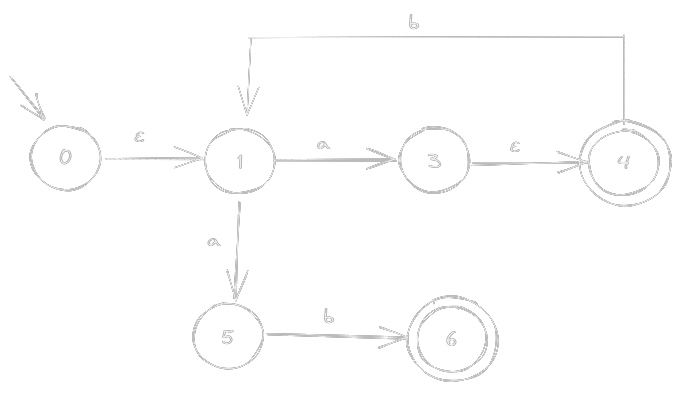
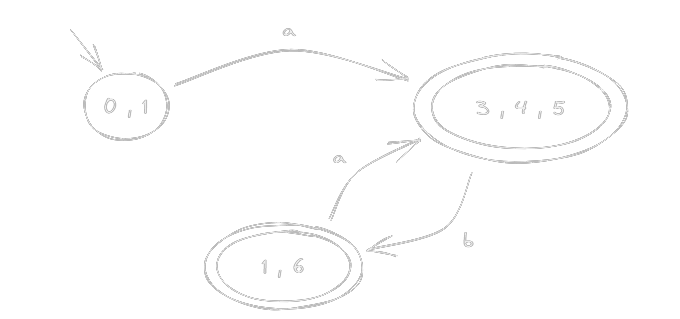

# 🐫 OCAML NFA-DFA

📚Class: CMSC 330 Organization of Programming Languages 

📓Subject: OCAML 

✏️Section: 0105 

📅Date: 2023-03-09

---

# 🎬 Intro to Non-Deterministic Finite Automata (NFA)

Theoretical concept in computer science that defines a mathematical model for recognizing regular languages.

NFA are useful to recognize a wide range of patterns that can be expressed as regular expressions. Used in many programming languages and software tools for pattern matching, parsing, and lexing.

The NFA determines whether a given string of input symbols is accepted. One accepted string needs to follow all possible paths that the machine can take, and see if any of them lead to an accepting state. If there is at least one path that leads to an accepting state, then the string is accepted by the NFA. Otherwise, it is rejected.

An NFA is represented by digraphs called state diagram.
-   The vertices represent the states.
-   The arrows with an input alphabet show the transitions.
-   The initial state is denoted by an empty single arrow.
-   The final state is indicated by double circles.

# 📝 Formal Definition

NFA → { Q, ∑, ∂, q0, F}
- ∑ → Finite non-empty set of input symbols. 
- Q → Finite non-empty set of states. 
- $q_{0}$ → Beginning state. 
- F → Final State
- ∂ → Transitional Function. 

# 💭 NFA Example
- Let a non-deterministic finite automaton:

- ∑ is alphabet → a , b
- Q nonempty states → s0 , s1 , s2 , s3 , s4 , s5 , s6
- $q_{0}$ start state → s0
- F final state → s4 , s6
- ∂ transitions list → 
	- [ (s0, ε ,s1) ; (s1, a, s3) ; (...) ; ...] 

# 🆚 NFA vs DFA
- NFA can have epsilon (ε) transitions, multiple transitions coming out of one state
- DFA cannot have ***ε-transitions*** and cannot have multiple transitions on the same symbol

# ➡ Convert NFA to DFA

## ε-closure
- `ε-closure(δ, p)` returns a **Set** of states reachable from p using only ***ε-transitions*** alone.
- Returned set always has `p`

Let the following NFA:

All possible transitions with epsilons (ε)
- ε-closure(p1) → {p1 , p2 , p3}
- ε-closure(p2) → {p2 , p3}
- ε-closure(p3) → { p3 }
- ε-closure({p1,p3}) → {p1 , p2 , p3} U {p2 , p3} = {p1 , p2 , p3}

## move
- Simpler version of ε-closure
- `move(δ,p,σ)` returns a **Set** of states reachable from `p` using exactly one transition on symbol `σ`.

Let the following NFA:

All possible `move`
- move(p1 , a) → {p2 , p3}
- move(p1 , b) → ø
- move(p2 , b) → {p3}
- move(p3 , a) → ø
- move(p3 , b) → ø
- move({p1 , p2} , b) → ø U {p3} = {p3}

### Note
`move` doesn't use free ***ε-transitions***

- move(p1 , b) = ø

## Algorithm NFA → DFA
- Converting NFA to DFA:
Let $r_0$ = $\varepsilon\text{-closure}(\delta, q_0)$, add it to $R$  
While $\exists$ an unmarked state $r \in R$:  
$\qquad$ Mark $r$  
$\qquad$ For each $\sigma \in \Sigma$  
$\qquad \qquad$ Let $E = \text{move}(\delta, r, \sigma)$  
$\qquad \qquad$ Let $e = \varepsilon\text{-closure}(\delta, E)$  
$\qquad \qquad \qquad$ If $e \notin R$  
$\qquad \qquad \qquad \qquad$ Let $R = R \cup {e}$  
$\qquad \qquad \qquad$ Let $\delta = \delta \cup { r, \sigma, e }$  
Let $F = {r \mid \exists s \in r \text{ with } s \in F_n }$  

## Example NFA to DFA - **Table Method**
Suppose we have the following NFA:

`Iteration 1`
- $1^{st}$ Step: 
	- Start at initial state = $0$
	- ε-closure(0) = { 0 , 1 }
	- So we start { 0 , 1 } in our table

- $2^{nd}$ Step:
	- move(0,a) = ø
	- move(1,a) = {3,5}
		- {3,5} + ø = {3,5}
		- ε-closure( $\{3,5\}$ ) = {3,5,4}
		- Total = {3, 5, 4}
	- move(0,b) = ø
	- move(1,b) = ø
- $3^{rd}$ put {3, 5, 4} in the **State** column
	- Since all sets from the **Alphabet** column must appear on the **State** column
- Repeat Process

| States    | a         | b   |
| --------- | --------- | --- |
| {0,1}     | {3, 5, 4} | ø   |
| {3, 5, 4} |           |     |

`Iteration 2`
- $1^{st}$ Step: 
	- Start at initial state = {3, 5, 4}
	- ε-closure( $\{3, 5, 4\}$ ) = {3, 5, 4}
	- So we start {3, 5, 4} in our table
- $2^{nd}$ Step:
	- move(3,a) = ø
	- move(5,a) = ø
	- move(4,a) = ø
		- Total = ø
	- move(3,b) = ø
	- move(5,b) = 6
	- move(4,b) = 1
		- ø + 6 + 1 = {1, 6}
		-  ε-closure( $\{1, 6\}$ ) = {1, 6}
		- Total = {1, 6}
- $3^{rd}$ put down {1, 6} in the **State** column
- Repeat Process

| States    | a         | b      |
| --------- | --------- | ------ |
| {0,1}     | {3, 5, 4} | ø      |
| {3, 5, 4} | ø         | {1, 6} |
| {1, 6}    |           |        |

`Iteration 3` - Step Simplified
- $1^{st}$ Step: 
	- Start at initial state = {1, 6}
	- ε-closure( $\{1,6\}$ ) = {1,6}
	- So we start {1,6} in our table
- $2^{nd}$ Step:
	- move( $\{1,6\}$ , a) = {3,5}
		- ε-closure( $\{3,5\}$ ) = {3,4,5}
		- Total = {3,4,5}
	- move( $\{ 1,6 \}$ , b) = ø
		- Total = ø
- All Sets appear in **Alphabet** column

| States    | a         | b      |
| --------- | --------- | ------ |
| {0,1}     | {3, 5, 4} | ø      |
| {3, 5, 4} | ø         | {1, 6} |
| {1, 6}    | {3,4,5}   | ø      |

`Final Step`
- Since all Sets from the **Alphabet** columns are in **States** columns, so we are done
- Draw the resulting DFA based on the table
	-  ***Important***: Double Circle all Nodes that has the final state in it

