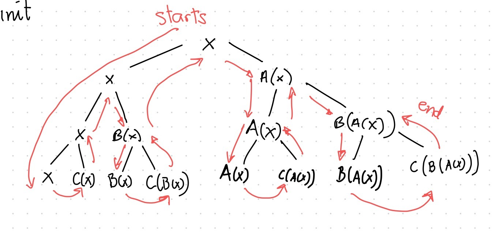

# OCAML Trees
Class: [[OCAML]]
Subject: #
Date: 2023-03-02
Topics: #, #, # 

---

# 🎬 Intro to Trees
- We will go over how to traverse a tree in Ocaml 🐫

# 🌲 Tree Type

- Tree data type, any other type
```ocaml
type `a tree =
	| leaf
	| Node of `a tree * `a * `a tree
```

- Recursively defines a `tree` to be
	- `Leaf`
	- `Node` with left sub-`tree`, a value, and a right sub-`tree`

# 📁 Fold Tree
- Recursively goes down all the way to the left until touches `Leaf`, then up, and right until touches `Leaf`. Next, It goes up to parent node and evaluates
	- Left value
	- Node value
	- Right value
- In this picture, 
	- It goes all the way to the left, touching `x`
		- It goes up parent node, `x`
	- It goes all the way to the right till Leaf, touching `C(x)`
		- It goes up parent node, `x`
	- Evaluates the value of `Left`, `Node`, `Right` nodes.
	- Repeats process


## Rule
- The `tree_fold` takes three parameters:
	- `f`: a function
	- `acc`: an accumulator
	- `tree`: a tree to fold over
- Use match pattern on `tree` to handle two cases
	- `Leaf`: base case, return initial value
	- `Node`: recursive case, passes initial value `acc` to left and right folds. When touches `Leaf` on right fold, it goes up to parent `Node`, then it applies the function `f` to the left accumulator, current value, and right accumulator to get the new accumulator value, which is returned as result

## Implementation
```ocaml
let rec tree_fold f init tree =
match tree with
	| Leaf -> init
	| Node (left, value, right) ->
		let left = tree_fold f init left in
		let right = tree_fold f init right in
		f left value right (* apply f to update accumulator *)
```

## Example
```ocaml
let tree = 
	Node(Node(Leaf, "Hello", Leaf), " World", Node(Leaf, "!", Leaf))

				" World"
			   /         \
			"Hello"      "!"
		   /     \     /    \
		  ""     ""   ""    ""

```

```ocaml

tree_fold (fun l s r -> l ^ s ^ r) "" tree = "Hello World!"
```

# Map Tree
## Rule
## Implementation
## Example
