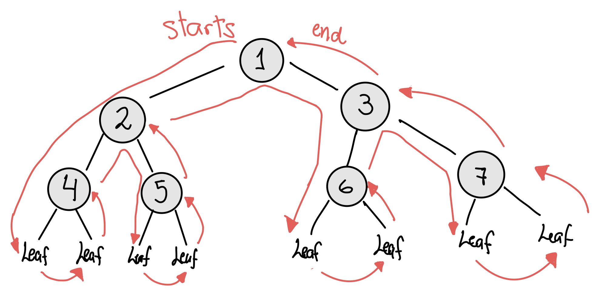

# OCAML Trees
Class: [[OCAML]]
Subject: #
Date: 2023-03-02
Topics: #, #, # 

---

# 🎬 Intro to Trees
- We will go over how to traverse a tree in Ocaml 🐫

# 🌲 Tree Type

- Tree data type, any other type
```ocaml
type `a tree =
	| leaf
	| Node of `a tree * `a * `a tree
```

- Recursively defines a `tree` to be
	- `Leaf`
	- `Node` with left sub-`tree`, a value, and a right sub-`tree`

# 📁 Fold Tree
- Recursively goes down all the way to the left until touches `Leaf`, then up, and right node. Next, It goes up to parent node and evaluates
	- Left value
	- Parent value
	- Right value

## Traversing Tree
- To traverse each node in the Tree, we do In-Order traversal, 
	1. It goes all the way to the left, touching base case `Leaf`
		- It goes up parent node, `4` but since right node exists
	2.  It goes to the right sub-tree touching `Leaf`
		- It goes up parent node, `4`
	- Fold Tree will evaluate the value of `Left`, `4`, `Right` nodes.
	- Repeats process


## Rule
- The `tree_fold` takes three parameters:
	- `f`: a function
	- `acc`: an initial value accumulator
	- `tree`: a tree to fold over
- Use match pattern on `tree` to handle two cases
	- `Leaf`: base case, return initial value
	- `Node`: recursive case, passes initial value `acc` to left and right folds. 
		- `f` traverses left and right. 
		- `f` keeps track of left, this, right node values
		- When touches `Leaf`, Leaf is replaced with `acc`
		- When touches `Leaf` on right fold and goes up to parent `Node`, then 
			- Applies the function `f` to the left accumulator, current value, and right accumulator to get the new accumulator value, which is returned as result
			- e.g Assume `acc` is 1, the `Leaf`'s are replaced with 1, then when traversing until the parent `node 4`, then function `f` uses left acc, current value, right acc to do something:
				- `f 1 4 1 -> 0 + 4 + 0` = 6
				- `f 1 5 1 -> 0 + 5 + 0` = 7
				- `f 6 2 7 -> 6 + 2 + 7` = 15
				- ...

## Implementation
```ocaml
let rec tree_fold f init tree =
match tree with
	| Leaf -> init
	| Node (left, value, right) ->
		let left = tree_fold f init left in
		let right = tree_fold f init right in
		f left value right (* apply f to update accumulator *)
		(* f traverses left and right *)
		(* f keeps track of left, this, right node values *)
```

## Example
```ocaml
let tree = 
	Node(Node(Leaf, "Hello", Leaf), " World", Node(Leaf, "!", Leaf))

             " World"
            /      \
	    "Hello"     "!"
       /    \      /   \
     Leaf  Leaf  Leaf   Leaf

```

```ocaml
tree_fold (fun l s r -> l ^ s ^ r) "" tree

Initial tree:
             " World"                        " World"
            /      \          Leaf->""      /        \
	    "Hello"     "!"         ->       "Hello"     "!"
       /    \      /   \                 /     \    /    \
     Leaf  Leaf  Leaf   Leaf            ""     ""  ""    ""

			 " World"                       " World"
			/      \                       /        \
		"Hello"    "?"          ->  ""^"Hello"^""   "!"^"?"^"!"
		/     \    /  \
	   ""     ""  "!"   "!"

			 " World"                       
			/      \                 "Hello" ^ " World" ^ "!?!"      
	   "Hello"     "!?!"        ->  


Returns:
	tree_fold (fun l s r -> l ^ s ^ r) "" tree = "Hello World !?!" 
```

# 🗺️ Map Tree
- Iterates each node and changes its value
## Rule
- `map` takes two parameters:
	- `f`: a function that applies to each node and changes its value
	- `tree`: a tree to fold over
- `Node(new_l, f v , new_r)`: 
	- `new_l`: traverse the tree all the way to the left until `Leaf`
	- `new_r`: traverse right until `Leaf`
	- Once `new_l` and `new_r` is returned `Leaf`
		- Goes up parent Node, creates a new node which has
			- Left node from `new_l`
			- New value from `f v`
			- Right node from `new_r`
	- Repeat process

## Implementation 1
```ocaml
let rec map tree f =
	match tree with
	| Leaf -> Leaf
	| Node(l,v,r) -> let new_l = map l f in
					 let new_r = map r f in
					 Node(new_l, f v , new_r)	
```

## Implementation 2
- Traverse the tree with `fold_left`
- `Node(left, f value, right)`: 
	- At each node, `map_f` will create a new Node with new value from `f value`
```ocaml
let map tree f =
	let map_f left value right = Node (left, f value, right)
	in
	tree_fold map_f Leaf tree
```

## Example
```ocaml
let tree = 
	Node(Node(Leaf, 1, Leaf), 2, Node(Node(Leaf, 3, Leaf), 4, Leaf))

	            2
            /      \
          1          4
       /    \      /   \
     Leaf  Leaf    3   Leaf
                 /   \
              Leaf    Leaf
```

```ocaml
map tree (fun x -> x + 1)

Initial tree:
                2
            /      \
          1          4
       /    \      /   \
     Leaf  Leaf    3   Leaf
                 /   \
              Leaf    Leaf

Step 1
                2
            /      \
        1+1          4
       /    \      /   \
     Leaf  Leaf    3   Leaf
                 /   \
              Leaf    Leaf

Step 2
                2
            /      \
          2          4
       /    \      /   \
     Leaf  Leaf   3+1   Leaf
                 /   \
              Leaf    Leaf

Step 3
                2
            /      \
          2         4+1
       /    \      /   \
     Leaf  Leaf    4   Leaf
                 /   \
              Leaf    Leaf

Step 4
               2+1
            /      \
          2          5
       /    \      /   \
     Leaf  Leaf    4   Leaf
                 /   \
              Leaf    Leaf

Returns: 
Node(
		Node(Leaf,2,Leaf), 
				
		3, 
				
		Node(
				Node(Leaf,4,Leaf), 
				5, 
				Leaf
			)
	)
```


# Mirror Tree
- TODO
# In-Order Tree
- TODO
# Pre-Order Tree
- TODO
# Compose Tree
- TODO
# Depth Tree
- TODO
# Trim Tree
- TODO

# 🌲 Tree Init
- Function: `tree_init f v`
- **Type**: `('a -> ('a * 'b * 'a) option) -> 'a -> 'b tree)`
- **Description**: A generator `f` is a function that returns a tuple of 3 values: (`v1`, `v2`, `v3`). 
	- Using the definition of type `Option`, `f`, and an init value `v`,
		- build a tree that has a root node with value `v2` 
		- a new generated left subtree with init value `v1`
		- a new generated right subtree with init `v3`. 
		- If `f` returns `None`, a `Leaf` will be placed into the tree.

## Example
```ocaml
let generator2 a =
  if a <= 3 then
    Some (a+1, a, a+2)
  else None

tree_init generator2 1 = 
	Node(Node(Node(Leaf, 3, Leaf), 2, Leaf), 1, Node(Leaf, 3, Leaf))
```

```ocaml
Initial tree:
                     1  <- a
                 /      \
    a+1 <= 3?  2           3  a+2 <= 3?
             /    \      /   \
         Leaf    Leaf  Leaf   Leaf

For a=1, Is a+1 <= 3? → 1+1 <= 3? Yes, print 2 node
		 Is a+2 <= 3? → 1+2 <= 3? Yes, print 3 node


                     1 
                 /      \
         a ->  2           3  <- a
             /    \      /   \
 a+1<=3?    3    Leaf  Leaf   Leaf 
                /        |       |
           a+2 <= 3?  a+1 <= 3?   a+2 <=3?

For a=2, Is a+1 <= 3? → 2+1 <= 3? Yes, print 3 node
		 Is a+2 <= 3? → 2+2 <= 3? No, print Leaf
For a=3, Is a+1 <= 3? → 3+1 <= 3? No, print Leaf
		 Is a+2 <= 3? → 3+2 <= 3? No, print Leaf


                     1  <- a
                 /      \
                2           3 
             /    \      /   \
      a ->  3    Leaf  Leaf   Leaf 
          /   \
       Leaf   Leaf
        |       |
    a+1<=3?   a+2<=3?

For a=3, Is a+1 <= 3? → 3+1 <= 3? No, print Leaf
		 Is a+2 <= 3? → 3+2 <= 3? No, print Leaf
```

## Solved
```ocaml
type 'a tree =
  | Leaf
  | Node of 'a tree * 'a * 'a tree

(*   (f: 'a -> ('a * 'b * 'a) option) 
     (v: 'a) 
     : 'b tree 
*)
let tree_init f v =
  match f v with
  | None -> Leaf
  | Some (v1, v2, v3) ->
      let left_subtree = tree_init f v1 in
      let right_subtree = tree_init f v3 in
      Node(left_subtree, v2, right_subtree)
```
Explanation:
- The `tree_init` function takes a generator function `f` and an initial value `v`, and returns a binary tree of type `'b tree`.
- The generator function `f` takes an argument of type `'a` and returns an option type containing a tuple of three values: `(v1, v2, v3)`. If `f` returns `None`, the function will create a `Leaf` node in the tree.
- The function pattern-matches on the output of `f v` and recursively calls itself on the left and right subtrees created by `f`, if `Some` is returned.
- Finally, a `Node` is created with the left and right subtrees and the `v2` value returned by `f`.


# 🫃🏻 From-Pre-In Tree

## Split
- Takes a list and split in two by separator `v`
- Returns two lists 
- Example:
	- split $[1;2;3;4;5]$ 3 = $([1;2] , [4;5])$
```ocaml
split [1; 2; 3; 4] 2 = ([1]; [3; 4])
split ["Hello"; "World"] "World" = (["Hello"], [])
```

```ocaml
let rec split lst v =
	match lst with
	| [] -> ([], [])
	| h :: t ->
		if h = v then
			([], t)
		else
			let (left, right) = split t v 
			in 
			(h :: left, right)
```


## Take
- Return a list with the first `n` elements
- Example: 
	- take 3 $[1;2;3;4;5]$ = $[1; 2; 3]$

```ocaml
let rec take n lst =
  match n, lst with
  | 0, _ -> []
  | _, [] -> []
  | n, h::t -> h::take (n - 1) t
```

## Drop
- Return a list without the first `n` elements
- Example: 
	- drop 3 $[1;2;3;4;5]$ = $[4;5]$
```ocaml
let rec drop n lst =
	match n, lst with
	| 0, lst -> lst
	| _, [] -> []
	| n, h::t -> drop (n - 1) t
```


## From_pre_in
- `from_pre_in pre in_ord`
- Given `from_pre_in [2; 1; 3] [1; 2; 3]`, construct a Binary Tree so that the `pre` list and `in_ord` list converted in Binary Trees are the same

### Pre_Order vs In_Order
- In an `pre_order` list, the tree will start with
	- at index 0, parent node
	- next index, left node
	- next index, right node ...
- In an `in_order` list, the tree will start with
	- left node `l`, then
	- parent `p`, then 
	- right node `r`
```ocaml
pre_order = [1;2;3]
			 p,l,r

			1
		  /   \
		 2     3


in_order =  [2;1;3]
		     l,p,r

			1
		  /   \
		 2     3		
```

- **Observation 1**: `pre_order` at index 0 is the `root` = 1 of the binary tree
- **Observation 2**: if we split `in_order`= $[2;1;3]$ with separator `root` = 1
	- We get the left hand = $[2]$
	- Right hand side = $[3]$
- **Observation 3**: it is recommend to build the tree based on `in_order`
	- because we can know the Left and Right hand side of the tree
	- and build the three based on `in_order` with the help of `pre_order`

### Solved
```ocaml
let rec from_pre_in pre in_ord =
match pre with
| [] -> Leaf
| root :: t ->
let left_in_ord, right_in_ord = split in_ord root in
let left_subtree = from_pre_in (take (List.length left_in_ord) t) left_in_ord in
let right_subtree = from_pre_in (drop (List.length left_in_ord) t) right_in_ord 

in

Node(left_subtree, root, right_subtree)
```

- Assume `from_pre_in pre in_ord` == `from_pre_in [2; 1; 4; 3] [1; 2; 3; 4]` where
	- `pre` = [2; 1; 4; 3]
	- `in_ord` = [1; 2; 3; 4]

Here's how the function will work:
1.  If the `pre` list is empty, we have reached a leaf node, so we return the `Leaf` constructor.
2.  Otherwise, by Observation 1, we use `pre` to get the `root` of the tree and `pre`'s tail `t`
	- `root`: 2
	- `t`: [1;4;3]
3. By observation 3, we start building tree based on `in_order`. So, we split `in_order` [1; 2; 3; 4] with separator `root = 2`
	- `left_in_order` = [1]
	- `right_in_order` = [3; 4]

- But we also need to keep track of: `left_pre_order` and `right_pre_order`
	- Remember that our new pre is `t`=[1; 4; 3] without the root [2] because we dont want to count the root of the tree anymore
	- `left_pre_order`: must have same length as `left_in_order`. 
		- take (List.length left_in_ord) t = [1]
	- `right_pre_order`: is the `pre`= [1; 4; 3] without [1]
		- drop (List.length left_in_ord) t = [4; 3]
	
4. We can make repeat this process to build our left-subtree and right-subtree by recursively calling `from_pre_in pre in_ord`
	- For `left-subtree`, call `from_pre_in left_pre_order left_in_ord`
		- `from_pre_in [1] [1]`
	- For `right-subtree`, call `from_pre_in right_pre_order right_in_ord`
		- `from_pre_in [4;3] [3;4]`

